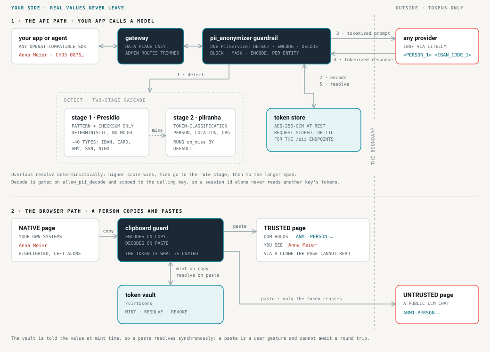
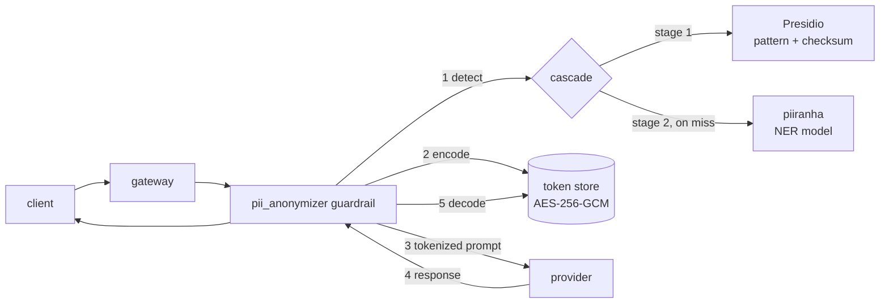

<div align="center">


**Sensitive data never leaves your boundary. The model still gets a sentence it can reason about.**

[Website](https://ma-abdellaoui.github.io/anonymice/) · [Jury summary](docs/JURY.md) · [Architecture](code/engine/PII_CODEC_ARCHITECTURE.md)

</div>

---

## The problem

Every useful LLM workflow ends with a person pasting something into a model they
do not control. A support ticket with a customer's IBAN. A `.env` file with a
live key. A patient note. Redacting it to `***` destroys the shape of the text,
and the model's answer along with it. Leaving it alone means the data is gone.

## What Anonymice does

Anonymice sits **between the user and the model** and swaps sensitive values for
typed, reversible tokens.

```
you type      Please email Anna Meier about invoice CH93 0076 2011 6238 5295 7
              ↓  detect + encode
model sees    Please email <PERSON_1> about invoice <IBAN_CODE_1>
              ↓  provider answers
model says    I've drafted a note to <PERSON_1> regarding <IBAN_CODE_1>.
              ↓  decode
you see       I've drafted a note to Anna Meier regarding CH93 0076 2011 6238 5295 7
```

The real values stay in a vault on our side of the boundary. The provider only
ever sees `<PERSON_1>`. The token is *typed*, so the model still knows a person
is a person and an IBAN is an IBAN, which is exactly what an opaque hash like
`a3f9c2e1` destroys.

Three properties hold throughout:

| | |
|---|---|
| **Reversible by us, opaque to them** | Only our layer can resolve a token back to a value |
| **Irreversible where we say so** | Entities marked `MASK` become a bare `<PERSON>` that the token grammar deliberately does not match. Masking is irreversible by construction rather than by remembering not to store the mapping |
| **Fail closed** | A detector we cannot reach is an error, never an empty result. "No PII found" from a scanner that is down is the one failure mode that silently leaks |

---

## Structure

```
anonymice/
├── code/
│   ├── engine/          the LLM proxy, an extension of LiteLLM
│   └── extensions/      where data is captured, before it reaches any model
│       ├── browser/     Chrome extension: highlight, tokenize on copy, reveal on paste
│       └── backend/     detection service the extension calls
├── docs/                specs, endpoint contracts, QA walkthroughs
└── site/                the landing page, deployed to GitHub Pages
```

Two layers, one idea. The **extension** catches sensitive data at the surface
people actually work in. The **engine** catches whatever reaches the API anyway,
and is what any application, agent, or SDK points at instead of the provider.

---

## How it works

Both surfaces answer the same question in the same order: find the sensitive
spans, replace them with a typed token, keep the mapping behind, and let only the
token cross.



<details>
<summary>The previous Mermaid version of the API path, kept for comparison</summary>



</details>

---

## The engine, an extension of LiteLLM

[`code/engine/`](code/engine/) is [LiteLLM](https://github.com/BerriAI/litellm)
(BerriAI, MIT) with a reversible PII layer added on top. We chose it because it
already solves the boring, unavoidable parts: 100+ providers behind one API,
virtual keys, budgets, rate limits, an admin dashboard, and a guardrail hook
interface that every request surface already routes through.

**Our additions are purely additive.** New packages, plus two lines in
`proxy_server.py`. Nothing upstream is rewritten, so tracking a newer LiteLLM
stays cheap, and `code/engine/README.md` is still LiteLLM's own.

| Path | What we added |
|---|---|
| [`litellm/pii/`](code/engine/litellm/pii/) | The core: detection, codecs, token stores, the vault, `PiiService`. Provider-agnostic, no `litellm.proxy` imports, unit-testable without a proxy |
| [`litellm/proxy/guardrails/guardrail_hooks/pii_anonymizer/`](code/engine/litellm/proxy/guardrails/guardrail_hooks/pii_anonymizer/) | The in-band guardrail: encode on the way to the provider, decode on the way back |
| [`litellm/proxy/pii_endpoints/`](code/engine/litellm/proxy/pii_endpoints/) | Standalone `/pii/detect`, `/pii/encode`, `/pii/decode`, plus session and subject revocation, export, and search |
| [`gateway/`](code/engine/gateway/), [`backend/`](code/engine/backend/) | Split entrypoints. The data plane and the admin plane trim the same app's route table to their own surface, so management endpoints do not ride on the pods that see prompts |

There is **one** implementation of detect, encode and decode, in `PiiService`.
The guardrail and the REST endpoints are both thin adapters over it, so what the
browser extension gets from `/pii/encode` is by construction what an in-flight
completion gets.

### Detection and encoding

**Detection is two-staged.** Stage one is Presidio pinned to its pattern and
checksum recognizers: deterministic, no model, low latency, and it covers around
40 entity types including IBAN, credit card, AHV, NINO, SSN and the other
national identifiers. Pinning the entity list matters, because an analyzer that
also loaded an NLP engine would return NER entities from the stage we treat as
high precision. Stage two is
[`piiranha`](https://huggingface.co/iiiorg/piiranha-v1-detect-personal-information),
a token-classification model, for what patterns cannot catch: `PERSON`,
`LOCATION`, `ORGANIZATION`. `ner_stage_policy` decides when stage two runs, and
it defaults to `always`. The older `on_miss` default skipped the model whenever
the rule stage matched anything, so a single email address in the text was
enough to let every name beside it through untouched.

Overlaps resolve deterministically: higher score wins, ties go to the rule stage,
then to the longer span.

**Encoding has two lifetimes**, deliberately different:

| | LLM path (guardrail) | Endpoint path (extension) |
|---|---|---|
| Lives | one request | until the TTL expires |
| Store | request metadata, dies with the request | the vault, values sealed with AES-256-GCM |
| Token | `<PERSON_1>` | `<PERSON:3f9c2e1b8d4a7f60>` |
| Why | short typed placeholders keep answer quality high | a random handle carries no information about the value, and deleting the entry kills the token permanently |

Per-entity actions are configurable. `BLOCK` rejects the request, `MASK` redacts
irreversibly, and `ENCODE` is the reversible path.

Decode returns real data, so it is gated on the `allow_pii_decode` key permission
and scoped to the calling key. A valid `session_id` on its own never reads
another key's tokens.

Full design: [`PII_ANONYMIZATION_PLAN.md`](code/engine/PII_ANONYMIZATION_PLAN.md)
and [`PII_CODEC_ARCHITECTURE.md`](code/engine/PII_CODEC_ARCHITECTURE.md).

---

## The extension

Catching data at the API is necessary but late. By then someone has already
pasted it. This catches it at the surface.

### Browser, [`code/extensions/browser/`](code/extensions/browser/)

Every host has a trust class, distributed by managed policy:

| Class | Behaviour |
|---|---|
| `NATIVE` | Your own systems. Values stay as they are, and sensitive spans are highlighted so people can see what they are about to copy |
| `TRUSTED` | The page holds the token. The user still sees the real value, rendered through a clone the page itself cannot read |
| `UNTRUSTED` | Everything else. A pasted token stays a token, and real values never enter the DOM |

#### Encoding and decoding on the fly

There is no "anonymize" button. The swap happens inside the two events a person
already performs.

**On copy, it encodes.** `clipboard.ts` installs a guard on `copy` and `cut`. It
takes the selection, projects it back onto the spans the scanner already found,
mints a token per distinct value, and rewrites the clipboard payload before the
event completes. What lands on the clipboard is `ANM1-PERSON-…`, so every
destination from that point on, including one Anonymice has never heard of, gets
the token. Paste into a public chat and the model sees the token.

**On paste, it decodes, but only where it is allowed to.** A `TRUSTED` page
receives the token in its DOM and stores the token. The real value is painted
back for the reader through a clone element that the page cannot read, so the
person sees `Anna Meier` while the site's own storage, telemetry and scripts only
ever hold `ANM1-PERSON-…`. On an `UNTRUSTED` page nothing is revealed and the
token stays exactly as it is.

The ordering matters more than it looks. A `paste` is a user gesture and cannot
await a network round trip, so a cache filled only by `resolve` would always be
one trip too late. The mint is the one moment both halves of the pair are in hand
without asking anyone, so the reveal cache is filled there instead, and the paste
resolves synchronously.

### Detection backend, [`code/extensions/backend/`](code/extensions/backend/)

`/v1/health`, `/v1/policy`, `/v1/detect` on one origin behind one bearer
credential. It receives raw page text and decides which pages get read at all, so
it sits inside the same trust boundary as the vault. That single constraint is
why it binds to loopback by default, refuses to start without a credential, has
**zero runtime dependencies**, and cannot log page text. `log.ts` throws on a
field name that could carry it, so the rule is enforced rather than remembered.

Classes: `IBAN`, `AHV`, `CARD`, `EMAIL`, `PHONE`, `PERSON`, `ORG`, `SECRET`.

---

## Status

| Component | State |
|---|---|
| Engine, detection, codecs, stores, `PiiService` | Implemented, unit-tested |
| Engine, guardrail and `/pii` endpoints | Implemented |
| Engine, streaming decode | Implemented. The guardrail sets `streaming_transform_mode = "incremental_diff"`, so SSE responses are decoded as they arrive |
| Engine, persistent vault | Implemented. `LiteLLM_PiiTokenTable`, with revocation, subject export and audit |
| Browser, detection and highlighting (SPEC §1 to §5) | Implemented |
| Browser, clipboard, tokens and reveal (SPEC §6 to §10) | Implemented. 271 unit tests pass, including the vault contract and cross-trust-class reveal |
| Detection backend | Implemented. 50 tests, zero runtime dependencies |
| Extension ↔ engine wiring | **Not connected.** The extension mints against `/v1/tokens`, which today only `browser/mock/` serves. The engine's `/pii/*` endpoints are the same idea and are where the two are meant to converge |

The last row is the honest gap. Each half has a working vault, and they are not
yet the same vault.

---

## Quick start

**You need** Docker with Compose, Node `^22.18` or `>=24` for the extension, and
`jq` for the examples below. The engine runs entirely in containers, so no local
Python is required.

```bash
git clone https://github.com/ma-abdellaoui/anonymice.git
cd anonymice
```

### 1. Run the engine

```bash
cd code/engine
cp .env.example .env          # required: compose reads it, and it is gitignored
docker compose up -d          # proxy on :4000, Postgres, Presidio
```

First run builds the image and pulls Presidio, so give it a few minutes. When
`docker compose ps` shows `anonymice` healthy:

```bash
curl -s localhost:4000/health/liveliness
```

`docker-compose.override.yml` is committed and mounts
[`litellm/proxy/dev_config.yaml`](code/engine/litellm/proxy/dev_config.yaml) as the
proxy config, so the PII guardrail is already enabled and the master key is
`sk-1234`. That file is where you change models, entity actions and codecs.

### 2. Watch a value round-trip

Decode hands back real PII, so it needs a key that was granted the permission
deliberately. The master key does not carry it:

```bash
KEY=$(curl -s localhost:4000/key/generate \
  -H 'Authorization: Bearer sk-1234' -H 'Content-Type: application/json' \
  -d '{"permissions":{"allow_pii_decode":true}}' | jq -r .key)

curl -s localhost:4000/pii/encode \
  -H "Authorization: Bearer $KEY" -H 'Content-Type: application/json' \
  -d '{"texts":["My name is Ada Lovelace and my email is ada@example.com"]}'
```

```json
{"texts":["My name is <PERSON:d0af67e1b89835dd> and my email is <EMAIL_ADDRESS:f06a2dd5194a1e5d>"],
 "session_id":"124f7666-…","tokens":[…]}
```

Feed that `texts` and `session_id` back to `/pii/decode` with the same key and the
values come out whole. Point any OpenAI-compatible client at
`http://localhost:4000` and the same swap happens in-band on every completion.

> **The first build is heavy.** The NER stage bakes the model weights into its
> image at build time rather than fetching them on start, so a container can
> never come up silently model-less. That image is around 3.3 GB and the build
> pulls PyTorch and Transformers, so budget ten minutes and a few GB of disk on
> the first `docker compose up`. Later runs reuse it.
>
> It is not optional. Stage one is patterns and checksums only, so without the
> NER stage no name is ever detected, and the guardrail refuses every request
> rather than forwarding text it could not scan. `LITELLM_PII_REQUIRE_NER=false`
> accepts rules-only if you genuinely want it.

Name detection is context-sensitive: the model reads the sentence around a name,
not just the name, so some phrasings are missed and a bare name with no sentence
around it usually is. Part 5b of
[`PII_CODEC_ARCHITECTURE.md`](code/engine/PII_CODEC_ARCHITECTURE.md) records what
was measured and the three ways out. Pattern entities like IBAN, card and AHV do
not depend on the model and are caught either way.

Set `LITELLM_PII_ENCRYPTION_KEY` in `.env` before storing anything you care
about, or vault values are not sealed at rest.

### 3. Run the browser extension

Trust class is a property of the host, so the fixtures are served under real
hostnames rather than `localhost`. Add them once:

```bash
cd code/extensions/browser
npm install
npm run hosts     # prints the exact /etc/hosts line and the sudo command to add it
```

Run it, paste the line it prints, then re-run it to confirm. With that done:

```bash
npm run mock        # detection + token vault on :8788, leave it running
```

In a second terminal:

```bash
cd code/extensions/browser
npm run build:qa    # bundles dist/ with host access and the dev policy baked in
npm run fixtures    # serves the labelled corpus on :8787
```

Then load it:

1. Open `chrome://extensions` and turn on **Developer mode**.
2. **Load unpacked**, and select `code/extensions/browser/dist`.
3. Visit <http://native.anonymice.test:8787/>. Sensitive spans should be
   highlighted, and copying one puts an `ANM1-…` token on your clipboard rather
   than the value. <http://trusted.anonymice.test:8787/> is the `TRUSTED` case,
   where the page holds the token and you still read the value.

`http://localhost:8787/` deliberately serves setup instructions rather than a
fixture, because a page's trust class depends on its hostname.

Reload the extension at `chrome://extensions` after every rebuild, or you are
looking at a stale bundle.

`npm run mock` is what serves `/v1/tokens`, so minting fails without it.
[`code/extensions/backend/`](code/extensions/backend/) is the real detection
service and binds the same port, so run one or the other: it does detection
properly but does not serve the vault yet.

[`docs/extensions/browser/QA.md`](docs/extensions/browser/QA.md) is the full
walkthrough, including the expected highlight counts.

---

## Documentation

| Document | What |
|---|---|
| [`docs/JURY.md`](docs/JURY.md) | Technical summary for the BärnHäckt jury: focus, decisions, architecture, and what we deliberately left out |
| [`code/extensions/SPEC.md`](code/extensions/SPEC.md) | Trust classes and the copy/paste model |
| [`code/extensions/browser/SPEC.md`](code/extensions/browser/SPEC.md) | Browser extension design, including the vault in §10 |
| [`docs/extensions/browser/ENDPOINTS.md`](docs/extensions/browser/ENDPOINTS.md) | The backend contract |
| [`docs/extensions/browser/DETECTION.md`](docs/extensions/browser/DETECTION.md) | Detection semantics |
| [`code/engine/litellm/pii/README.md`](code/engine/litellm/pii/README.md) | The PII layer, close up |
| [`code/engine/PII_CODEC_ARCHITECTURE.md`](code/engine/PII_CODEC_ARCHITECTURE.md) | Token format, encryption, the vault design |

---

## Licence

MIT, except `code/engine/`, which carries
[LiteLLM's licensing](code/engine/LICENSE): MIT for the project, with everything
under `code/engine/enterprise/` governed by the BerriAI Enterprise License.
