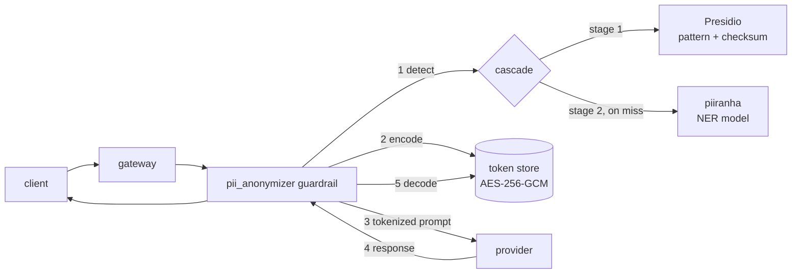

<div align="center">


**Sensitive data never leaves your boundary. The model still gets a sentence it can reason about.**

</div>

---

## The problem

Every useful LLM workflow ends with a person pasting something into a model they
do not control. A support ticket with a customer's IBAN. A `.env` file with a
live key. A patient note. Redacting it (`***`) destroys the shape of the text and
the model's answer with it. Not redacting it means the data is gone.

## What Anonymice does

Anonymice sits **between the user and the model** and swaps sensitive values for
typed, reversible tokens.

```
you type      Please email Anna Meier about invoice CH93 0076 2011 6238 5295 7
              ↓  detect + encode
model sees    Please email <PERSON_1> about invoice <IBAN_CODE_1>
              ↓  provider answers
model says    I've drafted a note to <PERSON_1> regarding <IBAN_CODE_1>.
              ↓  decode
you see       I've drafted a note to Anna Meier regarding CH93 0076 2011 6238 5295 7
```

The real values stay in a vault on our side of the boundary. The provider only
ever sees `<PERSON_1>`. The token is *typed*, so the model still knows a person is
a person and an IBAN is an IBAN — which is exactly what an opaque hash like
`a3f9c2e1` destroys.

Three properties hold throughout:

| | |
|---|---|
| **Reversible by us, opaque to them** | Only our layer can resolve a token back to a value |
| **Irreversible where we say so** | Entities marked `MASK` become a bare `<PERSON>` that the token grammar deliberately does not match — masking is irreversible by construction, not by remembering not to store the mapping |
| **Fail closed** | A detector we cannot reach is an error, never an empty result. "No PII found" from a scanner that is down is the one failure mode that silently leaks |

---

## Structure

```
anonymice/
├── code/
│   ├── engine/          the LLM proxy — an extension of LiteLLM
│   └── extensions/      where data is captured, before it reaches any model
│       ├── browser/     Chrome extension: highlight + tokenize on the page
│       ├── vscode/      VS Code extension: tokenize in the editor and on disk
│       └── backend/     detection service the extensions call
└── docs/                specs, endpoint contracts, QA walkthroughs
```

Two layers, one idea. The **extensions** catch sensitive data at the surfaces
people actually work in. The **engine** catches whatever reaches the API anyway,
and is what any application, agent, or SDK points at instead of the provider.

---

## The engine — an extension of LiteLLM

[`code/engine/`](code/engine/) is [LiteLLM](https://github.com/BerriAI/litellm)
(BerriAI, MIT) with a reversible PII layer added on top. We chose it because it
already solves the boring, unavoidable parts — 100+ providers behind one API,
virtual keys, budgets, rate limits, an admin dashboard, and a guardrail hook
interface that every request surface already routes through.

**Our additions are purely additive.** New packages, plus two lines in
`proxy_server.py`. Nothing upstream is rewritten, so tracking a newer LiteLLM
stays cheap.

| Path | What we added |
|---|---|
| [`litellm/pii/`](code/engine/litellm/pii/) | The core: detection, codecs, token stores, `PiiService`. Provider-agnostic, no `litellm.proxy` imports, unit-testable without a proxy |
| [`litellm/proxy/guardrails/guardrail_hooks/pii_anonymizer/`](code/engine/litellm/proxy/guardrails/guardrail_hooks/pii_anonymizer/) | The in-band guardrail: encode on the way to the provider, decode on the way back |
| [`litellm/proxy/pii_endpoints/`](code/engine/litellm/proxy/pii_endpoints/) | Standalone `POST /pii/detect`, `/pii/encode`, `/pii/decode` for the extensions |
| [`gateway/`](code/engine/gateway/), [`backend/`](code/engine/backend/) | Split entrypoints: the data plane and the admin plane trim the same app's route table to their own surface, so management endpoints do not ride on the pods that see prompts |

There is **one** implementation of detect / encode / decode — `PiiService`. The
guardrail and the REST endpoints are both thin adapters over it, so what a
browser extension gets from `/pii/encode` is by construction what an in-flight
completion gets.

### How a request flows



**Detection is two-staged.** Stage one is Presidio pinned to its pattern and
checksum recognizers — deterministic, no model, low latency, and it covers
~40 entity types including IBAN, credit card, AHV/NINO/SSN and the other national
identifiers. Stage two is
[`piiranha`](https://huggingface.co/iiiorg/piiranha-v1-detect-personal-information),
a token-classification model, for what patterns cannot catch: `PERSON`,
`LOCATION`, `ORGANIZATION`. `ner_stage_policy` decides when stage two runs —
the default, `on_miss`, only calls it when the rule stage found nothing, so most
requests pay only for the cheap pass.

Overlaps resolve deterministically: higher score wins, ties go to the rule stage,
then to the longer span.

**Encoding has two lifetimes**, deliberately different:

| | LLM path (guardrail) | Endpoint path (extensions) |
|---|---|---|
| Lives | one request | until the TTL expires |
| Store | request metadata, dies with the request | Redis-backed cache, values sealed with AES-256-GCM |
| Token | `<PERSON_1>` | `<PERSON:3f9c2e1b8d4a7f60>` |
| Why | short typed placeholders keep answer quality high | a random handle carries no information about the value, and deleting the entry kills the token permanently |

Per-entity actions are configurable: `BLOCK` rejects the request, `MASK` redacts
irreversibly, `ENCODE` is the reversible path.

Decode returns real data, so it is gated on the `allow_pii_decode` key permission
and scoped to the calling key — a valid `session_id` alone never reads another
key's tokens.

Full design: [`PII_ANONYMIZATION_PLAN.md`](code/engine/PII_ANONYMIZATION_PLAN.md)
and [`PII_CODEC_ARCHITECTURE.md`](code/engine/PII_CODEC_ARCHITECTURE.md).

---

## The extensions

Catching data at the API is necessary but late — by then someone has already
pasted it. These catch it at the surface.

### Browser — [`code/extensions/browser/`](code/extensions/browser/)

Every host has a trust class, distributed by managed policy:

| Class | Behaviour |
|---|---|
| `NATIVE` | Your own systems. Values stay as they are; sensitive spans are highlighted so people can see what they are about to copy |
| `TRUSTED` | Values are shown to the user but the DOM holds tokens |
| `UNTRUSTED` | Everything else. A pasted token stays a token; real values never enter the DOM |

Copying a highlighted value mints a token in the vault and puts *the token* on
the clipboard. Paste it into ChatGPT and the model gets `ANM1-PERSON-…`; paste it
back into a trusted system and it resolves.

### VS Code — [`code/extensions/vscode/`](code/extensions/vscode/)

One invariant: *a sensitive value is never present in any `TextDocument`, and
never in any file inside the workspace, at any instant.*

VS Code has no per-resource reader isolation — Copilot and agents attach to the
window, not the file — so the only place to enforce anything is the text itself.
`DB_PASSWORD=ANM1-SECRET-K3F9QW2MX7VBNC4H8` is what the completion provider, the
chat `#file` attachment, the agent's `read_file`, and the agent shelling out to
`cat` all see. You see the real value, rendered through a surface no other
extension can read back.

### Detection backend — [`code/extensions/backend/`](code/extensions/backend/)

`/v1/health`, `/v1/policy`, `/v1/detect` on one origin behind one bearer
credential. It receives raw page text and decides which pages get read at all, so
it sits inside the same trust boundary as the vault. That single constraint is
why it binds to loopback by default, refuses to start without a credential, has
**zero dependencies**, and cannot log page text — `log.ts` throws on a field name
that could carry it, so the rule is enforced rather than remembered.

Classes: `IBAN`, `AHV`, `CARD`, `EMAIL`, `PHONE`, `PERSON`, `ORG`, `SECRET`.

---

## Status

| Component | State |
|---|---|
| Engine — detection, codecs, stores, `PiiService` | Implemented, unit-tested |
| Engine — guardrail + `/pii` endpoints | Implemented |
| Engine — streaming decode | **Not wired.** The guardrail does not set `streaming_transform_mode = "incremental_diff"`, so SSE responses arrive still tokenized |
| Engine — persistent vault (DB table, revocation, audit) | Designed, not built |
| Browser — detection + highlighting (SPEC §1–§5) | Implemented, 68 unit tests, eval gate |
| Browser — clipboard, tokens, replacement (SPEC §6–§8) | Not built |
| VS Code — tokenize selection, on disk and in buffer | Implemented |
| Extensions ↔ engine wiring | **Not connected yet.** The extensions talk to `code/extensions/backend/`; the engine's `/pii/*` endpoints are the same contract and are where the two converge |

---

## Getting started

**Engine.** Detection tiers first, then the proxy:

```bash
docker compose -f code/engine/litellm/pii/deploy/docker-compose.pii.yml up -d
```

Then add the guardrail to your proxy config:

```yaml
guardrails:
  - guardrail_name: pii-anonymizer
    litellm_params:
      guardrail: pii_anonymizer
      mode: [pre_call, post_call]
      presidio_analyzer_api_base: http://localhost:3000
      pii_ner_api_base: http://localhost:8080
      pii_ner_stage_policy: on_miss
      pii_codec: placeholder
      pii_entities_config:
        CREDIT_CARD: BLOCK
        US_SSN: MASK
        PERSON: ENCODE
```

Set `LITELLM_PII_ENCRYPTION_KEY`, or stored values are not sealed at rest.

**Browser extension:**

```bash
cd code/extensions/browser && npm run check && npm run build
```

**VS Code extension:**

```bash
cd code/extensions/vscode && npm install && npm run check && npm run build
```

**Detection backend:**

```bash
cd code/extensions/backend && npm run dev
```

---

## Documentation

| Document | What |
|---|---|
| [`code/extensions/SPEC.md`](code/extensions/SPEC.md) | Trust classes and the copy/paste model |
| [`code/extensions/browser/SPEC.md`](code/extensions/browser/SPEC.md) | Browser extension design |
| [`code/extensions/vscode/SPEC.md`](code/extensions/vscode/SPEC.md) | Editor invariant and token format |
| [`docs/extensions/browser/ENDPOINTS.md`](docs/extensions/browser/ENDPOINTS.md) | The three-endpoint backend contract |
| [`docs/extensions/browser/DETECTION.md`](docs/extensions/browser/DETECTION.md) | Detection semantics |
| [`code/engine/litellm/pii/README.md`](code/engine/litellm/pii/README.md) | The PII layer, close up |
| [`code/engine/PII_CODEC_ARCHITECTURE.md`](code/engine/PII_CODEC_ARCHITECTURE.md) | Token format, encryption, the vault design |

---

## Licence

MIT, except `code/engine/`, which carries
[LiteLLM's licensing](code/engine/LICENSE): MIT for the project, with everything
under `code/engine/enterprise/` governed by the BerriAI Enterprise License.
