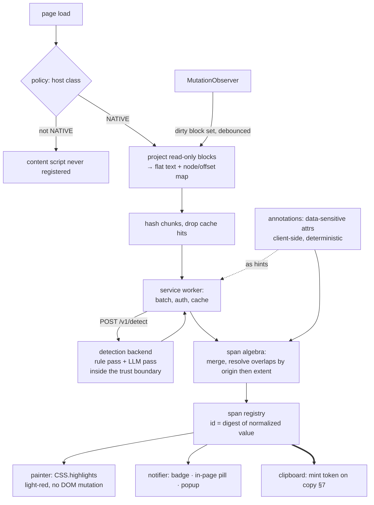
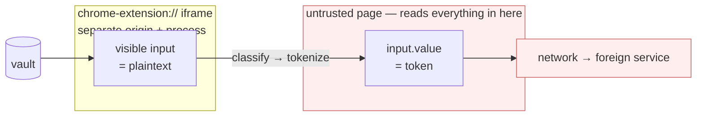
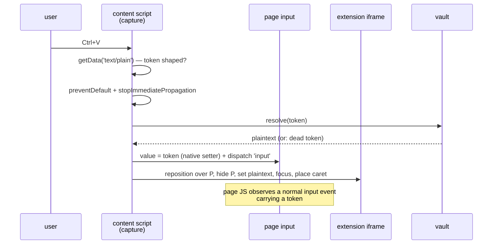

# Anonymice browser extension

One spec for the whole extension: how sensitive data is found on a page, shown
to the user, replaced by a token on its way out, and revealed again on its way
back in.

Merged from `docs/extensions/browser/DETECTION.md` and
`docs/extensions/REPLACEMENT.md`.

## Contents

- [0. Scope and settled decisions](#0-scope-and-settled-decisions)
- [1. Trust classes](#1-trust-classes)
- [2. Architecture at a glance](#2-architecture-at-a-glance)
- [3. Detection](#3-detection)
- [4. Highlighting](#4-highlighting)
- [5. Span registry](#5-span-registry)
- [6. Token format](#6-token-format)
- [7. Clipboard: the one decision point](#7-clipboard-the-one-decision-point)
- [8. Replacement: reading a value the page holds as a token](#8-replacement-reading-a-value-the-page-holds-as-a-token)
- [9. Verification](#9-verification)
- [10. Open](#10-open)

## 0. Scope and settled decisions

The product, end to end:

1. The extension classifies every host as `NATIVE`, `TRUSTED` or `UNTRUSTED`.
2. On `NATIVE` it finds sensitive data on the page, tells the user it is there,
   and paints it light-red.
3. Copying a highlighted value mints a token (`ANM1-PERSON-…`) in the vault and
   puts the **token**, not the value, on the clipboard. A partial copy mints a
   child of the parent token.
4. Pasting a token into an `UNTRUSTED` or `TRUSTED` field leaves the token in the
   page's input and shows the user the real value through a surface the page
   cannot read.

Everything downstream of detection — clipboard, tokens, vault, replacement —
consumes the **span registry** (§5). Nothing downstream re-reads the DOM.

Tracked as [#1](https://github.com/ma-abdellaoui/anonymice/issues/1).

| Decision | Choice | Why |
|---|---|---|
| Where we scan | **`NATIVE` only**, for now | Smallest surface that proves the flow; `TRUSTED` highlights too in target state, behind a policy flag |
| Editable regions | **Never touched on `NATIVE`** | Read-only regions only — no inputs, no textareas, no contenteditable. Removes the caret-exemption problem entirely |
| How much we highlight | **Everything detected**, no cap or clustering | A partial highlight is a false assurance; the user must see the whole footprint |
| Who detects | **Three layers** — markup annotations (client), rule pass and LLM pass (both backend) | Annotations are DOM facts the backend cannot see; both *guessing* passes stay server-side so there is exactly one guessing authority |
| Site annotations | **`data-sensitive` attributes in the markup** (§3.4) | The page already knows what the backend can only infer. Annotations only ever *add* spans, never suppress them |
| Paint mechanism | **CSS Custom Highlight API** | Zero DOM mutation — the copy path depends on selection geometry staying untouched |
| Token format | **Committed: `ANM1-CLASS-…`, Tier A by default** (§6) | Tokens outlive every process that made them; a later change is a data migration plus undecodable artifacts in other people's hands |
| Reveal mechanism | **Clone in a `chrome-extension://` iframe, mounted on paste** (§8) | The only rendering surface the page cannot read; lazy mount gives the correct failure direction |
| Token scope | **Source-scoped at copy, re-scoped at paste** (§6.3) | The clipboard has no reader identity, so the destination is unknowable at copy time; the paste handler is the first moment it is known |
| Subject identity | **Mechanical normalisation only, never entity resolution** (§5.1) | Over-merging resolves a token to the wrong person's data, silently; under-merging costs a join. Only one of those is unrecoverable |
| Declassification | **Silent when the new value shares nothing with the old, refused when it is a fragment of it** (§8.5) | A modal on every edit trains click-through; a fragment written through is the typed-prefix leak by another route |

## 1. Trust classes

Note the sense of `TRUSTED`: it is the class we are willing to *show real
values to*, not the class we let hold them.

| Class | What is in the DOM | Highlight | Paste behaviour |
|---|---|---|---|
| `NATIVE` | the real values, untouched | yes | n/a — nothing is ever rewritten here |
| `TRUSTED` | the page holds the **token**; the user sees the real value through a clone | yes | on sensitive paste, clone the target element, show the real value in the clone, keep the original hidden and carrying the token. For inputs, propagate to the original with sensitive data replaced by tokens |
| `UNTRUSTED` | the token, literally | n/a | paste inserts the token as-is; real values never enter the DOM |

**`NATIVE`** is the source of truth. We leave every value exactly as it is and
only highlight. We do not touch editable regions at all.

**`TRUSTED`** is the interesting one: the site must never receive real values,
but the user must still be able to read them. Hence the clone — the visible
element carries plaintext, the element the page actually reads carries the
token, so anything the site stores or submits is tokenised. Risks to work
through on that path: a framework re-render discarding the clone, the site's own
validation running against token text, copy-out-of-clone needing
re-tokenisation, and accessibility labels pointing at the hidden original. §8
covers the mechanism; §8.8 is the honest cost list.

**`UNTRUSTED`** gets no decoration and no clone by default. The token *is* the
content — with the one exception of a paste the user needs to read back (§8).

The trust list is distributed via `chrome.storage.managed` and is not
user-editable. The managed policy may carry the list outright, or carry an
**enrollment** — a policy endpoint, a credential, and the detect origin — and
let the extension pull the current lists from `GET /v1/policy`. The pull is a
delegation of the administrator's list, never a replacement: managed values
still outrank it, it cannot move the detector off the pinned origin, and every
pattern is validated before it can become a match pattern. The contract, the
precedence rules and the failure semantics are in
[docs/extensions/browser/ENDPOINTS.md](../../../docs/extensions/browser/ENDPOINTS.md)
§2.

**Gate before reading:** content scripts are registered dynamically (`chrome.scripting.registerContentScripts`) with `matches` built
from the class lists, rather than `<all_urls>` plus an early return. On a host
in no list the extension never touches the page at all — a property that can be
demonstrated, not just asserted.

**Three registration profiles, not one.** `NATIVE` and `TRUSTED` hosts get the
content script from the class lists. `UNTRUSTED` hosts get **nothing by
default** — the token pastes as-is, no extension code runs, and the promise
above holds literally. The reveal path of §8 is the one exception, and it is
opt-in per host: the user activates it from the popup, the extension requests
that host's permission, and only then is a paste handler registered there. An
`UNTRUSTED` host the user never activated behaves exactly as the table says —
token in, token stays, extension absent.

**When `TRUSTED` highlighting turns on** is a flag with three positions,
`policy.scan.trusted`, not a date:

- `off` (today) → `readonly` once the `NATIVE` eval gate is green (§9) and the
  corpus carries `TRUSTED`-shaped fixtures that pass it. `readonly` runs exactly
  the `NATIVE` algorithm over read-only regions and skips every editable, so it
  ships no new painting machinery.
- `readonly` → `full` only once the overlay painter (§4) has its own perf
  assertion, because `full` means painting inside `<input>` and `<textarea>`,
  which the Custom Highlight API cannot do. That limitation, not policy, is what
  makes `full` the later step.

On `TRUSTED` the highlighter runs over what the user sees — the clone's contents
— while the page's own nodes hold tokens, so a token is never painted as though
it were a value. Tracked as
[#7](https://github.com/ma-abdellaoui/anonymice/issues/7).

## 2. Architecture at a glance



The tail of that flow — a token on the clipboard, pasted somewhere else — is
§8:



## 3. Detection

### 3.1 Backend placement and authority

**Placement is a constraint, not a deployment detail.** The detector sees raw
page text, so it must sit inside the same trust boundary as the vault. A
detection service outside that boundary would leak exactly the data it exists to
protect. It is `NATIVE`-class infrastructure by definition.

**Who calls it.** Content script → service worker → backend. The content script
never fetches directly: the worker holds the credential, owns the cache, and
coalesces every tab into one connection instead of a per-tab storm.

**Authority.** Both guessing passes — the deterministic **rule pass** (regex +
checksums) and the probabilistic **LLM
pass** — run on the backend, and the backend is authoritative for everything it
guesses. Two guessers in two places would let the highlight and the clipboard
token disagree, which is the one inconsistency this product cannot have. The
client contributes exactly one thing the backend cannot see: markup annotations
(§3.4). The rule table may be mirrored client-side behind a flag as a latency
optimisation — enabled only if the eval shows it agrees with the backend span
for span.

Tracked as [#8](https://github.com/ma-abdellaoui/anonymice/issues/8).

### 3.2 Protocol

```http
POST /v1/detect
Authorization: Bearer <from managed policy, attached by the service worker>
```
```json
{
  "policyVersion": "2026-08-01",
  "locale": "de-CH",
  "hostClass": "native",
  "chunks": [
    {
      "id": "c1",
      "hash": "sha256:9f2b…",
      "text": "Kunde Anna Meier, IBAN CH93 0076 2011 6238 5295 7",
      "hints": [
        { "start": 6, "end": 16, "cls": "PERSON", "origin": "annotation" }
      ]
    }
  ]
}
```

```json
{
  "modelVersion": "det-3.2",
  "policyVersion": "2026-08-01",
  "chunks": [
    {
      "id": "c1",
      "hash": "sha256:9f2b…",
      "spans": [
        { "start": 6,  "end": 16, "cls": "PERSON", "normalized": "Anna Meier",          "origin": "model" },
        { "start": 23, "end": 44, "cls": "IBAN",   "normalized": "CH9300762011623852957", "origin": "rule"  }
      ]
    }
  ]
}
```

- **Offsets are UTF-16 code units** over NFC-normalised text — what
  `String.prototype.slice` uses. A backend counting codepoints desynchronises on
  the first emoji or astral character. The backend converts; the client does
  not.
- `hash` is SHA-256 of the NFC-normalised chunk text. It does three jobs: cache
  key (together with `modelVersion` + `policyVersion`), response-to-chunk
  binding, and **staleness guard** — the client re-hashes the chunk before
  painting and discards the response if the text changed while in flight.
- Chunks whose `(hash, modelVersion, policyVersion)` is already cached are never
  sent. The cache lives in the service worker, survives navigation, and is a
  bounded LRU.
- **Determinism is part of the contract**: same text + same versions ⇒ same
  spans. `spanId` digests depend on it, and so does the normalisation table in
  §5.1, which the backend applies before returning `normalized`.
- A span may carry an optional `subjectHint`: an opaque grouping id meaning
  "these spans probably denote the same subject". It is advisory, never
  consulted when minting or resolving a token (§5.1), and may be absent.
- Batching: one request per idle tick, viewport chunks first. Caps on chunk
  size, chunk count, and total bytes; `413` tells the client to re-split.
- Only text projections leave the browser — never page HTML, URLs, or cookies.
  `hints` are the one structural signal that crosses: annotation spans (§3.4),
  sent so the passes need not re-derive what the markup already stated. They are
  advisory — the backend may return spans that overlap or ignore them, and the
  client merges by precedence regardless.
- **Failure semantics.** Retry with backoff, then circuit-break. On `NATIVE` a
  failed detection degrades to "not scanned" and *says so* in the badge —
  silence would read as "nothing sensitive here". On the `TRUSTED` /
  `UNTRUSTED` paste paths the same failure fails **closed**: unresolved content
  is treated as sensitive.
- Optional later: NDJSON streaming so the viewport paints before the tail of the
  page comes back.

### 3.3 Three layers, one merge

| origin | runs | nature |
|---|---|---|
| `annotation` | client, from the DOM | deterministic — the page states it |
| `rule` | backend | deterministic — regex + checksum (IBAN mod-97, Luhn, AHV) |
| `model` | backend | probabilistic — LLM over the chunk |

Every span carries its origin:

```
{ start, end, cls, value, normalized, origin: 'annotation' | 'rule' | 'model' }
```

**No confidence on the wire, and none in the registry.** A span exists or it
does not. The LLM pass is probabilistic internally, but that is the backend's
problem: it decides its own bar and returns only spans it stands behind. A score
travelling to the client would just relocate the same decision into the
extension and give two authorities two answers.

**Merge rule.** Precedence is `annotation` > `rule` > `model`, then extent. On
an overlap the **class comes from the higher-precedence origin**, but the
**extent is the union** — a span is never narrowed by a higher-ranked one. That
is deliberate and fail-closed: over-highlighting costs a glance,
under-highlighting costs the promise. An ambiguous partial overlap therefore
widens; it never narrows.

The three layers are additive, never subtractive. No layer can veto another —
see the security note in §3.4.

Tracked as [#3](https://github.com/ma-abdellaoui/anonymice/issues/3).

### 3.4 Site annotations

**Settled: attributes in the markup.** The site labels its own sensitive
elements and we read the label:

```html
<span data-sensitive="PERSON">Anna Meier</span>
<td   data-sensitive="IBAN">CH93 0076 2011 6238 5295 7</td>
<span data-sensitive>internal case note</span>   <!-- class unknown -->
```

A selector manifest — config mapping `.customer-name` → `PERSON` for sites we
cannot edit — is **not** built. It buys coverage on third-party apps at the cost
of config that breaks silently whenever a vendor renames a class, and the rule
and LLM passes already cover those pages. Reconsider only if a specific `NATIVE`
host proves un-annotatable.

**Reading them.** Annotation spans are produced client-side during projection:
the annotated element's text extent maps through the node/offset map to chunk
offsets, exactly like any other span. Nested annotations resolve
innermost-first. The attribute value must name a class from the vocabulary; a
bare `data-sensitive` with no value means *sensitive, class unknown* and gets
the generic token prefix rather than being dropped.

**Annotations never suppress.** There is no `data-sensitive="none"` and no way
for markup to mark a region as safe. The layers are additive (§3.3), so a page
can only ever cause *more* to be highlighted, never less. This is what makes
reading attributes off a page safe to keep doing if scanning is later enabled on
`TRUSTED`, where the markup is not fully under our control: the worst a hostile
page achieves is a false positive.

**They do not replace guessing.** Annotation coverage is a bonus, not a
precondition — an un-annotated `NATIVE` page must still detect at full quality
through the rule and LLM passes. The eval enforces this by running the whole
corpus twice, with annotations and with them stripped.

### 3.5 Scheduling, skipping, budget

- Chunk by block container, not one body-wide projection, so a mutation
  re-scans a subtree and only cache-missing chunks reach the network.
  Projection must handle entities straddling inline elements
  (`<b>Anna</b> Meier`) and collapse source whitespace without losing the
  offset map back to the original nodes.
- MutationObserver → debounce → dirty set → `requestIdleCallback` with
  time-slicing; viewport first via IntersectionObserver.
- Per-node cache keyed by text hash: re-renders that change nothing cost
  nothing, locally and on the wire.
- Never scan on `NATIVE`: **any editable region** (input, textarea,
  contenteditable), password fields, `script` / `style` / `code`, and our own UI
  (closed shadow root).

## 4. Highlighting

```js
CSS.highlights.set('anonymice-sensitive', new Highlight(...ranges));
// ::highlight(anonymice-sensitive) { background-color: #ffdada; }
```

Zero DOM mutation, so `getSelection().toString()` is identical to the untouched
page — which is what the partial-copy step depends on. One `Highlight` object
holds all N ranges, so "highlight everything" costs one registry entry
regardless of count.

Constraints, known up front:

- Only paint properties apply (`color`, `background-color`, `text-decoration`,
  shadows). No radius, no padding — a light-red fill is expressible, a rounded
  chip is not.
- Does not reach inside `<input>` / `<textarea>` — irrelevant on `NATIVE`, where
  we skip editables anyway, but it will matter for `TRUSTED`.
- Ranges into open shadow roots work, but the `::highlight()` rule must exist in
  that tree — inject via `adoptedStyleSheets` per root.
- Ranges go stale on mutation; the registry revalidates rather than trusting
  them.

Support: Chrome 105+, Safari 17.2+, recent Firefox. Fallback backend paints
absolutely-positioned rects from `Range.getClientRects()`, repositioned on
scroll and resize. Both sit behind one `paint(spans)` interface.

Because we highlight everything, a page can end up mostly red. A global
dim/undim toggle (one `CSS.highlights.delete`) keeps the page readable without
discarding what was detected.

Painter is [#4](https://github.com/ma-abdellaoui/anonymice/issues/4); the badge
/ pill / popup notifier is
[#6](https://github.com/ma-abdellaoui/anonymice/issues/6).

## 5. Span registry

The durable artifact. Highlighting is the visible half; this is the half the
clipboard step consumes.

```
spanId → { cls, value, normalized, ranges[], origin, token? }
```

`spanId` is a **deterministic digest of `normalized`**, never a counter — so the
same value in two places on a page, or in two tabs, collapses to one entry.

**The registry is keyed by value, not by occurrence.** One entry is one real
value; the page may show it in six places.

| field | what it is |
|---|---|
| `cls` | the class — `PERSON`, `IBAN`, `CARD`… Decides the token's class label (§6.4) and comes from the highest-precedence origin that matched |
| `value` | what the page literally displays, in the first occurrence's formatting — `"CH93 0076 2011 6238 5295 7"`. This is what the user sees and what a plaintext copy would have produced |
| `normalized` | the canonical form of the same value — `"CH9300762011623852957"`. Its digest **is** `spanId`, so two occurrences formatted differently collapse into one entry and one token. Structured classes normalise mechanically (strip separators, upper-case); `PERSON` needs entity resolution and is the open question — whether `"MEIER, Anna"` normalises onto `"Anna Meier"` decides whether they share a token |
| `ranges[]` | the live DOM locations of every occurrence: `Range` objects, each `(startNode, startOffset) → (endNode, endOffset)`. Plural because one value appears many times on a page. They do three jobs: they are handed straight to `new Highlight(...ranges)` to paint, they map a user selection back to *which* value was copied, and they are what goes stale when the page mutates — hence the revalidation pass |
| `origin` | which layer produced it — `annotation` (the markup said so), `rule` (backend regex + checksum), `model` (backend LLM). Drives merge precedence, per-origin eval reporting, and answering "why is this red?" With confidence gone, origin is the only ordering signal left |
| `token?` | optional because **tokens are minted lazily**. Detection is read-only — highlighting a value writes nothing to the vault. The token appears only once the user actually copies that value and the vault mints one. Absence means "not copied yet", never "unknown": `spanId` is deterministic, so the entry can always be looked up again later. This is what keeps a page of 400 highlights from creating 400 vault entries nobody asked for |

Tracked as [#5](https://github.com/ma-abdellaoui/anonymice/issues/5).

### 5.1 Normalisation is mechanical, never inferential

`normalized` decides identity: two occurrences with the same `normalized`
collapse to one entry, one `spanId`, and therefore one token. The rules are
fixed, and the backend applies them before returning a span so client and
backend agree character for character.

Every class, first: NFKC → strip zero-width and format characters
(U+200B–U+200F, U+00AD, U+FEFF) → collapse whitespace runs to one space → trim.

| class family | then |
|---|---|
| structured (`IBAN`, `CARD`, `AHV`, `PHONE`) | strip separators (space, hyphen, dot, parentheses) and upper-case; `PHONE` to E.164 where the country is known |
| `EMAIL` | lower-case the domain only. The local part stays byte-exact — case is significant there and `+tag` addresses are different addresses |
| free text (`PERSON`, `ADDR`, `ORG`) | case-fold, and **nothing else** |

**No entity resolution.** `"MEIER, Anna"` does **not** normalise onto
`"Anna Meier"`. They get two entries and two tokens, and that is the correct
outcome, because the two failure directions are not symmetric:

- **Over-merge** — two subjects collapse into one token, which later resolves to
  the wrong person's data in a document that gives no sign anything went wrong.
  Silent, and unrecoverable once the document is sent.
- **Under-merge** — one subject holds two tokens. A reader loses the join
  between them and the vault holds a row too many. Visible, and cheap.

So: no reordering across a comma (`"Meier, Anna"` may be a two-name list, not an
inversion), no diacritic folding (`Muller` and `Müller` are different names, and
folding is locale-hostile), no initial expansion, no nickname tables. Only
transformations that cannot change *which string a human would read* are applied.

**Subject links carry the fuzzy half.** The vault may record that two value
records probably denote the same subject — from the backend's optional
`subjectHint` (§3.2), or from the user linking them by hand. A link is
**advisory and never consulted when minting or resolving**. It drives exactly
two things: grouping in the popup ("4 values for this subject") and optional
revocation fan-out when the user revokes a subject rather than a value. A wrong
link therefore costs a mis-grouped list, never a mis-resolved value.

### 5.2 `spanId` is not a token

`spanId` is a digest of plaintext and therefore brute-forceable by whoever holds
it. It never leaves the browser and is never emitted. The token core is CSPRNG
and scoped (§6.3), so one `spanId` may hold several tokens over its life — the
entry's `token?` field is really a small map:

```
tokens?: { [scopeId]: tokenId }
```

Minting is `vault.mint({ normalized, cls, scope })`. The vault derives its
internal value index `HMAC-SHA256(k, normalized)`, finds or creates the **value
record**, then finds or creates that record's **alias for the scope**, and
returns the alias. `spanId` is the page's key, the value index is the vault's,
and the two never meet: neither the index nor `k` leaves the vault, and `spanId`
never enters it.

## 6. Token format

Not deferrable, and settled here rather than left to the clipboard
implementation. The format determines the detection strategy on paste (§8.3),
and tokens outlive every process that made them — they sit in vaults, in other
people's documents, and on clipboards that survive the browser session. Changing
it later is a data migration plus a population of undecodable artifacts held by
people who do not have our vault.

### 6.1 Decision

**One identity core, two encodings.**

| | Tier A — *labelled* | Tier B — *format-preserving* |
|---|---|---|
| Looks like | `ANM1-PERSON-K3F9QW2MX7VBNC4H8` | `k3f9qw2m@example.org` |
| Carries | full global token id | short scoped handle |
| Lifetime | durable, resolvable anywhere | scoped to (origin, session) |
| Detection | regex, synchronous | vault lookup on normalized value |
| Used when | default, always | destination validation rejects Tier A **and** a reserved range exists for the class |

Both resolve to the same vault entry. Tier B is an *encoding of last resort*,
not a parallel scheme.

**MVP emits Tier A for every class except `EMAIL`.** Any other field that
rejects Tier A is blocked with an explanatory message rather than
format-preserved. This commits the format without committing us to building
seven encoders.

### 6.2 Why two tiers rather than one

The two requirements are arithmetically incompatible.

Tier A must be *recognisable*: a sigil the destination would never produce,
carrying enough entropy to be a global key. Tier B must be *invisible*: a
syntactically valid instance of the class, checksum and all, because the field
validates it.

Capacity settles it. A Swiss IBAN has 12 alphanumeric account characters ≈ 62
bits, minus whatever a marker consumes. A 16-digit card is 16 digits minus the
BIN minus the Luhn check ≈ 30 bits. A national phone number is worse. There is
no single width that both survives an IBAN field and stays globally unique.

So Tier B carries a **handle unique within (origin, session)** — enough to tell
apart the handful of tokens live in one form at one time — and Tier A carries
the **global id**. That split is forced by the arithmetic, not chosen, and it
has a consequence worth stating plainly: *format-preserving tokens are not
durable*. Paste one into a document, come back next week, and there is nothing
left to resolve it against. Tier A is the only encoding safe to let escape into
an artifact.

### 6.3 The identity core

- **80 bits, from a CSPRNG.**
- **Never derived from the plaintext.** Not `HMAC(value)`, not a truncated hash,
  nothing. Swiss AHV numbers occupy a space of roughly 10⁹ and about 9×10⁶ are
  issued; any deterministic function of the value is brute-forceable in seconds
  by whoever holds the tokens. Where we need a value→token index for dedupe,
  that index is `HMAC-SHA256(k, NFKC(value))` stored **inside** the vault, with
  `k` never leaving it. The index is not the token.
- **Stable within a scope, fresh across scopes.** The same customer pasted twice
  into one conversation gets one token; the same customer pasted into a
  different conversation next week gets a different one. Globally stable tokens
  would let an untrusted destination correlate a subject across sessions, which
  is the leak we are here to prevent. Scope is bound in two stages, below.

**Two stages, because the destination is unknowable at copy time.** The
clipboard has no reader identity (§7): when we mint on copy, no destination
exists yet.

| stage | scope | what carries it |
|---|---|---|
| copy | `(source origin, session)` | the **clipboard token** — Tier A, durable, the only encoding that escapes into artifacts |
| paste, where our handler runs | `(destination origin, session)` | a second alias, substituted into the field in place of the clipboard token |

On a `TRUSTED` host — or an `UNTRUSTED` host the user has activated (§1) — the
paste handler of §8.3 already rewrites the field, so it writes the
destination-scoped alias and the clipboard token never lands in the page. Where
no handler runs, the clipboard token lands as-is and destination scoping is not
achieved. That is a stated degradation, not a silent one, and it is bounded:
both aliases point at one value record, so revocation and TTL cover them
together.

**`session` is defined vault-side and per scope**, so it is testable rather than
folkloric. An alias is reused while it was last used less than `T_idle` ago
(default 12 h) *and* was minted less than `T_max` ago (default 7 d); otherwise
the next mint issues a fresh one. Locking the vault, signing out, or choosing
*new session* ends every session immediately. All three are managed-policy
settings.

### 6.4 Tier A grammar

```
ANM1-PERSON-K3F9QW2MX7VBNC4H8
└┬─┘ └─┬──┘ └───────┬───────┘
 │     │            └─ 16 chars payload (80 bits) + 1 check char
 │     └─ class label, [A-Z]{2,10}, from a closed list
 └─ namespace + format version
```

**The closed list.** `PERSON`, `IBAN`, `CARD`, `AHV`, `PHONE`, `EMAIL`, `ADDR`,
`ORG`, `SECRET`, `UNKNOWN`. `SECRET` is credential material — passwords, API
keys, private keys — and is Tier A only, since §6.5 finds no reserved range to
format-preserve against. `UNKNOWN` is an annotation that stated no class.

The list is part of the format, not of the detector: the label sits inside the
token and both extensions resolve against one vault, so it is duplicated
verbatim in `browser/src/lib/types.ts` and `vscode/src/lib/types.ts` and changed
in both together. **Writers emit only labels from this list; readers accept any
well-formed `[A-Z]{2,10}`** and report the label as unrecognised rather than
rejecting the token — same asymmetry as the sigil versions in §6.6, and for the
same reason: a reader that rejects what a newer writer emitted is what turns an
addition into an artifact graveyard.

- **Alphabet: Crockford base32** (`0-9 A-Z` minus `I L O U`). Chosen for four
  properties we actually need: no visually confusable characters, no accidental
  profanity, case-insensitive decode, and **hyphens ignored on decode** — so a
  line-wrap or an editor inserting a separator does not destroy the token.
- **Check character** is one symbol from the same 32-symbol alphabet. Its job is
  *error messaging*, not integrity — it distinguishes "this is a mangled token"
  from "this is not a token", so a truncated paste produces a useful message
  instead of a silent miss. The vault lookup is the real integrity check.
- **Length 29 characters.** Deliberately under 30 so it survives hard-wrapped
  email bodies and most `maxlength` attributes that permit it at all.
- **ASCII only.** No delimiter-decorated forms such as `⟦PERSON·a3f2⟧`.
  Non-ASCII delimiters are mangled by NFKC normalization, render as tofu in
  fields with a restricted font stack, are stripped by charset-limited inputs,
  count unpredictably against `maxlength` in UTF-16 units, and cannot be retyped
  by a user trying to recover from a failure.
- **No bracket delimiters.** `[[…]]` is wiki-link syntax and markdown-adjacent;
  `{{…}}` is template syntax and risks being *interpreted* by a destination that
  templates user input; `<…>` is stripped or escaped as markup. A bare
  hyphenated word survives markdown, HTML, JSON, CSV, URL paths, shells and
  email without a delimiter to mangle.

Detection, run in the paste handler before deciding whether to
`preventDefault()`:

```js
/\bANM1-[A-Z]{2,10}-[0-9A-HJKMNP-TV-Z]{17}\b/gi
```

Synchronous and cheap. Confirm every hit against the vault: the sigil plus check
character makes natural collisions negligible, but a hit on documentation
containing an example token must not mount a clone.

**Normalize before matching:** NFKC, strip zero-width characters, uppercase,
drop hyphens inside the payload. Rich editors inject `&zwnj;` and non-breaking
hyphens on copy-paste; without normalization those are silent detection
failures.

### 6.5 Tier B: the reserved-range rule

**A class may be format-preserved only if a reserved, never-issued range exists
for it.** Otherwise a generated token is a syntactically valid identifier that
may belong to a real person, and we have converted a privacy control into a
data-integrity hazard.

| Class | Format-preserve? | Reasoning |
|---|---|---|
| `EMAIL` | **yes** | RFC 2606 reserves `example.org`; guaranteed unissued. `k3f9qw2m@example.org`. Prefer `.invalid` only where the validator accepts unknown TLDs |
| `PHONE` | yes, per country | reserved drama ranges exist (US `555-01xx`, UK Ofcom blocks). No reserved range for that country ⇒ no Tier B |
| `IBAN` | yes, with care | pick a bank clearing number unassigned in the published national registry; mod-97 check computed over it. Collision zero by construction |
| `CARD` | **no** | no reserved BIN exists. A valid-Luhn number in an assigned BIN may be a real card, and emitting one into an untrusted payment flow risks a transaction against a stranger. Block the field instead |
| `AHV` | **no** | the `756` prefix is fixed and roughly 1% of the structurally valid space is issued. A fake collides with a real person about one time in a hundred |
| `PERSON`, `ADDR`, `ORG` | n/a | no format validation to satisfy; Tier A works |

Where the answer is **no** and the destination rejects Tier A, the field is
blocked and the user is told why. That is the correct failure: refusing to fill
a field is recoverable, minting a stranger's national identity number is not.

### 6.6 Versioning

The `ANM1` prefix is the whole migration story.

- **Writers emit exactly one version.** Currently `ANM1`.
- **Readers accept every version ever emitted, forever.** A dropped reader
  version is what turns a format change into an artifact graveyard.
- A new version bumps the sigil. Old tokens keep resolving; nothing is
  rewritten.

This is why the format can be committed now without the commitment being
irreversible — the cost of being wrong is one more branch in the reader, not a
migration.

### 6.7 Lifetime, expiry, and dead tokens

The clipboard outlives the vault: a token copied at 17:00 is pasted into a
document at 09:00 the next morning, or read out of someone else's file next
year. A resolution failure must therefore be *legible* — class, age, origin —
and never a bare "unknown".

**Retention.** A value record lives `T_retain` from its last successful resolve
— rolling, so a token in active use cannot die mid-workflow while abandoned ones
age out. Default 90 days, managed-policy setting. Revocation is immediate and
independent of that clock.

**Tombstones are what make a dead token legible.** When a record expires or is
revoked, the plaintext *and* the value index are destroyed and a tombstone
remains: `tokenId → { cls, mintedAt, sourceOrigin, state, endedAt }`. It holds
no plaintext and cannot be reversed into one, so keeping it costs nothing we
care about. Tombstones outlive records — default one year — after which the
token degrades to the "another vault" row below, which is still class-legible
from the string itself.

| what the reader has | what we can say | shown as |
|---|---|---|
| live record | everything | the value |
| tombstone, expired | class, minted-at, source origin, expiry | "IBAN copied from crm.example on 3 Mar — expired 1 Jun" |
| tombstone, revoked | class, minted-at, revoked-at | "revoked on 12 May" |
| well-formed, no record, no tombstone | class and format version, read out of the token itself | "a PERSON token from another vault or profile" |
| check character fails | class label if it survived | "this looks like a damaged token — it may have been truncated" |

The last two rows are why Tier A is self-describing (§6.4), and why Tier B is
explicitly not durable (§6.2): a format-preserving token that outlives its scope
has nothing to say for itself, which is exactly why it never escapes into an
artifact.

**Warning before death.** A resolve within `T_warn` of expiry (default 7 days)
reveals the value *and* states the expiry date; the popup lists live tokens with
their clocks. We cannot extend the life of a token for a paste we never see —
that is the residual the warning exists to soften.

## 7. Clipboard: the one decision point

**The clipboard has no reader identity.** One buffer, no caller attribution, no
per-destination views. Whatever we put on it is what *every* consumer gets — the
untrusted page, a native app, a clipboard manager syncing to a vendor cloud. A
copy-time decision is therefore a decision for all destinations at once, made
before any of them is known. This is why sanitisation happens at copy: it is the
only point where one decision covers every subsequent reader.

Consequences that bind the rest of the spec:

- A copy that intersects any registry range is sanitised. The registry's
  `ranges[]` map the selection back to *which* value was copied (§5); the DOM is
  never re-read at copy time.
- A **whole-value copy** mints (or reuses, within the copy scope) the token for
  that entry. A **partial copy** mints a **child** of that token — same lineage
  and revocation as an edit-time child (§8.4).
- What goes on the clipboard is the **source-scoped** alias (§6.3). It is the
  encoding that must survive an unknown destination, so it is always Tier A and
  always durable; the destination-scoped alias is minted later, by the paste
  handler, if one runs.
- The token is written as `text/plain`. A custom clipboard flavour may
  additionally carry provenance for our own paste handler, but nothing may
  depend on it surviving: flavours are dropped by most destinations, which is
  precisely why Tier A must be regex-detectable from plain text alone.
- Because the painter mutates no DOM (§4), `getSelection().toString()` is
  exactly what an unhijacked copy would have produced — the sanitiser operates
  on the true selection, not on a decorated approximation.

## 8. Replacement: reading a value the page holds as a token

How the user sees a real value in a field whose value the untrusted client reads
as a token.

The claim elsewhere in this spec is that the untrusted client's own JavaScript
never sees the plaintext. That claim is cheap to keep if the user never needs to
see the plaintext either — tokens go in, tokens stay. This section covers the
case where they do: the user is looking at a form field and needs to read,
confirm, or correct the value that the field is standing in for.

### 8.1 The platform constraint

**An isolated world is not an isolated DOM.** Content scripts get separate
globals and separate prototypes. They share the document tree. Anything we
render into the page is readable by the page:

| Surface | Page-readable? | Note |
|---|---|---|
| text node, `innerText`, `value` | yes | also via a `MutationObserver` installed at `document_start` |
| attribute, `data-*` | yes | |
| CSS `::before/::after { content }` | yes | `getComputedStyle(el, '::after').content` returns it |
| closed shadow root | mostly not | encapsulation, never designed as a confidentiality boundary; a page that patched `attachShadow` before us holds the root |
| `chrome-extension://` iframe | **no** | separate origin, same-origin policy, usually a separate process |

So the plaintext cannot be written into the page in any form. The only rendering
surface that holds is one the browser itself isolates.

**Invariant:** the page's input holds a token at every instant — before the
paste, during the edit, at submit. There is no window in which it holds
plaintext, a fragment of plaintext, or anything whose length or shape is derived
from the plaintext.

### 8.2 Why a clone and not an overlay

Two ways to show the user something other than what the field contains.

**Paint over it.** Position plaintext on top of the token and let the real input
keep focus. The caret, selection, arrow keys, wrapping and IME all operate on
the *token's* geometry while the user sees the *value's* — 13 characters against
21. Every text-editing affordance desyncs. This is a permanent bug farm and we
are not doing it.

**Clone into an iframe.** A genuine `<input>` in a `chrome-extension://`
document, holding the genuine value, positioned over the hidden real field.
Caret, selection, double-click-to-select-word, undo, RTL and IME are all
natively correct, because there is a real value for the browser to operate on.
The length mismatch stops being a caret problem and becomes a sync problem,
which we solve by re-tokenizing the whole value rather than mapping characters.

This is the hosted-field pattern — Stripe Elements, Adyen, Braintree — run with
the trust direction reversed. It is proven, and it is expensive; §8.8 is honest
about how expensive.

### 8.3 Mount on paste, not on load

Cloning every input on every untrusted page is where this design dies. We mount
lazily, triggered by a paste that we can prove is one of ours.

This narrowing is not just economy — it removes two failure modes outright:

- **No typed-prefix leak.** Paste is atomic. We classify a complete value.
  Mirroring a value as it is *typed* would hand the page `C`, `CH`, `CH93`, … —
  none of which classify, all of which reassemble into the secret.
- **No autofill hazard.** Chrome's address and password autofill target the real
  input and would drop plaintext straight into the page tree. Autofill is not a
  paste, so it never reaches this path. Suppress it on fields we manage.

**Detection.** `getData('text/plain')` is synchronous, so the decision is made
before we commit to `preventDefault()`. Tier A regex first (§6.4),
vault-lookup-by-value as the Tier B fallback, both confirmed against the vault.
The vault confirmation disambiguates the false positive where someone pastes
documentation that happens to contain a token-shaped string; not in the vault,
no clone.

**Sequence.** Pre-warm one hidden iframe per page at load and reuse it. Mounting
cold inside a paste handler is where the visible glitch comes from;
repositioning a warm frame is one frame.



`stopImmediatePropagation()` is load-bearing and separate from
`preventDefault()`. The latter only suppresses the browser's default insertion;
without the former, a page handler still on the propagation path receives a live
`ClipboardEvent` and calls `getData()` itself.

**Rules that keep the scope honest:**

- **Empty-field or full-replace pastes only.** Pasting into the middle of
  existing content means reconciling mixed state — some typed plaintext, some
  previously tokenized. Fall back to a plain tokenized paste with no reveal.
- **Single-value inputs first.** A `<textarea>` receiving a paragraph with three
  tokens gives three spans to track through arbitrary edits, and there is no way
  to render an atomic chip inside a textarea to make them indivisible. Separate,
  harder problem — the rich-editor path, where chips *are* available, is where
  it gets solved.
- **Tear down on blur or on declassification.** The clone's lifetime is bounded
  to one active interaction.
- **Copy the computed accessible name** into the iframe input's `aria-label` at
  mount. `<label for>` cannot cross the boundary; the accessible name can.

### 8.4 Editing: child tokens

The naive rule — "re-tokenize whenever the value still classifies" — has a gap.
Delete the last four digits of an IBAN and it no longer classifies. Mid-edit we
would be choosing between stale page state and mirroring a fragment.

Instead: **the mirrored value is always a token, and an edit mints a child.**

- **One child per edit session, not per keystroke.** Mint at edit-start, mutate
  its value in the vault as the user types, commit on blur. The page sees one
  stable token throughout. Per-keystroke tokens would explode the vault and leak
  edit cadence through the churn.
- **Collapse to depth 1.** A child edited again reparents to the root. Chains
  make revocation a graph traversal and lineage unreadable.
- **Mint on first divergence, not on focus.** Focusing a field and typing
  nothing must not create a record. The page holds the parent token until the
  first keystroke that actually changes the value; that keystroke mints the
  child and swaps the field's token exactly once. After the swap the page sees
  one stable token for the rest of the edit, which is what the first bullet
  needs.

"Child" bundles three properties; each is chosen separately:

| Property | Decision | Why |
|---|---|---|
| Derivation | always recorded | without it an edited value is an orphan and the chain back to "copied from the CRM at 14:32" is lost |
| Revocation | inherited | revoke the record, every derivative dies with it — this is the property that makes the scheme defensible |
| TTL | inherited | one clock, not many; the dead-token problem stays legible |

Mark children `user-modified` so a trusted destination resolving one knows it is
not the canonical record. The partial-copy child of §7 is the same construct
reached from the other end.

**Abandoned drafts are collected by idleness.** A child is born `draft` with its
own short clock — `T_draft`, default 15 minutes, reset on each keystroke — and
is promoted to `committed` on blur or submit, inheriting the parent's TTL. A
sweep on vault open and on an hourly alarm collects drafts whose clock ran out
and whose owning frame is gone. Collection leaves a tombstone (§6.7) rather than
nothing, because a draft token *can* escape before it is ever committed: an
autosaving page may submit the field mid-edit. Mint-on-divergence is what keeps
this population small — the common abandonment, focusing a field and walking
away, now creates nothing to collect.

Because Tier A has no format to preserve (§6.1), a mid-edit value can hold a
child token at every instant without shape constraints.

### 8.5 Declassification is the exit

The user pastes an IBAN, clears the field, types `invoice ref 12`. That is not
sensitive, and emitting a token for it puts a token where the destination
expects a plain string. So on the value ceasing to classify we resolve to the
literal, write it through, sever the parent link and audit the transition.

This is the one operation that deliberately puts plaintext into the page, so
what governs it is not "did it still classify" but **whether the new value is a
descendant of the old one**:

| the new value | verdict | why |
|---|---|---|
| shares no normalised substring with the resolved plaintext of length ≥ `min(4, ⌈len/2⌉)`, and is not a prefix of it | declassify, silently, with an audit entry | a genuine replacement — `invoice ref 12` after an IBAN. The length-relative floor keeps the test meaningful for short values, where a fixed 4 would pass trivially |
| is a prefix, truncation, re-spacing or other fragment of it | **refuse** — hold the child token | this is the typed-prefix leak of §8.3 arriving by another route. A fragment written through is still the secret |
| classifies as some class again | mint or reuse a token for the new value | a hand-typed second IBAN is not a declassification |

**No confirmation dialog in the common case.** A modal on every edit trains
click-through and buys nothing, because the substring test already refuses the
only direction that leaks. Managed policy may set `requireDeclassifyConfirm` per
host for the paranoid case; off by default.

The audit entry records the class before, a hash of the literal rather than the
literal, the timestamp and the destination origin. The field's protection
indicator in browser chrome drops at the same instant — that passive signal is
what replaces the modal.

Safe to expose, because page JS cannot reach into a cross-origin iframe. Only
the actual user can trigger declassification.

### 8.6 Failure direction

If the iframe fails to mount, fails to position, or is torn out of the DOM by
the page, the field contains the token — which is what the untrusted client is
supposed to receive. **Degraded UX, intact security.** The user sees a token
where they expected their value, which is visible, self-explaining and
recoverable.

This is the inverse of an eagerly-cloned design, where the real input is hidden
from page load and a mount failure makes the field appear to vanish. The lazy
mount is what buys the correct failure direction.

The page can also delete or z-index over the frame deliberately; same outcome.
What it **cannot** do is read the value inside it, and it cannot type into it.

The residual is spoofing in the other direction: the page draws its own fake "🔒
protected" affordance so the user believes a field is tokenized when it is not.
Nothing rendered in page-space can defend against this. Any trustworthy
confirmation belongs in browser chrome — popup or side panel — not in an overlay
the page could imitate.

### 8.7 What the clone validates, and what it does not

The destination validates a token on every `input` event, so its live feedback
is meaningless. We replace exactly two things and refuse to replace a third:

1. **The field's declared constraints, mirrored automatically.** `pattern`,
   `maxlength`, `minlength`, `required`, `type` and `inputmode` are read off the
   real input at mount and applied to the clone, which also reproduces `:invalid`
   styling. Zero per-destination maintenance: whatever the page declared, the
   clone enforces.
2. **Class-intrinsic checksums, from one shared library.** IBAN mod-97 plus the
   country length table, Luhn for `CARD`, the `756` prefix and check digit for
   `AHV`, E.164 for `PHONE`, RFC-5322-lite for `EMAIL`. This is the same code the
   backend rule pass runs (§3.3), so the clone cannot disagree with the detector
   about what a valid IBAN is.
3. **Nothing that is the destination's business.** "This IBAN must be in a SEPA
   country we serve", "this customer already exists", anything needing a server
   round-trip. We do not reimplement these and we maintain no rule packs per
   destination. They run at submit, against the token, and the destination
   reports them — the user gets that error where they would have got it anyway.

If a destination proves it needs more than 1 and 2, the answer is a Tier B
encoding for that class (§6.5), not a rule pack. That holds the maintenance
surface at one checksum library plus the reserved-range table, both of which we
already own for detection.

### 8.8 Known costs

Stated plainly, because each one is a reason this does not generalise to
arbitrary inputs on arbitrary sites.

- **The destination's live validation goes blind.** It validates the token on
  every `input` event, so it always passes or always fails regardless of what
  the user typed. "IBAN checksum invalid" from the app itself is gone; §8.7 says
  which half of it we replace and which half the user does not get back until
  submit.
- **Token format vs. destination validation.** A field with `pattern`,
  `maxlength` or `type=email` rejects a labelled token. Bounded by the Tier A /
  Tier B split (§6) to `EMAIL` plus whatever the two or three target
  destinations actually reject in testing.
- **Web fonts do not cross the boundary.** The iframe is a separate document and
  does not inherit the page's `@font-face`. Re-declare them, and expect CORS or
  CSP to block some font files from our origin. Wrong font is instantly visible.
- **State styles must be enumerated.** `:focus`, `:hover`, `:invalid`,
  `:disabled`, `::placeholder`, and `:focus-within` on the page's wrapper —
  floating labels break here. Chrome's `:autofill` styling is UA-level and
  cannot be replicated.
- **Clipping.** Appended to `<body>` to escape z-index wars, the frame no longer
  clips inside the page's `overflow: hidden` ancestor and bleeds. Left in place,
  the page can stack over it.
- **Position tracking desyncs.** `ResizeObserver` + `IntersectionObserver` +
  `MutationObserver` + a rAF fallback, and still a frame of jitter on nested
  scroll containers, sticky ancestors and virtualised lists that recycle nodes.
- **SPA re-renders detach the anchor.** React reconciliation replaces the node
  and the measured clone points at a detached element. Needs re-attach logic, in
  practice per site.
- **Accessibility.** The accessible name can be copied across;
  `aria-describedby` pointing at page elements cannot. This is a real
  regression, not polish.
- **Synthesized events are `isTrusted: false`.** Anti-fraud and bot-detection
  scripts check this.
- **Password managers** inject their own overlays at the same coordinates and
  will fight ours.
- **Session replay** — FullStory, Hotjar, LogRocket, Datadog RUM serialise the
  DOM continuously and ship it to a third party. This is the concrete reason the
  iframe boundary is not paranoia: plaintext in the page tree is exfiltrated
  even by applications that never read the field themselves.
- **Selection does not cross the boundary**, so the user cannot select the
  revealed text to copy it. Provide an explicit "copy real value" action or they
  will work around us.
- **Screen sharing.** A permanently-revealed value defeats the point during a
  call — an argument for reveal-on-demand over a persistent clone.

### 8.9 Ship order

1. **Reveal-on-demand tooltip.** Field holds the token; hover or focus pops a
   read-only extension-iframe popover with the real value. No focus transfer, no
   caret placement, no accessibility regression, no style matching beyond a
   popover. Covers "paste it, glance to confirm it is the right customer, move
   on", which is most of the traffic.
2. **Paste-triggered clone** (§8.3–8.5), for the specific fields where users
   demonstrably need to correct a value in place.

The paste-triggered mount is the right mechanism for both; the question is only
what gets mounted.

## 9. Verification

The eval is the contract; it lands before anything else
([#2](https://github.com/ma-abdellaoui/anonymice/issues/2)).

- Labeled fixture corpus: HTML pages plus sidecar JSON of ground-truth spans.
- Harness reporting precision / recall per class and per origin, with a
  regression gate.
- Backend contract tests: offset encoding against astral characters,
  determinism across repeated calls, cache-key invalidation on version bump,
  staleness guard on in-flight mutation.
- Annotation tests: every corpus page scored twice, annotated and stripped —
  stripping may lower precision but must not lower recall below the gate, and no
  annotation may ever remove a span the other layers found.
- Perf budget as an assertion, not a hope: first paint on a large DOM under
  budget, no jank under a mutation storm.
- Token tests: Tier A round-trips through markdown, HTML, JSON, CSV, a URL path,
  a shell argument and a hard-wrapped email body; NFKC/zero-width/hyphen
  normalization recovers a token mangled by a rich editor; readers accept every
  emitted sigil version.
- Replacement tests: the page input holds a token at every instant across paste,
  edit, blur and submit; a torn-out or blocked iframe degrades to a visible
  token, never to plaintext in the page tree.
- Identity tests (§5.1): case, whitespace and zero-width variants of one value
  collapse to one entry; `"MEIER, Anna"` and `"Anna Meier"` do **not**; `Müller`
  and `Muller` do not; a `subjectHint` never changes what a token resolves to.
- Scope tests (§6.3): one value copied twice inside a session yields one
  clipboard token; copied again past `T_max`, a fresh one; a paste on a host
  where our handler runs substitutes a destination-scoped alias, and the
  clipboard token is never observable in the page.
- Lifetime tests (§6.7): an expired token resolves to a legible tombstone, not a
  bare failure; a revoked record kills every child and every scoped alias in one
  step; a draft abandoned past `T_draft` is collected and leaves a tombstone;
  tombstones hold no plaintext under a dump of the store.
- Declassification tests (§8.5): every fragment of the resolved plaintext —
  prefix, truncation, re-spacing — is refused; a genuine replacement is written
  through and audited, with the literal absent from the audit record.

## 10. Open

Everything previously listed here is now decided in the section that owns it:
scoping and `session` in §6.3, `PERSON` identity in §5.1, token lifetime and
dead tokens in §6.7, draft GC in §8.4, declassification in §8.5, clone
validation in §8.7, the `TRUSTED` rollout in §1. What is left is genuinely open.

- **Every default is a first guess.** `T_idle` 12 h, `T_max` 7 d, `T_retain`
  90 d, `T_warn` 7 d, `T_draft` 15 min, tombstone one year. They are
  managed-policy settings precisely so being wrong is a config change, not a
  migration — but the numbers want a policy owner and a look at real usage.
- **The fragment threshold wants calibration.** `min(4, ⌈len/2⌉)` (§8.5) is
  reasoned, not measured. Run it over the corpus and over real edit traces
  before trusting it on short values and on `ADDR`, where a legitimate
  replacement can share a street name with the old one.
- **Whether `subjectHint` ships in v1.** The wire field is optional and the
  links are advisory (§5.1), so the cost of deferring is only that the popup
  cannot group. Ship the strict path first.
- **Vault internals are a separate spec.** Storage, key handling for `k`,
  revocation propagation, sync across devices, and what "signing out" destroys
  are referenced throughout this document and specified nowhere in it.
- **Tier B's scope in practice.** `EMAIL` is committed (§6.5). Whether `PHONE`
  and `IBAN` ever get encoders depends on what the first two or three real
  destinations actually reject — measure before building.
- **`UNTRUSTED` activation UX.** §1 settles the security model (opt-in per host,
  no script until then); how the user discovers and grants it, and whether a
  grant is remembered or per-session, is undesigned.
