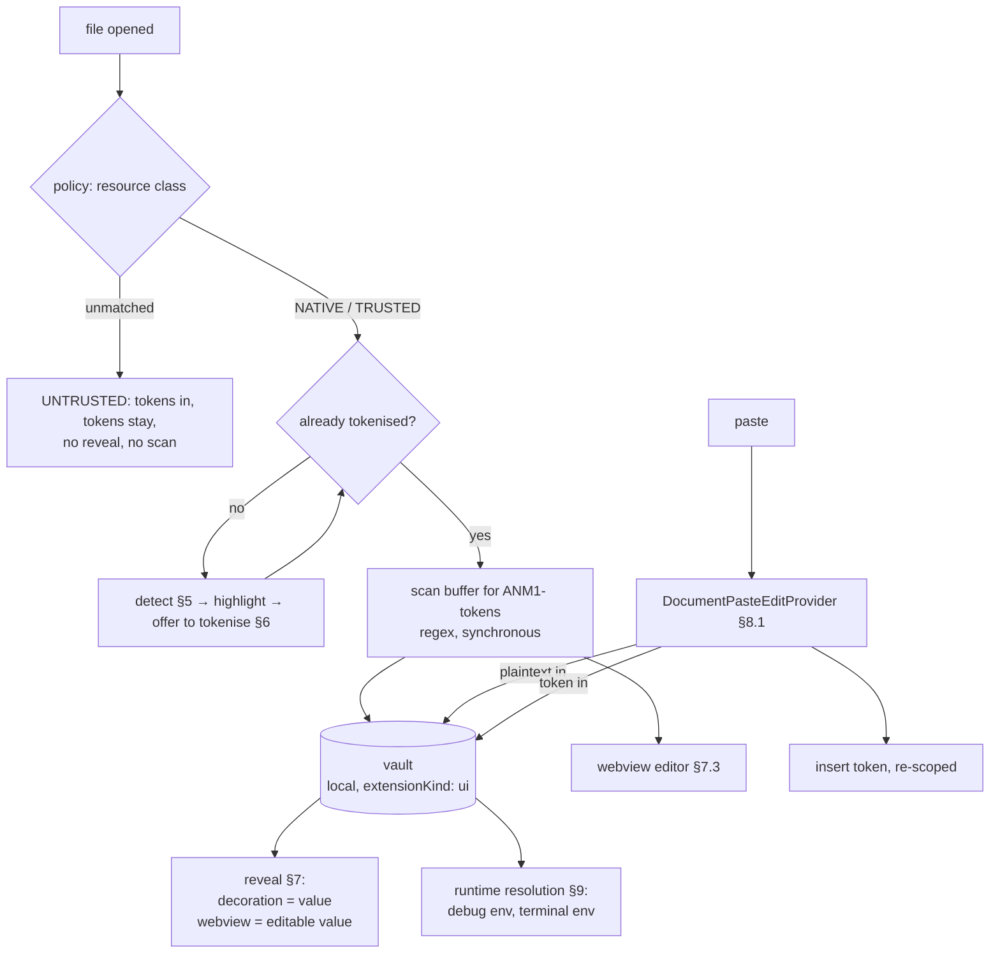

# Anonymice VS Code extension

One spec for the editor surface: how a sensitive value is kept out of every
buffer an assistant can read, and shown to the user anyway.

Companion to [`../browser/SPEC.md`](../browser/SPEC.md). The two extensions
share one vault, one token format and one detection backend — a value copied
from a `NATIVE` web page resolves in the editor, and the reverse. This document
specifies only what is different about VS Code, and says explicitly what it
inherits.

## Contents

- [0. Scope and settled decisions](#0-scope-and-settled-decisions)
- [1. What this inherits unchanged](#1-what-this-inherits-unchanged)
- [2. The platform: what reads what](#2-the-platform-what-reads-what)
- [3. Trust classes, remapped](#3-trust-classes-remapped)
- [4. Architecture at a glance](#4-architecture-at-a-glance)
- [5. Detection](#5-detection)
- [6. Masking: tokenising at rest](#6-masking-tokenising-at-rest)
- [7. Reveal](#7-reveal)
- [8. Clipboard and paste](#8-clipboard-and-paste)
- [9. Resolution at runtime](#9-resolution-at-runtime)
- [10. Leak surfaces that are not the editor](#10-leak-surfaces-that-are-not-the-editor)
- [11. Verification](#11-verification)
- [12. Open](#12-open)

## 0. Scope and settled decisions

The product, end to end:

1. A sensitive value is replaced by a token (`ANM1-SECRET-…`) **in the file and
   in the buffer**. That is what every extension, language server, completion
   provider and chat agent in the window reads.
2. The user sees the real value rendered through an editor decoration — a
   surface with no read API — or, when they need to edit it, inside a webview.
3. Copy, paste and the clipboard behave as the browser spec already defines.
4. Values are resolved back to plaintext at the moment a *process* needs them —
   at debug launch, in a terminal environment — never by writing them into a
   document.

| Decision | Choice | Why |
|---|---|---|
| The invariant | **No `TextDocument`, and no file in the workspace, ever holds a sensitive value** (§2.3) | VS Code has no per-resource reader isolation. Every reader in the window reads every document, so the only place to enforce anything is the text itself |
| No `NATIVE` display mode | **A file holding real values is never opened in a normal text editor** (§3) | Opening it is what creates the `TextDocument`. The browser's `NATIVE` — real values on screen, highlight only — has no safe equivalent here |
| Masking | **Tokenise at rest**, file and buffer alike (§6) | A token in the buffer but plaintext on disk is defeated by `cat`; agents have a terminal |
| Reveal, in place | **Editor decorations**, `before`/`after.contentText` (§7.1) | The only in-editor rendering surface with no read API anywhere in `vscode.d.ts` and no `vscode.execute*` command behind it |
| Reveal, default mode | **`annotate`** — the token stays visible, the value renders beside it (§7.2) | `substitute` hides model text under a decoration and desyncs caret, find, and column against the buffer — the overlay failure the browser spec rejected in its §8.2 |
| Reveal, for editing | **Webview** (`vscode-webview://`) (§7.3) | Separate-origin iframe; the only isolated surface that can hold a real caret. Same role as the browser's `chrome-extension://` iframe |
| Paste | **`DocumentPasteEditProvider`** (§8.1) | Stable API, runs before insertion, and what it returns *is* the inserted text |
| Copy | **Not interceptable; we do not pretend otherwise** (§8.2) | `prepareDocumentPaste` writes to an in-memory store keyed by a handle and never to the system clipboard (§8.2). Only the keyboard path can be taken, via a keybinding |
| Why that is survivable | **The buffer already holds tokens** (§8.3) | Copy interception exists to stop plaintext leaving a buffer. We removed the plaintext instead, so the missing hook costs UX, not the promise |
| Vault and detector placement | **Local machine only**, `"extensionKind": ["ui"]` (§10.1) | In a remote or devcontainer window the extension host is someone else's machine |
| Threat model | **Incidental readers, not hostile extensions** (§2.1) | The extension host is Node with unrestricted `fs`. There is no boundary to enforce against code that has decided to go looking |

## 1. What this inherits unchanged

These are specified in the browser document and are not restated here. Where
this spec needs one, it cites the browser section.

| Inherited | Where | Note |
|---|---|---|
| `/v1/detect` protocol, chunk hashing, cache keys, failure semantics | browser §3.1–3.2 | Offsets are UTF-16 code units over NFC text, which is exactly what `TextDocument.offsetAt` and `Position.character` already are. The contract needs no editor-specific variant |
| Three origins and the merge rule (`annotation` > `rule` > `model`, extent is the union) | browser §3.3 | |
| Span registry, `spanId` as a digest of `normalized` | browser §5 | The registry is keyed per `(document uri, version)` here rather than per page |
| Mechanical normalisation, no entity resolution | browser §5.1 | |
| Token format `ANM1-CLASS-…`, Tier A / Tier B, the reserved-range rule, versioning | browser §6.1–6.6 | A token minted in the browser resolves in the editor because the format and the vault are one |
| Token lifetime, tombstones, legible dead tokens | browser §6.7 | A dead token in a *file* is more likely than in a form field — the file outlives the session by design. Tombstone legibility matters more here, not less |
| Child tokens on edit, collapse to depth 1 | browser §8.4 | |
| Declassification, and the fragment refusal | browser §8.5 | |

Two inherited things need a VS Code definition rather than a restatement:

- **Scope.** The browser scopes tokens by `(origin, session)` (browser §6.3).
  The editor's equivalent of an origin is the **artifact destination**: a
  workspace folder's git remote URL if it has one, otherwise its absolute path;
  for a chat or completion request, the model provider. This is the axis that
  decides where a token can travel, which is what scoping is for.
- **Re-scoping at paste.** The browser rewrites the clipboard token into a
  destination-scoped alias in its paste handler. Ours does the same, in
  `provideDocumentPasteEdits` (§8.1) — the one place we still control the text
  before it lands.

## 2. The platform: what reads what

### 2.1 The extension host is not a sandbox

The browser spec rests on a boundary the browser enforces: a page cannot read a
`chrome-extension://` frame, because same-origin policy stops it. **VS Code has
no equivalent boundary between extensions.** Every extension in the window runs
in one Node process, with the user's full filesystem privileges, no origin, and
no permission manifest. Any installed extension can read the vault file, the
`SecretStorage` backing store, and every buffer, whenever it likes.

So the guarantee has to be scoped honestly, and it is worth being blunt about
it:

> This extension defends against **readers that read documents** — completion
> providers, chat participants and agents, language servers, source control,
> telemetry, crash and hot-exit artifacts, session replay of a shared screen. It
> does **not** defend against an extension that has decided to steal secrets.
> Nothing installed in the same extension host can.

That is not a weaker product than it sounds. Every reader in the first list is
one the user installed on purpose and does not think of as an exfiltration path,
which is exactly why they leak. The one in the second list is a supply-chain
problem, and the control for it is extension allowlisting, not us.

### 2.2 Surfaces, and which of them another extension can read

The direct analogue of browser §8.1, and the reason the design lands where it
does. "Readable" here means: a second extension, with no privileged API, can
obtain the rendered string.

| Surface | Readable by another extension? | How |
|---|---|---|
| `TextDocument` text — saved or dirty | **yes** | `workspace.textDocuments`, `workspace.openTextDocument(uri)` |
| file on disk | **yes** | `workspace.fs.readFile`, or plain `node:fs` |
| virtual document via `TextDocumentContentProvider` | **yes** | `openTextDocument(uri)` works for *any* scheme, including ours |
| custom `FileSystemProvider` | **yes** | `workspace.fs.readFile` on that scheme |
| hover contents | **yes** | `vscode.executeHoverProvider` |
| completion item `detail` / `documentation` | **yes** | `vscode.executeCompletionItemProvider` |
| inlay hints | **yes** | `vscode.executeInlayHintProvider` |
| CodeLens titles | **yes** | `vscode.executeCodeLensProvider` |
| diagnostics | **yes** | `languages.getDiagnostics()` returns every URI, every provider |
| document symbols, definitions, references | **yes** | `vscode.executeDocumentSymbolProvider` and friends |
| clipboard | **yes** | `env.clipboard.readText()` |
| terminal contents | **treat as yes** | shell integration and terminal-data APIs |
| **editor decoration** `before`/`after.contentText` | **no** | `TextEditor` exposes only `setDecorations`; `TextEditorDecorationType` exposes only `key` and `dispose`. There is no getter and no `vscode.executeDecorationProvider` |
| **webview** (`vscode-webview://`) | **no** | Separate-origin iframe in the renderer; extensions have no DOM access and no cross-extension webview API |
| `SecretStorage` (`context.secrets`) | **no**, at API level | Namespaced per extension id, OS-keychain backed. See §2.1 for what that is and is not worth |
| QuickPick / InputBox / notification | **no** | Write-only, transient |

Two results matter, and neither is obvious:

**Every language-provider surface is enumerable.** The tempting designs — put
the real value in a hover, an inlay hint, or a CodeLens — are the worst
available, because `vscode.execute*Provider` is a *deliberate* fan-out: it
invokes every registered provider and hands the caller all their results.
Rendering plaintext into a hover does not merely fail to hide it, it publishes
it through a documented command that any extension can call on any position of
any file. The same goes for a virtual `anonymice-clear:` document, which reads
as isolation and is a plain `openTextDocument` away from anyone.

**Decorations are the exception.** They are the only in-editor rendering path
with no read API, because they are pushed to the renderer rather than pulled
from a provider. That single asymmetry is what makes reveal-in-place possible
at all.

Both are asserted here and **tested in §11**, by an adversary extension that
tries each row. A negative claim about an API surface is worth exactly as much
as the test that holds it.

### 2.3 The invariant

> **A sensitive value is never present in any `TextDocument`, and never present
> in any file inside the workspace, at any instant.**

Everything else in this spec follows from it. It is stronger than the browser's
invariant (browser §8.1, which covers one input element) and it has to be,
because the editor has no per-resource reader isolation to fall back on: there
is no such thing as a document that only the user reads.

Note what it does *not* say. It says nothing about files outside the workspace,
about the vault, or about process memory. Those are out of reach of the readers
in §2.1's first list, and in reach of nothing we could stop anyway.

### 2.4 What a model sees

The payoff, concretely. Given `DB_PASSWORD=ANM1-SECRET-K3F9QW2MX7VBNC4H8` in
the file:

| Reader | Path it uses | What it gets |
|---|---|---|
| inline completion (Copilot and equivalents) | `document.getText()` plus neighbouring files | the token |
| chat, `#file` or an attached selection | `TextDocument` | the token |
| agent `read_file` | `workspace.fs` / `node:fs` | the token |
| agent running `cat`, `grep`, `rg` in a terminal | the file at rest | the token — this is why §0 tokenises on disk and not only in the buffer |
| language server | LSP `didOpen` / `didChange` | the token |
| git, and every diff, blame and PR downstream of it | the file | the token |
| hot exit backup, local history, Timeline, settings sync | the buffer | the token |

**A token is better input than a redaction.** `***` or a removed line destroys
the shape of the code and completions degrade accordingly. `ANM1-SECRET-…` is a
well-formed string literal of a known class: the model can still see that this
is a password assignment, still complete the line below it, still refactor
around it. We are removing the secret, not the structure — which is the argument
for doing this at all rather than telling people to close their `.env` before
opening chat.

## 3. Trust classes, remapped

The product's three classes (`../SPEC.md`) survive, but the axis they sit on
changes, and the change is the whole reason this spec differs from the browser's.

**In the browser, the class is a property of the reader.** An `UNTRUSTED` page
reads its own DOM and nothing else, so putting real values in a `NATIVE` page is
safe: the adversary is not in the room.

**In VS Code, one reader pool reads every resource.** Copilot, the agent and the
language server are attached to the *window*, not to the file. A `NATIVE` file
open in the same window as an `UNTRUSTED` one is read by the same extensions.
There is no configuration of the browser model that makes plaintext-on-screen
safe here.

So the class stops describing *what may be displayed* and describes only **where
plaintext is allowed to exist and who resolves it**:

| Class | Plaintext lives | In the buffer | Reveal |
|---|---|---|---|
| `NATIVE` | in the vault, and in the source it was imported from — never in the workspace | token | yes, by default (§7) |
| `TRUSTED` | in the vault; injected into a *process* at launch, never into a file (§9) | token | yes |
| `UNTRUSTED` | nowhere | token | opt-in per file, off by default |

Note that the "In the buffer" column is constant. That is the point: the classes
no longer control the buffer, because §2.3 already does, unconditionally. What
they control is the resolution boundary — `NATIVE` resolves for the user's eyes,
`TRUSTED` additionally resolves for a process, `UNTRUSTED` resolves for nothing
until the user asks.

**Classification is per resource**, from managed settings — glob patterns over
workspace-relative paths, plus a class per pattern — with the same rule as the
browser: the list is distributed by policy and is not user-editable. Anything
unmatched is `UNTRUSTED`.

**A `NATIVE` file that has not been tokenised yet is the on-ramp, not a mode.**
We detect, we highlight, and we offer to tokenise it (§6). Until the user
accepts, the file is plaintext on disk and in a buffer, and every reader in §2.4
can see it. The extension says so, in those terms, rather than displaying a
badge that implies protection it does not have.

## 4. Architecture at a glance



The buffer is the wire. Everything above it — decorations, the webview — renders
from the vault and writes nothing back into the text model except tokens.

## 5. Detection

Detection is the on-ramp: it finds values that are still plaintext so §6 can
offer to tokenise them. Once a resource is tokenised, detection has nothing left
to do on it, and the steady state is a cheap synchronous regex for `ANM1-`
(browser §6.4), not a backend call.

### 5.1 What gets scanned

Same backend, same protocol, same authority as browser §3.1–3.2. What changes
is the chunking and the gate.

- **Chunk by document, split on blank-line boundaries**, capped by the same size
  and byte limits the protocol already defines. `TextDocument.offsetAt` gives
  UTF-16 offsets directly, so the projection step the browser needs — flattening
  a DOM subtree into text plus a node/offset map — does not exist here. A
  document *is* the flat text. This is the one place VS Code is simpler.
- **Cache key is `(hash, modelVersion, policyVersion)`**, as inherited. Add
  `document.version` as a local invalidation trigger only; it never reaches the
  wire.
- **Only classified resources are ever sent.** An `UNTRUSTED` file is never
  chunked and never leaves the machine. This is a harder gate than the browser's
  because the content is source code: the failure mode of scanning too broadly
  is uploading someone's repository to a detection service.
- **Never scanned:** anything matching `files.exclude`, anything `.gitignore`d,
  binaries, files over the size cap, and output/`node_modules`-shaped paths.
- Debounced on `onDidChangeTextDocument`, visible ranges first via
  `TextEditor.visibleRanges`.

### 5.2 Annotations

The browser reads `data-sensitive` off the markup (browser §3.4). The editor's
equivalent is a comment directive and a manifest:

```
# anonymice: SECRET
DB_PASSWORD=hunter2-prod-9f

customer_iban = "CH93 0076 2011 6238 5295 7"   # anonymice: IBAN
```

```jsonc
// .anonymice.json — structural facts the backend cannot infer
{
  "annotations": [
    { "glob": "fixtures/customers/*.csv", "columns": { "2": "PERSON", "5": "IBAN" } },
    { "glob": "deploy/secrets.*.yaml", "valuesOf": "$.data.*", "cls": "SECRET" }
  ]
}
```

The manifest earns its place here in a way the browser's rejected selector
manifest did not: a CSV column or a YAML path is a *stable structural fact about
a format*, not a CSS class a vendor renames on redeploy. It breaks loudly (the
path stops matching) rather than silently.

**Annotations only ever add.** No `anonymice: none`, no suppression from
anything inside the workspace — inherited from browser §3.4, and the reason is
sharper here: a cloned repository is untrusted input that the user is about to
open in an editor attached to their vault. A hostile repo must not be able to
mark its own contents safe.

**Suppression exists, but only from user scope.** False positives on a test
fixture are a real cost that a web page does not have, so suppression is a
setting in user or machine scope (`anonymice.suppress`, globs plus classes),
never workspace scope, never a file in the repo. VS Code's settings scoping is
what makes this expressible; we use it rather than inventing an ignore file that
would travel with the repo.

### 5.3 Workspace trust

The extension declares `"capabilities": { "untrustedWorkspaces": { "supported": "limited" } }`.

In a restricted-mode window: no detection (no content leaves the machine), no
`.anonymice.json`, no runtime resolution (§9). Reveal of already-minted tokens
still works, because that reads the vault and renders to a decoration — it
executes nothing the workspace supplied. Restricted mode is exactly the case
where a user is looking at code they do not trust, which is the worst possible
moment to hand it a resolution path.

## 6. Masking: tokenising at rest

### 6.1 Highlight, then offer

On a classified resource that still holds plaintext, detection paints the spans
(a decoration with a background colour, the light-red of browser §4) and the
extension offers one action: **tokenise**. Applied, it is an ordinary
`WorkspaceEdit` — mint a token per registry entry, replace every occurrence,
save. Reversible in the same breath by the editor's own undo, and reversible
later from the vault.

Two rules keep this from being a footgun:

- **Never automatic.** Rewriting a user's file on open, on a probabilistic
  detection, is not something to do behind their back. The offer names the
  count and the classes, and shows the diff.
- **Tokenise everything, or nothing, per value.** The registry is keyed by value
  (browser §5), so accepting `IBAN` means every occurrence of that IBAN in the
  file. A half-tokenised value is a leak with a badge saying it is protected.

### 6.2 The vault-backed file

For a `NATIVE` file that must keep real values on disk — a fixture someone else
regenerates, a dump a tool consumes — tokenising it is not available. That file
should not be in the workspace. If it is, the honest position is that the
extension cannot protect it, and it says so: the badge reads *unprotected*, and
the file is excluded from nothing, because pretending otherwise is worse than
the leak.

The alternative we do build: **the file is tokenised, and the tool is pointed at
a resolved copy at run time** (§9). That keeps the workspace clean and moves
resolution to the process boundary, where it belongs.

## 7. Reveal

### 7.1 Inline reveal: decorations

The token is in the buffer. The value renders as an inline decoration
attachment, from `context.secrets`-backed vault state, and never enters the text
model:

```ts
const reveal = vscode.window.createTextEditorDecorationType({
  after: { contentText: '', color: new vscode.ThemeColor('editorCodeLens.foreground') }
});
editor.setDecorations(reveal, [
  { range: tokenRange, renderOptions: { after: { contentText: `  ${plaintext}` } } }
]);
```

Per §2.2 this is the only in-editor surface another extension cannot read back.
Its limits, up front:

- **Single line, no wrapping.** `contentText` is an inline attachment; newlines
  do not render. A PEM block, a JSON blob or any multi-line value cannot be
  revealed this way and goes to the webview (§7.3).
- **Not selectable and not copyable.** Copy operates on the text model, and the
  attachment is not in it. This is the same cost the browser spec books in its
  §8.8 — and the same silver lining: it is why an accidental copy yields the
  token.
- **Not in the accessibility tree** in any dependable way. A screen-reader user
  gets the token. That is a real regression, not polish, and the webview path is
  the accessible one.
- **Rendered pixels.** Screen sharing, screenshots and session recording capture
  it. Hence the global toggle below.

**One command toggles every reveal off** (`anonymice.hideAll`, a single
`setDecorations(type, [])`), for screen sharing and pairing. Same reasoning as
the browser's dim/undim: the user needs one gesture, not a per-value hunt.

### 7.2 `annotate` by default, `substitute` opt-in

Two ways to render the value against a token that is 29 characters wide when the
value is not.

**`annotate` — default.** The token stays; the value renders after it.

```
DB_PASSWORD=ANM1-SECRET-K3F9QW2MX7VBNC4H8  hunter2-prod-9f
            └──────── buffer text ───────┘  └─ decoration ─┘
```

Nothing desyncs, because nothing is hidden: column numbers, find matches,
selection, word wrap and every LSP position stay exactly what the buffer says.
The user can also see, at a glance, that masking is on and where — which is the
signal that stops them from wondering whether the extension is working.

**`substitute` — opt-in.** The token's range is hidden and the value renders in
its place.

```
DB_PASSWORD=hunter2-prod-9f
            └─ decoration; 29 columns of buffer text hidden behind it ─┘
```

WYSIWYG, and the cost is precisely the one the browser spec refused for editing
in its §8.2: **the caret, selection, find and column all operate on the token's
geometry while the user sees the value's.** Arrow-keying through the hidden
range makes the caret appear to stall; find matches text nobody can see; "line
12, column 30" points at nothing. It is available because some users will want
it for a read-only glance at a config file, and it is not the default because
those failures are indistinguishable from bugs.

Hiding is also unsanctioned: it works by smuggling `display: none` through the
`textDecoration` property, which VS Code has never promised to keep working.
`opacity: 0` is supported but does not reclaim the columns, so the value would
render 29 characters to the right of where it belongs. If the hack is ever
closed, `substitute` is withdrawn and `annotate` — which uses only documented
behaviour — is unaffected. That is the reason the default is the one that does
not depend on it.

**Editing is never done through either mode.** Both are read-only reveals. A
value the user wants to change goes through §7.3, which is the same conclusion
the browser reached and for the same reason.

### 7.3 The isolated editor: webview

For editing, for multi-line values, and for accessibility, the reveal is a
webview: `vscode-webview://`, a separate origin in the renderer, unreadable by
any extension (§2.2). It is the exact counterpart of the browser's
`chrome-extension://` iframe, and it inherits that design wholesale:

- **Opened on demand**, from a code action or a click on the reveal, never
  eagerly. The lazy mount is what gives the correct failure direction (browser
  §8.6): if the webview fails to open, the buffer shows a token — visible,
  self-explaining, recoverable — and never plaintext.
- **The buffer is not touched while editing.** The user edits the real value
  inside the webview; the vault holds a child token for the edit session (browser
  §8.4) and the buffer keeps showing one stable token throughout. On commit the
  vault updates. The document version does not change at all, which means no
  `onDidChangeTextDocument` fires and no completion provider is woken.
- **Declassification** — the user replaces the secret with something that is not
  one — follows browser §8.5 including the fragment refusal, and only then does
  a `WorkspaceEdit` write a literal into the buffer.
- **Copy out of the webview** is possible, unlike out of a decoration. The
  default action copies the *token*; copying plaintext is a separate, explicit
  action with an audit entry. Given §8.2, a plaintext copy here is a one-way
  door — nothing downstream will re-tokenise it.

For a `NATIVE` file whose whole content is sensitive — a customer CSV, a
credentials YAML — the same surface scales up to a `CustomEditorProvider`
registered with `"priority": "default"` for that glob: the file on disk holds
tokens, and the editor that opens it is a webview showing real values. No
`TextDocument` with plaintext is ever created, because no `TextDocument` is
created at all. The user can still force *Reopen with… Text Editor*, and they
get tokens, which is the correct outcome rather than a bypass.

### 7.4 What we do not build, and why

Stated explicitly, because each one is a design someone will propose and three
of them look like the obvious answer:

| Rejected | Why |
|---|---|
| hover showing the value | `vscode.executeHoverProvider` publishes it to every extension (§2.2) |
| inlay hint showing the value | `vscode.executeInlayHintProvider`, same |
| CodeLens showing the value | `vscode.executeCodeLensProvider`, same |
| a `anonymice-clear:` virtual document | `openTextDocument` works on any scheme; this is a `TextDocument` full of plaintext with a reassuring name |
| a `FileSystemProvider` serving resolved content | `workspace.fs.readFile`, same |
| resolving into the terminal for the user to read | terminal contents are readable, and land in scrollback |
| plaintext in the buffer with a save-time tokenise hook | there is no pre-change hook on a document; every reader sees the plaintext before the save |

The last row is worth dwelling on. `onWillSaveTextDocument` exists and looks
like the right place to tokenise. It is not: completion providers, language
servers and agents read the document on change, not on save, so a
tokenise-on-save design leaks continuously to exactly the readers this product
exists to stop, and leaks nothing to the file — which was already the safest
part.

## 8. Clipboard and paste

### 8.1 Paste is hookable

`languages.registerDocumentPasteEditProvider` is the editor's equivalent of the
browser's capture-phase paste handler, and it is better: it runs before
insertion and the `DocumentPasteEdit` it returns *is* what gets inserted.

```ts
provideDocumentPasteEdits(document, ranges, dataTransfer, context, token) {
  const text = await dataTransfer.get('text/plain')?.asString();
  // 1. ANM1- token?  → re-scope to this document's destination, insert alias
  // 2. resolves to a known value? → insert that value's token for this scope
  // 3. classifies as sensitive?   → mint, insert token, reveal
  // 4. otherwise                  → return nothing, let VS Code paste normally
}
```

Rules that keep it honest:

- **Confirm every `ANM1-` hit against the vault** before acting, exactly as
  browser §6.4 requires — pasting documentation that contains an example token
  must not mint anything.
- **Case 3 needs a synchronous answer** and the detection backend is not
  synchronous. So case 3 runs the local rule pass only (checksummed classes:
  IBAN, CARD, AHV, EMAIL, PHONE) plus the high-confidence secret patterns. A
  `PERSON` pasted as bare text is not caught here, and is caught by the next
  detection sweep, which then offers to tokenise (§6.1). Stating the gap rather
  than pretending paste is a detection boundary.
- **Registered only for classified resources.** On an `UNTRUSTED` file the
  provider is not registered and paste is untouched.
- The provider returns an edit of a declared `DocumentDropOrPasteEditKind` and
  yields to nothing; if the user has `editor.pasteAs.enabled` off, or picks a
  different paste option from the widget, our edit does not apply. That is a
  user-visible setting we do not override — see §12.

### 8.2 Copy is not hookable

**There is no supported way for an extension to change what a copy puts on the
system clipboard.** `DocumentPasteEditProvider.prepareDocumentPaste` looks like
the hook and is not: VS Code creates a `VSDataTransfer`, lets providers write to
it, stores it in memory keyed by a generated handle, and writes only that handle
as metadata onto the real clipboard event. The provider's data transfer is
retrieved again on paste *within the same window* and is never handed to
`clipboardData.setData`. The API documentation says as much from the other
direction — added metadata "cannot be seen by other editor windows or by other
applications" — which is precisely what a system clipboard is.

What is available:

1. **The keyboard path**, by contributing a keybinding for `ctrl+c` / `cmd+c`
   and `ctrl+x` guarded by a `when` clause, running our own command that reads
   the selection, tokenises, and calls `env.clipboard.writeText`.
2. **Nothing else.** The editor context menu's *Copy*, the *Edit* menu,
   drag-and-drop, and middle-click primary selection on Linux all invoke
   built-in commands that cannot be re-registered or removed.

A post-hoc clipboard sanitiser — poll `env.clipboard.readText()`, replace
plaintext with a token — is deliberately **not** built. It cannot close the
race, only shorten it, and a control that works most of the time on a clipboard
is worse than none: it produces a habit of trusting it.

### 8.3 Why that is survivable

Copy interception exists to stop plaintext leaving a buffer that contains
plaintext. §2.3 says no buffer contains plaintext. A copy from any classified
resource therefore yields tokens whether we hook it or not — the platform gap
costs us nothing on the main path.

It costs on exactly two paths, and both are bounded:

- **Copy out of the webview reveal** (§7.3). Fully under our control, because
  the webview is our document: default action copies the token, plaintext copy
  is explicit and audited.
- **Copy out of an un-tokenised `NATIVE` file** — the on-ramp state of §3, where
  detection has painted the values but the user has not accepted the rewrite.
  Here the keybinding of §8.2 case 1 does the browser's job, and the context
  menu does not. The mitigation is to shorten that state: the tokenise offer is
  the first thing the extension does, not a preference buried in a panel.

Everything the browser spec says about the clipboard having no reader identity,
about partial copies minting children, and about `text/plain` being the only
flavour that can be depended on (browser §7) applies unchanged, including to
case 1's keybinding path.

## 9. Resolution at runtime

`TRUSTED` in the browser means a page that may hold real values. In the editor,
no file may — but a *process* still needs the real database password to start.
So the `TRUSTED` boundary moves from the file to the process launch, which is
the last point before the value is needed and the first point where a real
destination is known.

Two injection points, both of which resolve from the vault and write nothing to
disk:

- **Debug and tasks.** A `DebugConfigurationProvider` resolves `ANM1-` tokens in
  `env` at `resolveDebugConfiguration` time, so the debuggee gets real values
  and `launch.json` — a file, in git — holds tokens.
- **Integrated terminal.** `context.environmentVariableCollection` injects
  resolved variables into terminals the user opens, so `npm run dev` works
  without a plaintext `.env`.

Both are gated: `TRUSTED` resources only, trusted workspaces only (§5.3), and
each resolution is audited with the destination. Both are also, unavoidably,
where plaintext re-enters the world — a child process has it in its environment,
and anything that process logs or prints is out of our hands. That is the
correct place for the boundary to be, and it should be drawn there explicitly
rather than being where the design quietly leaks.

**The `.env` case, end to end:** `.env` on disk holds `DB_PASSWORD=ANM1-SECRET-…`
and is safe to commit, to open next to a chat panel, and to hand to an agent.
The user reads the real value through a decoration (§7.1). The dev server gets
the real value through the terminal's environment. Nothing in between ever holds
both.

## 10. Leak surfaces that are not the editor

### 10.1 Remote, containers, WSL, Codespaces

In a remote window the extension host runs **on the remote machine** — a
devcontainer, a build server, someone's cloud VM. A vault there is a vault on
infrastructure the user does not control and may not own.

So the extension declares `"extensionKind": ["ui"]`: it runs on the local
machine even when the workspace is remote. Consequences to work through, and
the reason this is only sketched here: a `ui` extension reaches remote files
through `workspace.fs` rather than `node:fs`, and
`environmentVariableCollection` (§9) applies to terminals that live on the
remote host, which is a resolution path crossing the boundary we just drew.
Tracked as open (§12).

### 10.2 Notebooks

A `.ipynb` stores **outputs** next to source, and those outputs are on disk, in
git, and read by every agent that reads the file. A cell that prints a dataframe
of real customers has leaked it in a way no amount of buffer tokenisation
addresses, because the value never passed through a buffer — it came out of a
kernel.

Cell sources are `TextDocument`s and get everything in this spec. Outputs need
their own treatment — detect on `onDidChangeNotebookDocument`, offer to strip or
tokenise before save — and that is not specified here.

### 10.3 The rest

- **Search results, peek views, diff editors** render from the buffer, so they
  render tokens. Decorations do not follow into all of them; the reveal simply
  is not there, which is the safe direction.
- **Git**, and everything downstream of it, sees tokens. This is a positive
  consequence of §2.3 and not a separate feature — but it is not a substitute
  for secret scanning in CI, which catches the un-tokenised files this extension
  never saw.
- **Copilot content exclusion** and similar vendor-side controls are
  complementary and not load-bearing: they are per-vendor, configured outside
  the editor, and honoured voluntarily. Being invisible to a reader that chose
  to honour an exclusion list is weaker than having nothing to read.

## 11. Verification

The eval is the contract, as in browser §9, and this extension adds one gate
that the browser's does not have, because the browser gets its boundary from the
platform and we get ours from an assertion.

**The adversary extension.** A second test extension is installed into the test
window and, for each row of §2.2 that this spec relies on being unreadable, it
tries to obtain the plaintext:

```
workspace.textDocuments        → every open document's text
workspace.openTextDocument(u)  → for every workspace uri, and for anonymice-* schemes
workspace.fs.readFile(u)       → every workspace file
executeHoverProvider           → every position of every open document
executeCompletionItemProvider  → same
executeInlayHintProvider       → same
executeCodeLensProvider        → same
executeDocumentSymbolProvider  → same
languages.getDiagnostics()     → all uris
env.clipboard.readText()       → after a copy of a revealed value
```

The gate: **no vault plaintext appears in any of it**, with a revealed value on
screen and a webview open at the time. This is the property the whole design
rests on, and §2.2 asserts a set of negatives about the API surface — negatives
that a VS Code release can invalidate without telling us. Running the adversary
on every supported VS Code version is what turns the claim into something that
can be demonstrated rather than believed.

Beyond that, and in addition to everything inherited from browser §9:

- **Invariant test**: across paste, edit-in-webview, commit, save, undo, redo
  and declassification, `document.getText()` never contains a vault plaintext at
  any document version. Asserted on every version, not just the final one — the
  browser's equivalent phrasing is "at every instant" and this is how it is
  measured.
- **Paste tests**: `provideDocumentPasteEdits` for each of its four cases;
  a token-shaped string not in the vault pastes literally and mints nothing;
  paste into an `UNTRUSTED` file is untouched.
- **Copy tests**: the keybinding path yields a token; the context-menu path is
  asserted to yield buffer text, documenting the known gap as a test rather than
  a comment.
- **Decoration tests**: `substitute` mode's column arithmetic against the buffer;
  the `display:none` smuggling asserted to still work, so its removal in a future
  VS Code release breaks a test rather than a user.
- **Restricted-mode test**: nothing leaves the machine, no `.anonymice.json` is
  read, no runtime resolution occurs, reveal of existing tokens still works.
- **Performance**: reveal decorations on a large file, and a document with a
  thousand tokens, within budget as an assertion.

## 12. Open

- **`extensionKind: ["ui"]` versus everything it breaks** (§10.1). The vault
  belongs local; `environmentVariableCollection` targets remote terminals; a
  `CustomEditorProvider` over remote files goes through `workspace.fs`. Whether
  the runtime-resolution path (§9) can cross that boundary at all, and what it
  should refuse to do when it cannot, is undecided and blocks remote support.
- **Notebook outputs** (§10.2) need their own detection and rewrite path.
- **`editor.pasteAs.enabled`** (§8.1). Our paste edit can be bypassed by a user
  setting or a widget choice. Whether that is acceptable, or whether the
  keybinding path should back it up the way it backs up copy, is not settled.
- **Multi-line reveal.** §7.1 cannot render a PEM block inline, so those values
  are webview-only, which makes them second-class in a way single-line ones are
  not. Whether a hover-height rendering exists that is not readable — there is
  currently no candidate — or whether the answer is simply a better affordance
  to open the webview.
- **Un-tokenisable `NATIVE` files** (§6.2). "Do not put it in the workspace" is
  correct and unhelpful. A resolved-copy-at-run-time mechanism is sketched in §9
  and not designed.
- **Vault internals**, as in the browser spec, are a separate document:
  storage, `k`, revocation, and how the browser and editor extensions share one
  vault across two processes on one machine. That last part is new here and is
  the integration this whole spec assumes.
