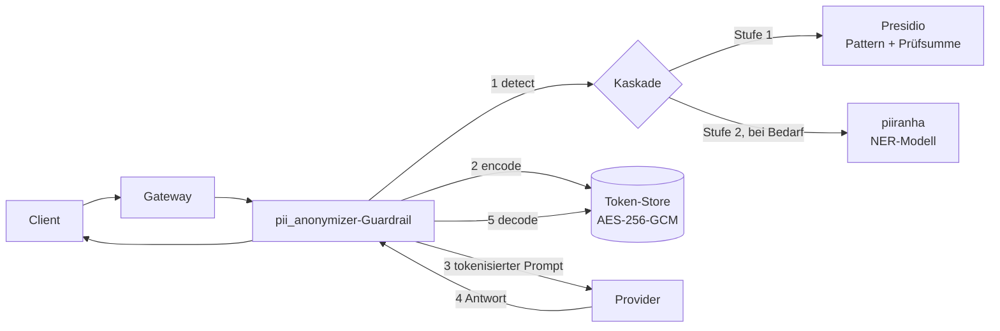

<div align="center">


# Technische Informationen für die Jury

</div>

---

## Aktueller Stand des Sourcecodes

**Repository:** https://github.com/ma-abdellaoui/anonymice

```
code/engine/          LLM-Proxy — Erweiterung von LiteLLM (Python)
code/extensions/
  ├── browser/        Chrome-Extension (TypeScript, MV3)
  └── backend/        Detection- und Policy-Service (Node, ohne Dependencies)
docs/                 Specs, Endpoint-Verträge, QA-Walkthroughs, Messungen
```

Teststand: über 700 Python-Tests für die PII-Schicht, 280 Unit-Tests in der
Browser-Extension inklusive Eval-Gate, 50 Tests im Backend-Service.

Gemessene Erkennungsqualität am Swiss-Data-Airlock-Korpus, mit Methodenkritik und
den offenen Lücken: [BENCHMARKS.md](BENCHMARKS.md).

## Ausgangslage

### Worauf haben wir uns fokussiert?

Jeder produktive LLM-Workflow endet damit, dass jemand etwas in ein Modell einfügt, das er
nicht kontrolliert: ein Support-Ticket mit IBAN, eine
Patientennotiz. Redaktion (`***`) zerstört die Struktur des Textes und damit die
Antwortqualität. Keine Redaktion bedeutet: die Daten sind weg.

Unser Fokus liegt deshalb nicht auf Erkennung allein, sondern auf **Reversibilität**:
Sensible Werte werden durch typisierte Platzhalter ersetzt, das Modell arbeitet auf einem
lesbaren Satz, und die Rückübersetzung passiert ausschliesslich innerhalb unserer
Vertrauensgrenze.

```
Eingabe    Bitte E-Mail an Anna Meier zu Rechnung CH93 0076 2011 6238 5295 7
Modell     Bitte E-Mail an <PERSON_1> zu Rechnung <IBAN_CODE_1>
Antwort    Ich habe eine Notiz an <PERSON_1> zu <IBAN_CODE_1> entworfen.
Ausgabe    Ich habe eine Notiz an Anna Meier zu CH93 0076 2011 6238 5295 7 entworfen.
```

Zweiter Fokus: die Daten **dort** abfangen, wo Menschen tatsächlich arbeiten — im Browser und schon
bestehende Systeme.

### Welche technischen Grundsatzentscheide haben wir gefällt?

1. **Aufbau auf LiteLLM fork statt eigener Proxy.** Multi-Provider-Routing, Virtual Keys,
   Budgets, Rate Limits und ein Guardrail-Hook-Interface, durch das bereits jede
   Request-Oberfläche geleitet wird, sind gelöste Probleme. Unsere Ergänzung ist: neue Pakete plus wenige Router-Registrierungen in `proxy_server.py`. 
   Kein Upstream-Modul wird umgeschrieben, das Nachziehen einer neueren LiteLLM-Version bleibt
   dadurch günstig.

2. **Typisierte Tokens statt Hashes.** `<PERSON_1>` statt `a3f9c2e1`. Das Label trägt die
   Semantik, die das Modell zum Argumentieren braucht; ein Zufallsstring zerstört genau
   die. `<` und `>` benötigen in JSON kein Escaping, Tool-Call-Argumente bleiben also
   gültig.

3. **Robustheit im Parser, nicht im Token.** Statt das Token mit Prüfsummen zu panzern und
   bei jedem Request Tokens dafür zu bezahlen, kostet das Format nichts auf der Leitung und
   die Verzerrung wird beim Parsen aufgefangen.

4. **Maskierung ist per Konstruktion irreversibel.** Als `MASK` markierte Entitäten werden
   zu einem blossen `<PERSON>` ohne Ordinalzahl — eine Form, die die Token-Grammatik
   bewusst nicht matcht. Irreversibel, weil der Parser sie nicht sieht, nicht weil wir
   daran denken, das Mapping nicht zu speichern.

5. **Fail closed.** Ein nicht erreichbarer Detektor ist ein Fehler, nie ein leeres
   Ergebnis. „Keine PII gefunden" von einem ausgefallenen Scanner ist der einzige
   Fehlermodus, der still leckt.

6. **Genau eine Implementation von detect / encode / decode.** Der Guardrail und die
   REST-Endpunkte sind beide dünne Adapter über demselben `PiiService`. Was eine
   Browser-Extension über `/pii/encode` bekommt, ist per Konstruktion das, was eine
   laufende Completion bekommt.

7. **Zwei bewusst unterschiedliche Lebensdauern** für Tokens statt eines Kompromisses
   (siehe [Technischer Aufbau](#engine-codeengine)).

8. **Detection und Policy liegen innerhalb derselben Vertrauensgrenze wie der Vault.**
   `/v1/detect` empfängt rohen Seitentext, `/v1/policy` entscheidet, welche Seiten
   überhaupt gelesen werden — ein Detektor ausserhalb der Grenze leckt genau die Daten,
   für deren Schutz er existiert. Daraus folgt alles Weitere: Loopback-Binding per
   Default, kein Default-Credential (ohne gesetztes `DETECT_TOKEN` startet der Dienst
   nicht), **null Laufzeit-Dependencies**, und ein Logger, der Felder mit Seitentext
   gar nicht erst annimmt.

## Technischer Aufbau

### Engine (`code/engine/`)

| Komponente | Einsatz |
|---|---|
| **LiteLLM** (FastAPI) | Basis-Proxy: Provider-Routing, Virtual Keys, Auth, Admin-UI |
| **Microsoft Presidio Analyzer** | Stufe 1 der Erkennung, auf Pattern- und Prüfsummen-Recognizer festgenagelt — deterministisch, kein Modell, ~40 Entitätstypen inkl. IBAN, Kreditkarte, AHV, NINO, SSN |
| **piiranha** (`iiiorg/piiranha-v1-detect-personal-information`) | Stufe 2 über den HuggingFace-Token-Classification-Vertrag, für `PERSON`, `LOCATION`, `ORGANIZATION` — alles, was Muster nicht erfassen |
| **Redis / DualCache** | Kurzlebiger Token-Store des Endpunkt-Pfads, mit TTL |
| **AES-256-GCM** (`cryptography`) | Versiegelung der Werte im Store; ein kompromittierter Cache liefert Ciphertext, nie Klartext |
| **PostgreSQL / Prisma** | Persistenter Vault mit Retention, Widerruf und Key-/User-/Team-/Org-Scopes |
| **Prometheus / OpenTelemetry** | Betrieb |

Wichtig: Presidio wird **nur** über `/analyze` genutzt. Der Presidio-Anonymizer ist nicht
im Pfad — Ersetzung und Rückübersetzung sind unsere eigene Codec-Schicht. Das ist bewusst
so: Presidios Anonymizer liefert Offsets bezogen auf den *Ausgabetext*, und das Mischen
dieser Koordinatenräume ist eine bekannte Fehlerklasse. Bei uns referenzieren Spans immer
den **Originaltext**.

Ablauf eines Requests:



`ner_stage_policy` steuert, wann Stufe 2 läuft. Default ist `always`: Sonst genügt eine
erkannte E-Mail, damit ein Name im selben Text ungeprüft passiert. Lange Prompts werden
überlappend gefenstert; ohne erreichbare NER-Stufe startet die PII-Schicht nicht, ausser
der Betreiber akzeptiert den Rules-only-Modus explizit. Überlappungen lösen
deterministisch auf: höherer Score gewinnt, bei Gleichstand die Regelstufe, dann die
längere Spanne.

**Zwei Lebensdauern:**

| | LLM-Pfad (Guardrail) | Endpunkt-Pfad (`/pii/*`) |
|---|---|---|
| Lebt | einen Request | bis TTL bzw. Retention abläuft |
| Store | Request-Metadaten, stirbt mit dem Request | Redis oder PostgreSQL, Werte AES-256-GCM-versiegelt |
| Token | `<PERSON_1>` | `<PERSON:3f9c2e1b8d4a7f60>` |
| Begründung | kurze typisierte Platzhalter erhalten die Antwortqualität | ein zufälliges Handle trägt keine Information über den Wert; Löschen des Eintrags tötet das Token endgültig |

Der Namespace des Token-Scopes ist `sha256(api_key)`. Eine gültige `session_id` allein
liest nie die Tokens eines anderen Keys. `/pii/decode` gibt echte Daten zurück und ist
zusätzlich an die Key-Berechtigung `allow_pii_decode` gebunden.

Der optionale Datenbank-Vault bindet Verschlüsselung und Autorisierung an Key-, User-,
Team- oder Org-Scopes. Sessions und Betroffene lassen sich widerrufen bzw. exportieren;
Decode, Export und Suche werden auditiert.

Pro Entität ist die Aktion konfigurierbar: `BLOCK` weist den Request ab, `MASK` redigiert
irreversibel, `ENCODE` ist der reversible Pfad.

### Extensions (`code/extensions/`)

| Komponente | Einsatz |
|---|---|
| **Chrome-Extension** (MV3, Custom Highlight API) | Markiert PII, tokenisiert beim Kopieren und enthüllt beim Einfügen nur gemäss Vertrauensklasse |
| **Backend-Service** (Node, ohne Dependencies) | `/v1/health`, `/v1/policy`, `/v1/detect` auf einer Origin hinter einem Bearer-Credential |
| **Aktivitäts-Anbindung an die Engine** | Was die Extension tut, meldet sie an `POST /pii/activity` — denselben Feed, in dem der LLM-Pfad erscheint. Der `Beacon`-Typ hat kein Feld für Seitentext |

Jeder Host hat eine per Managed Policy verteilte Vertrauensklasse:

| Klasse | Verhalten |
|---|---|
| `NATIVE` | Eigene Systeme. Werte bleiben stehen, sensible Spans werden markiert |
| `TRUSTED` | Der Nutzer sieht den Wert, das DOM hält Tokens |
| `UNTRUSTED` | Alles andere. Echte Werte gelangen nie ins DOM |

## Implementation

### Gibt es etwas Spezielles zur Implementation?

**Ein gemeinsamer Token-Raum pro Request.** Alle Nachrichten werden zusammen kodiert.
Dieselbe Person in Nachricht 1 und Nachricht 3 erhält dasselbe Token — sonst bekäme das
Modell zwei Platzhalter für eine Person und verlöre die Koreferenz. Diese Wiederverwendung
überschreitet nie die Grenze eines Aufrufs: identische Eingaben in zwei Requests
kollidieren nie.

**Der Guardrail implementiert nur `apply_guardrail`.** Damit sind Chat Completions,
Anthropic Messages, die Responses API, MCP und Realtime von *einer* Implementation
abgedeckt statt von Parsing pro Oberfläche.

**Fehler als Werte.** `DetectionError`, `CodecError` und `StoreError` sind typisierte
Unions, die an der Proxy-Grenze über ein erschöpfendes `match` mit `assert_never` auf den
öffentlichen HTTP-Vertrag abgebildet werden. Ein neuer Fehlerfall bricht die Typprüfung,
nicht die Produktion.

**Ein nicht auflösbares Token bleibt wörtlich stehen.** Wir haben das Präfix-Raten des
bestehenden Presidio-Guardrails bewusst *nicht* übernommen: Es rät, welches vollständige
Token ein abgeschnittenes war, und setzt bei einem Fehlgriff den Namen der falschen Person
ein. `<PERSON_` anzuzeigen ist der bessere Fehlerfall.

**Backend und Extension können nicht still auseinanderlaufen.** `npm run parity`
vergleicht die in beiden gehaltenen Vertragsmodule bit-identisch; `log.ts` verbietet im
Backend Felder, die Seitentext tragen könnten.

**Ein Aktivitätsbild über alle Pfade.** Guardrail, REST-Endpunkte und Browser-Extension
melden Detect, Encode und Decode in denselben begrenzten In-Memory-Log. Counts, Typen und
Ergebnis sind immer sichtbar; Text-Capture ist opt-in und benötigt beim Lesen dieselbe
Decode-Berechtigung wie der Vault. Die Admin-UI kann den Feed live verfolgen.

**Streaming wird während der Übertragung dekodiert.** Der Guardrail hält nur ein kurzes
Token-Präfix zurück und emittiert synthetische Deltas. Dadurch erscheint auch ein über
mehrere SSE-Chunks zerschnittenes Token beim Client wieder als Originalwert.

**Die Demo läuft auf dem echten Pfad.** Der Flow-Tab sendet den unveränderten Prompt an
`/v1/chat/completions`; der Guardrail erledigt Encode und Decode, die UI rekonstruiert die
Zwischenstände über die korrelierte Activity-ID. Alternativ zeigt sie den langlebigen
Endpunkt-Pfad. Proxy-Admins können eine ChatGPT-Subscription per Device-Code anmelden.

**Eval mit Regressions-Gate.** Zwei annotierte Korpus-Seiten werden je zweimal gescort —
annotiert und mit gestripptem `data-sensitive` — und der Lauf schlägt bei Regression gegen
`eval/gate.json` fehl. UTF-16-Offsets unter Astral-Zeichen und Determinismus über Läufe
hinweg sind Teil der Vertragsprüfung. Ein leerer Korpus gilt als Fehler, nicht als
vakuöse 100 %.

### Was ist aus technischer Sicht besonders cool?

Das Elegante ist die **Konstruktion statt Konvention** an drei Stellen:

1. Maskierung ist irreversibel, weil die Grammatik die maskierte Form nicht matcht — nicht,
   weil ein Entwickler daran denkt, den Wert nicht zu speichern.
2. Der Erkennungsvertrag kann keine unbekannte Entität einschleusen: Das Label-Mapping von
   piiranha verwirft alles Unbekannte, ein Modell-Upgrade kann das Vokabular nicht
   erweitern.
3. Autorisierung ist im Kurzzeit-Store-Key
   (`pii:{sha256(key)}:{session}:{token}`) bzw. im Vault-Scope und dessen AAD eingebacken,
   nicht nur in einer Abfrage geprüft.

Dazu die **sichere Vollständigkeit der Kaskade**: Die Modellstufe läuft standardmässig
immer, wird bei langen Eingaben aber überlappend gefenstert. Eine günstige Regelerkennung
kann dadurch nie versehentlich die Suche nach Namen abschalten.

## Abgrenzung / Offene Punkte

Bewusst nicht implementiert:

| Abgrenzung | Weshalb |
|---|---|
| **Audio, Bild, Video, Realtime** | Der Codec ist textbasiert. Ein binäres Media-Payload durchliefe den Guardrail unberührt. Eine Oberfläche, die per Design leckt, ist schlechter als eine, die 404 liefert |
| **Nur `texts`, noch nicht `tool_calls` / `structured_messages`** | Bekannte Lücke, gleiche Mechanik |
| **Ausdünnen des LiteLLM-Forks** | Wir haben es evaluiert und gemessen — 189 → 159 Pakete, Image von ~1,4 auf 1,11 GB, Build grün — und **bewusst zurückgerollt**. Der Gewinn an Bytes wog das Divergenzrisiko gegenüber Upstream nicht auf. Die Laufzeit-Angriffsfläche wird ohnehin über eine Route-Allowlist in unserer eigenen Datei begrenzt, die beim Nachziehen nichts kostet |

Eine Grenze, die kein Token-Format löst: Ein Request mit `response_format: json_schema` und
einem strikten Feldformat wie `"format": "email"` weist `<EMAIL_ADDRESS_1>` zurück, weil es
keine gültige E-Mail ist. Die Abhilfe ist ein Opt-out pro Feld oder Entität — das gehört
dokumentiert, nicht wegkonstruiert.

---

## Weiterführende Dokumentation

| Dokument | Inhalt |
|---|---|
| [`../README.md`](../README.md) | Überblick über das ganze Repository |
| [`../code/engine/PII_ANONYMIZATION_PLAN.md`](../code/engine/PII_ANONYMIZATION_PLAN.md) | Architektur der PII-Schicht, Detektion, Modul-Layout |
| [`../code/engine/PII_CODEC_ARCHITECTURE.md`](../code/engine/PII_CODEC_ARCHITECTURE.md) | Token-Format, Verschlüsselung, Vault-Design, Streaming |
| [`../code/engine/litellm/pii/README.md`](../code/engine/litellm/pii/README.md) | Die PII-Schicht aus der Nähe |
| [`../code/extensions/SPEC.md`](../code/extensions/SPEC.md) | Vertrauensklassen und das Copy/Paste-Modell |
| [`../code/extensions/browser/SPEC.md`](../code/extensions/browser/SPEC.md) | Design der Browser-Extension |
| [`extensions/browser/ENDPOINTS.md`](extensions/browser/ENDPOINTS.md) | Endpunkt-Vertrag zwischen Extension und Backend-Service |
