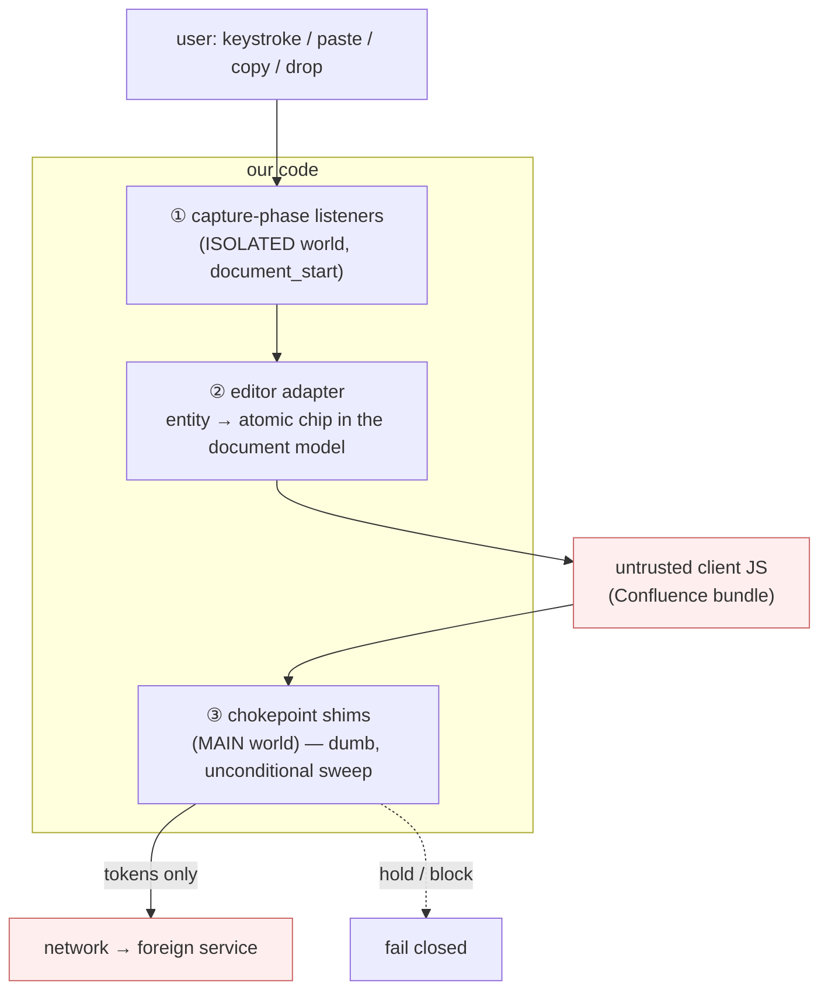

# Control Points

Where we get between the user and an untrusted client, and how much each point
is actually worth.

The claim we want to be able to defend is stronger than "we scrub the network
request". It is: **the untrusted client's own JavaScript never sees the
plaintext.** Confluence's editor bundle is not a trusted party — it is the
thing that will sync, autosave, index, telemeter and unfurl on a cadence it
controls and can change with any deploy. So we take the data before it is
handed over, not after.

## ① Capture-phase input & clipboard listeners — *before the client*

Registered on `document` in the capture phase, from a content script that runs
at `document_start`. Capture descends window → document → … → target, so our
handler fires before any listener the page attached to the editor element, and
`preventDefault()` + our own insertion means the page's handler receives the
tokenized value or nothing at all.

| Event | What we take | File |
|---|---|---|
| `copy`, `cut` | selection, classified with full DOM context | `content/clipboard.js` |
| `paste`, `drop` | every `DataTransfer` flavour | `content/clipboard.js` |
| `input`, `compositionstart/end` | dirty range, caret-aware, debounced | `content/input.js` |

This is the point that earns the strong claim, and it is worth being precise
about what it does and does not cover:

- **Covers** typed input, pasted input, dragged input, and the clipboard the
  user hands to the rest of the OS.
- **Does not cover** a page that registers its own capture listener on `window`
  (fires before `document`), content the page synthesises itself, or anything
  it reads back out of the DOM during our debounce window. Layer ③ exists
  because of that, and §0.5 of USER_FLOWS.md states the residual honestly.

Ordering guarantee, concretely: our content script is injected before the
page's own scripts execute, so at the moment the page's bundle starts running,
the shims and listeners are already installed.

## ② Editor adapter — *the document model, not the pixels*

Substitution has to land in the model the client will serialize, not in a
display layer painted over it. The entity becomes an **atomic inline node** —
serializes to the token, renders as plaintext, caret and backspace treat it as
one unit — reusing the primitive every editor already ships for @mentions.

Also owned here: grouping the substitution into the same undo step as the
triggering keystroke, so `Ctrl+Z` cannot resurrect plaintext into the model.

Adapters live in `content/input.js`. `plain` (input/textarea) is implemented;
ProseMirror and generic contenteditable are stubs.

## ③ Chokepoint shims — *the guarantee*

MAIN world, installed at `document_start`, wrapping every path bytes can leave
by:

| Shim | Hold strategy |
|---|---|
| `fetch` | natural — await the sweep, then call through |
| `XMLHttpRequest.send` | defer the real `send`; **sync XHR is blocked outright** |
| `WebSocket.send` | per-socket promise queue — held frames cannot reorder |
| `navigator.sendBeacon` | swallow, re-emit as `keepalive` fetch after sweep; drop on failure |
| `FormData`/uploads | flagged as binary → block or hand to the CH gateway |

This layer re-scans whatever is actually about to be serialized and trusts
nothing that happened upstream. It is deliberately dumb: no caret exemption, no
code-block suppression, no provenance fast path.

Everything here fails closed — vault unreachable, bridge timeout, unknown
policy → the request does not go.

## What we do *not* control

- **Other clients entirely**: mobile app, REST API, bulk import, a colleague
  without the extension. Only the network gateway covers those, which is why
  enforcement cannot live in this repo alone (USER_FLOWS.md §8).
- **A compromised page**: if hostile script is already running in the tab it
  wins the debounce race. This tool defends against the SaaS *storing* your
  data, not against a hostile frontend.
- **OS clipboard managers** that sync to a vendor cloud — mitigated by never
  putting plaintext in `text/plain`, not by controlling them.
