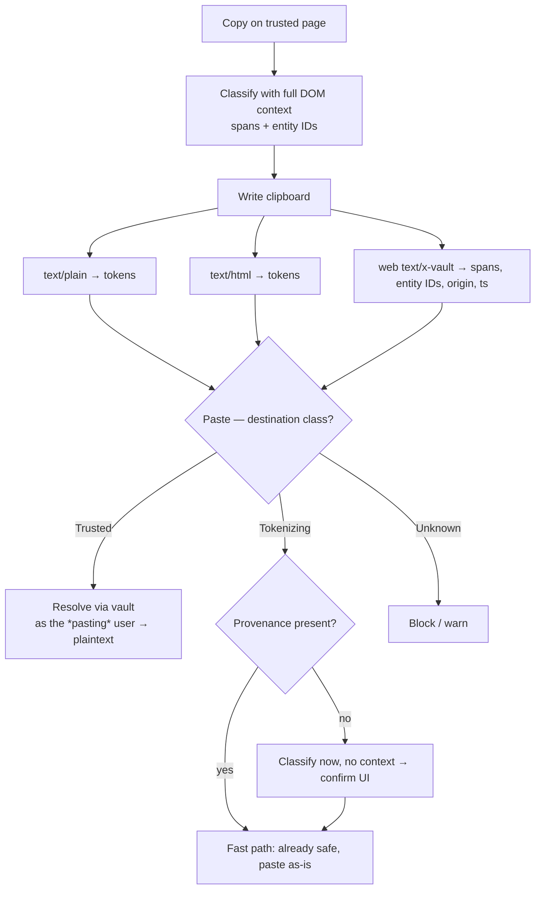
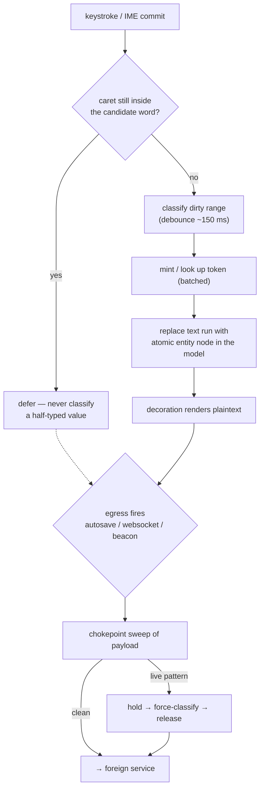
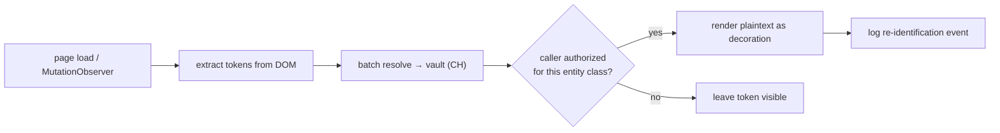
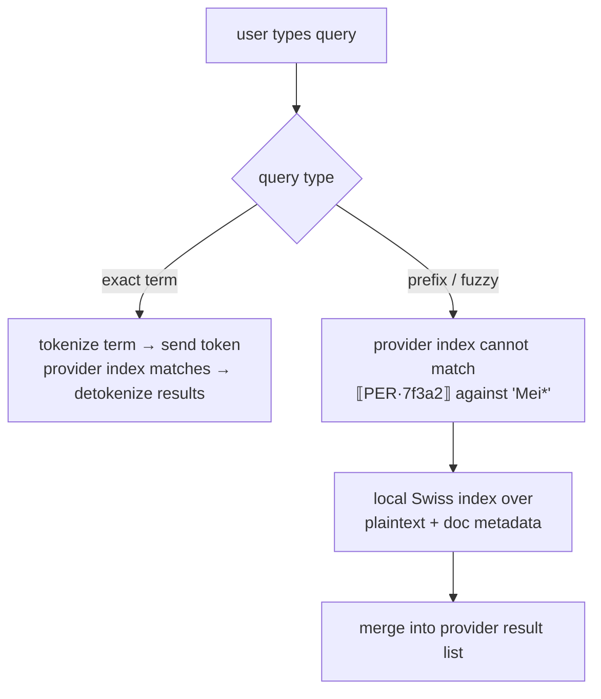
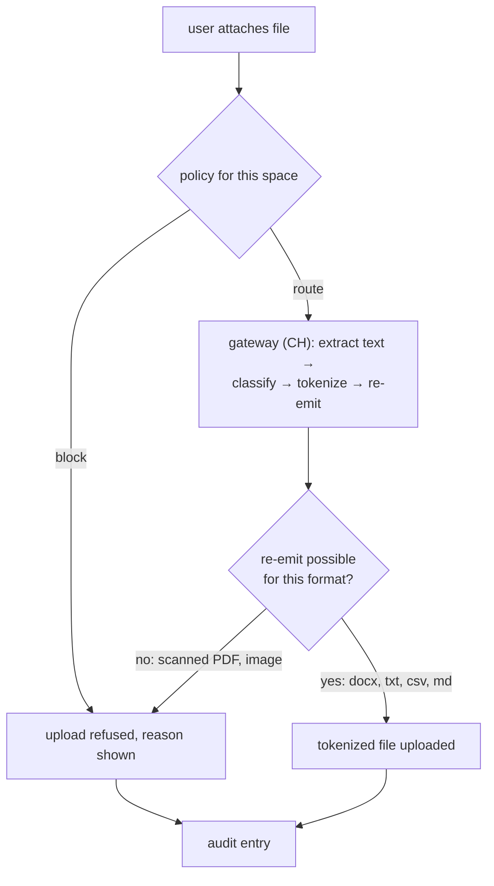
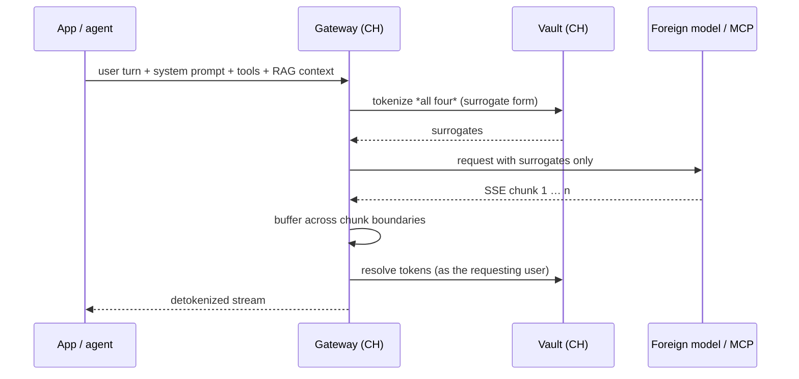
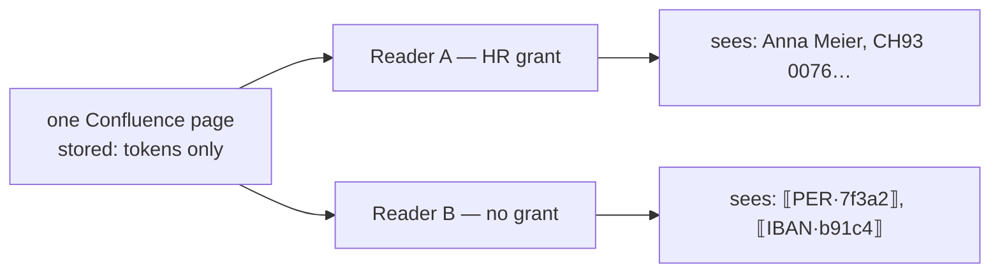

# User Flows — Browser Extension

Status: design draft. No implementation yet.

The extension is the **UX layer**, not the enforcement layer. The guarantee
("real values never reach the foreign service") is owned jointly by the
extension's egress chokepoint and by a network-side gateway that covers the
paths a browser cannot see (mobile apps, REST clients, server-to-server).
Every flow below is written against that assumption.

---

## 0. Shared foundations

These are referenced by every flow; they are stated once here.

### 0.1 Destination classes

The primary question is never "does this text contain PII?" but "is this
destination inside our boundary?" — the second question is decidable and cheap,
and it lets us tune classification aggressively on the foreign path only.

| Class | Example | Behaviour |
|---|---|---|
| **Trusted** | `vault.ourco.ch`, intranet | plaintext passes, no interception, no latency |
| **Tokenizing** | `ourco.atlassian.net`, LLM gateway | full chokepoint + per-app adapter |
| **Unknown** | everything else | extension does not activate; the network gateway is the backstop |

Not a geography list — a **trust list curated by control**. A Swiss region of a
foreign provider fails the test, so `.ch` TLDs and IP geolocation are not inputs.
Distributed by enterprise policy (`chrome.storage.managed`), not user-editable.

Decisions are **per request**, not per tab: a trusted page can still ship content
to a foreign analytics or error-reporting endpoint.

Known limit: **transitive trust**. A Swiss-hosted SaaS that itself calls a
foreign API looks trusted at hop one. Contractual + gateway problem, not
solvable in the extension.

### 0.2 Token model

```
token = HMAC(vault_key, normalize(value))[:n]      # key stays in the HSM, CH
```

Deterministic derivation ⇒ the same value yields the same token across
documents, users, apps and time, with no coordination and no "have I seen this
before?" round trip. The keyed hash must never leave the vault: the token is
public, the derivation is not, or small value spaces (AHV numbers, phone
numbers) become brute-forceable.

Rendering is **policy per destination**:

| Destination | Token form | Why |
|---|---|---|
| LLM / MCP | format-preserving surrogate (`Nadja Brunner`) | model reasoning quality; response is re-resolved anyway |
| Confluence & co. | visible token (`⟦PER·7f3a2⟧`) | a human may read it without the extension and must know it is not real |

Above the string layer sits an **entity layer**: `Anna Meier`, `A. Meier`,
`Meier, Anna`, `anna.meier@…` are one entity with one token. Normalisation into
entities is the difference between a demo and a product.

### 0.3 Two clocks

**Classification** is early, incremental, interactive, and best-effort.
**Substitution at the chokepoint** is late, unconditional, and dumb. The first
gives good UX; only the second is a guarantee.

Chokepoint = shims on `fetch`, `XMLHttpRequest`, `WebSocket.send`,
`navigator.sendBeacon`, form and file uploads, installed in the MAIN world.
Each can **hold** a payload, not merely observe it.

### 0.4 Fail-closed rules

- Vault unreachable → egress stops. Never fall through to plaintext.
- Classification not caught up → hold the frame until the sweep completes.
- Partial / ambiguous entity match → mask the whole fragment.
- `sendBeacon` is synchronous by contract and fires on unload → buffer and
  re-emit, or block that endpoint outright.

### 0.5 Accepted limits (state these; do not paper over them)

- Between keystroke and end of debounce, plaintext lives in the DOM. A
  compromised SaaS frontend wins that race. This tool defends against the SaaS
  **storing** your data, not against a hostile page.
- OS-level clipboard managers that sync to a vendor cloud are outside our
  control — mitigated by never putting plaintext in `text/plain` (§1).
- Pasting into a native desktop app degrades to the token. We cannot
  distinguish "local trusted app" from "foreign sync client" from the browser.

---

## Flow index

| # | Flow | Stresses |
|---|---|---|
| 1 | Copy trusted → paste untrusted | provenance, mixed content, clipboard flavours |
| 2 | Typing into an untrusted surface | editor model, debounce race, typeahead leaks |
| 3 | Reading a tokenized page | authorization, decoration vs. document truth |
| 4 | Search | the honest functional gap |
| 5 | Attachments / uploads | binary content, policy choice |
| 6 | AI request / response | streaming, RAG context, hallucinated tokens |
| 7 | Two users, one page | the value proposition |
| 8 | Out-of-band egress | notifications, mobile, API — why the gateway exists |

---

## 1. Copy from a trusted source → paste into an untrusted one

**Governing insight:** at copy time you know the source but not the
destination; at paste time you know the destination but the content has lost
its provenance. So **classify at copy, decide at paste**.

Copy time on a trusted page is the richest context available — DOM, field
labels, table headers, an app adapter that knows column 3 is an IBAN. Throwing
that away and re-deriving it from a flat string later is strictly worse.



### The clipboard never carries plaintext

`text/plain` holds tokens; the custom format holds only spans, entity IDs,
origin and timestamp. Resolving to plaintext on a trusted paste is a **vault
lookup performed as the pasting user**. That buys three things:

- copy by an authorized user, paste in an unprivileged session → tokens.
  Authorization is checked at use, not at copy.
- revocation is retroactive: copy 09:00, access revoked 10:00, paste 11:00 →
  nothing resolves.
- OS clipboard managers that sync to a vendor cloud receive tokens.

Tokens are minted **eagerly at copy**. Lazy minting would leave plaintext
sitting in `text/plain` during the gap.

Degradation is the safe path: any consumer that does not understand the custom
format sees the token. Fail-closed with no policy engine at paste time.

Caveat: custom clipboard formats are reliable within the browser; Firefox's
support for unsanitized custom formats is weaker than Chrome's → Chrome-first.

### Mixed content — three things that break naive implementations

1. **Sanitize every flavour.** A rich paste into Confluence uses `text/html`.
   Tokenize the plain branch only and the app picks HTML: the full selection
   leaks while the UI cheerfully shows tokens. `image/png` (pasted screenshot)
   cannot be handled — policy is strip or block, stated explicitly.
2. **Span-level substitution.** Non-sensitive prose must survive byte-identical.
   The classifier emits a span list against the source string; substitution
   walks it in **reverse offset order** so earlier replacements do not shift
   later indices. In the HTML branch an entity can straddle text nodes
   (`<b>Anna</b> Meier`) → flatten to a text projection with a node/offset map,
   substitute, map back.
3. **Consistency is the demo.** The IBAN pasted here gets the same token as the
   one typed into a different page last month, with no coordination. This is the
   requirement most designs hand-wave.

### Escape hatch

"Paste as-is" defeats the guarantee, so: permitted only for low-confidence
classes, never for high-confidence ones (IBAN, AHV number, contract-number
pattern). Every override is audited with the value class.

### Edge cases

- **Partial selection across an entity** (`Anna Mei` out of `Anna Meier`) →
  mask the whole fragment. No clever partial matching.
- **Reverse direction**: tokens copied out of Confluence and pasted into an
  internal tool round-trip and resolve on arrival. The token is a durable
  reference, not a display artifact.
- **Drag and drop** is the same channel with different event names
  (`DataTransfer`) — trivial to cover once paste exists, easy to forget.

### Audit

A copy that yields plaintext is a re-identification event, logged like any
other. This gives the organisation something it cannot do today: *who took real
customer names out of the wiki, and when.*

---

## 2. Typing directly into an untrusted surface

No provenance, no discrete gesture, no moment where the user is "done". This
flow decides whether the product is usable.



### The entity is a chip, not text

Replacing `Anna Meier` with `⟦PER·7f3a2⟧` in the document and painting the real
name over it means a lifetime of cursor arithmetic — token length ≠ display
length, so arrow keys, selection, click-to-position and every offset the editor
computes are wrong.

Instead model the entity as a **single atomic inline node**, exactly like an
@mention chip: serializes to the token, renders as plaintext, caret steps over
it as one unit. ProseMirror / Slate / Lexical / TinyMCE all have this primitive
because mentions needed it first.

Consequence: **deletion is atomic**. Backspace removes the whole entity, not a
character of it. Correct semantics anyway — a half-deleted IBAN is a
half-leaked IBAN.

### Never classify under the caret

`CH93 0076 2011` is a valid IBAN prefix and the user is still typing. Classify
a candidate only once the caret leaves its word boundary, and never mid-IME
composition (wait for `compositionend`, or every non-ASCII name gets mangled).
The chokepoint covers the gap: an autosave firing while the caret sits inside a
live pattern masks the partial, and the chip snaps into place a beat later.

### Undo is a leak channel

The substitution is a programmatic transaction. As its own history step,
`Ctrl+Z` resurrects plaintext into the document model and the next autosave
ships it. Group the substitution into the same history step as the triggering
keystroke, or mark it non-undoable — and make false-positive correction a
separate explicit affordance on the chip ("this is not a name → unmask"), not
something reachable by reflex.

### The leak nobody plans for: typeahead

Typing `@Anna` fires a user-picker query to the foreign service with the
plaintext prefix, character by character, before the word is finished. Same for
link unfurls, `/`-commands with arguments, inline search-as-you-type. These
endpoints leak the same characters **earlier and more often** than the document
body does.

Both mitigations are usually needed:

- route picker queries to the local (trusted) directory instead;
- block the endpoint and accept a degraded picker.

This is the concrete instance of the **operational identity vs. content
identity** split: the picker needs an identity the service can act upon, so it
receives an allowlisted account handle — never the content-side entity. Same
email address, two roles, two treatments.

### No confirmation dialogs

Typing cannot be interrupted. Masking is silent, visually marked (a chip
treatment legible at a glance), and cheaply reversible. Aggressive recall is
affordable precisely because the destination class already declared this
surface foreign: a false positive costs one click, a false negative costs the
promise.

---

## 3. Reading a tokenized page

Inbound is the easy direction — and the one place where "display only" is
correct, because the stored value at the provider genuinely is a token.



Rules:

- **Decoration, never document content.** Rewriting DOM text inside an editor
  means the next keystroke ships the rewritten text back to the server. Real
  values render as an overlay; the token stays the truth in the model.
- **Batch and cache.** One resolve call per viewport, not per token. Cache
  keyed by token, invalidated on session change.
- **Partial authorization is normal.** A page may render some entities in
  plaintext and others as tokens for the same reader (§7).
- Every resolution is logged: subject, entity class, page, timestamp.

---

## 4. Search

The honest gap. Split it by query type rather than pretending it is solved.



- **Exact match works trivially** and should be demoed: intercept the query,
  tokenize the term, the provider's own index matches the token, results are
  detokenized on the way back.
- **Substring / fuzzy / stemmed search cannot work** against opaque tokens. The
  only real answer is a **local index in Switzerland** holding plaintext plus
  document metadata, whose hits are merged into the provider's result list.
- Rejected alternative: emitting n-gram tokens so the provider can prefix-match.
  It leaks structure and partially defeats the whole point.
- Ranking is degraded either way — the provider ranks on token frequency, which
  is not term frequency. Say so rather than hiding it.

---

## 5. Attachments and uploads

The genuinely hard case; refuse to hand-wave it.



- Text-bearing formats can be round-tripped through the gateway. Images and
  scanned PDFs realistically cannot (OCR + re-render loses fidelity and is a
  poor place to stake a guarantee).
- **Filenames leak too** — `Vertrag_Meier_2024.pdf` is content. Tokenize the
  filename on the same path as the body.
- The extension's job here is to hold the upload and delegate; it should not
  attempt document parsing in the content script.
- Whatever is chosen, the pitch states which option was implemented and why.

---

## 6. AI request / response

No editor and no keystrokes — a request is assembled and sent, which makes the
outbound side the simple case. The subtleties are in *what* gets tokenized and
in the streaming response.



- **Tokenize the whole request, not just the user turn.** Retrieved RAG chunks,
  tool definitions and the system prompt are the likeliest places for real PII
  to slip past someone who only handled the visible message.
- **Buffer across SSE boundaries.** `⟦PER·` can arrive in one frame and
  `7f3a2⟧` in the next; naive per-chunk regex silently ships broken tokens.
  Surrogate-form tokens make this far less fragile, which is a second reason to
  prefer them on this path.
- **Detokenize on receipt inside the boundary**, before the response reaches the
  app — not as a browser display pass, or the task is not solved.
- **Hallucinated tokens** need defined behaviour: if the model emits
  `⟦PER·9999⟧`, the vault returns nothing → leave as-is and flag. Never guess a
  nearest match.
- Tool calls travelling back out (arguments the model wants executed) pass
  through the same tokenizing path as any other egress.

---

## 7. Two users, one page, different permissions

The flow that sells the architecture.



The vault is the authorization point: OIDC identity, grants per entity class,
every resolution logged. Two people open the same URL and see different content
— not because the provider enforced anything, but because re-identification is
a separate, revocable capability.

Today, provider permissions are all-or-nothing per page. Here, least privilege
lands at **field granularity**, as a side effect of the architecture. This is
the closing slide.

---

## 8. Out-of-band egress (why the extension alone is not enough)

Paths that never touch the browser:

| Path | Behaviour | Verdict |
|---|---|---|
| Notification email with a comment excerpt | provider sends `⟦PER·7f3a2⟧` | **Correct.** The token crossed the border, the plaintext did not. Unreadable without re-identification — that is the point, and it is a feature, not a gap. |
| Mobile app | shows tokens | correct, degraded UX |
| REST API / bulk import / integration | **bypasses the extension entirely** | covered only by the network gateway |
| Colleague without the extension | writes plaintext straight into the provider | covered only by the gateway |

The last two are the reason enforcement cannot live in the extension. The
extension is precise about a few known surfaces; the gateway is the backstop
for everything else. Both read the same policy and the same vault.
