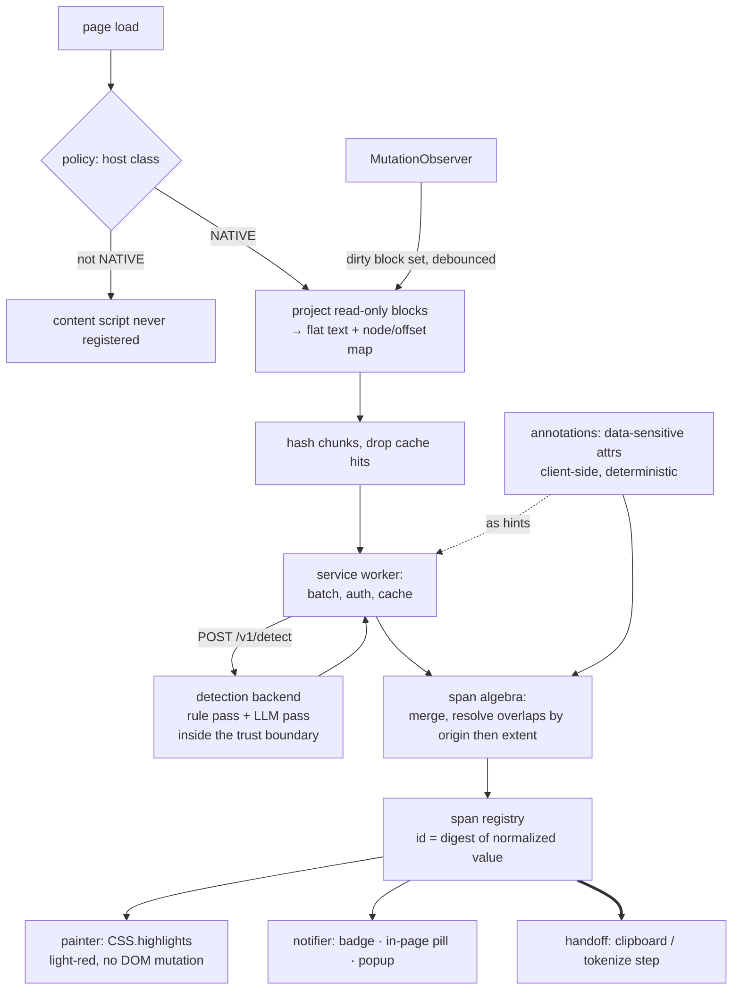

# Detection & highlighting

Scope: SPEC lines 1–4 — find sensitive data on a page, tell the user it is
there, paint it light-red. Everything downstream (clipboard, tokens, vault)
consumes the **span registry** this pipeline produces; nothing downstream
re-reads the DOM.

Tracked as [#1](https://github.com/ma-abdellaoui/anonymice/issues/1).

## 0. Settled decisions

| Decision | Choice | Why |
|---|---|---|
| Where we scan | **`NATIVE` only**, for now | Smallest surface that proves the flow; `TRUSTED` highlights too in target state, behind a policy flag |
| Editable regions | **Never touched on `NATIVE`** | Read-only regions only — no inputs, no textareas, no contenteditable. Removes the caret-exemption problem entirely |
| How much we highlight | **Everything detected**, no cap or clustering | A partial highlight is a false assurance; the user must see the whole footprint |
| Who detects | **Three layers** — markup annotations (client), rule pass and LLM pass (both backend) | Annotations are DOM facts the backend cannot see; both *guessing* passes stay server-side so there is exactly one guessing authority |
| Site annotations | **`data-sensitive` attributes in the markup** (§8) | The page already knows what the backend can only infer. Annotations only ever *add* spans, never suppress them |
| Paint mechanism | **CSS Custom Highlight API** | Zero DOM mutation — the copy path depends on selection geometry staying untouched |

## 1. Trust classes

Renamed from v0, whose `TRUSTED` meant the opposite of the SPEC's.

| Class | What is in the DOM | Highlight | Paste behaviour |
|---|---|---|---|
| `NATIVE` | the real values, untouched | yes | n/a — nothing is ever rewritten here |
| `TRUSTED` | the page holds the **token**; the user sees the real value through a clone | yes | on sensitive paste, clone the target element, show the real value in the clone, keep the original hidden and carrying the token. For inputs, propagate to the original with sensitive data replaced by tokens |
| `UNTRUSTED` | the token, literally | n/a | paste inserts the token as-is; real values never enter the DOM |

**`NATIVE`** is the source of truth. We leave every value exactly as it is and
only highlight. We do not touch editable regions at all.

**`TRUSTED`** is the interesting one: the site must never receive real values,
but the user must still be able to read them. Hence the clone — the visible
element carries plaintext, the element the page actually reads carries the
token, so anything the site stores or submits is tokenised. Risks to work
through when that path gets its own spec: a framework re-render discarding the
clone, the site's own validation running against token text, copy-out-of-clone
needing re-tokenisation, and accessibility labels pointing at the hidden
original.

**`UNTRUSTED`** gets no decoration and no clone. The token *is* the content.

The trust list is distributed via `chrome.storage.managed` and is not
user-editable. **Gate before reading:** content scripts are registered
dynamically (`chrome.scripting.registerContentScripts`) with `matches` built
from the class lists, rather than `<all_urls>` plus an early return. On a host
in no list the extension never touches the page at all — a property that can
be demonstrated, not just asserted.

## 2. Pipeline



## 3. Detection backend

**Placement is a constraint, not a deployment detail.** The detector sees raw
page text, so it must sit inside the same trust boundary as the vault. A
detection service outside that boundary would leak exactly the data it exists
to protect. It is `NATIVE`-class infrastructure by definition.

**Who calls it.** Content script → service worker → backend. The content
script never fetches directly: the worker holds the credential, owns the
cache, and coalesces every tab into one connection instead of a per-tab storm.

**Authority.** Both guessing passes — the deterministic **rule pass** (regex +
checksums, ported from the v0 `classifier.js`) and the probabilistic **LLM
pass** — run on the backend, and the backend is authoritative for everything it
guesses. Two guessers in two places would let the highlight and the clipboard
token disagree, which is the one inconsistency this product cannot have. The
client contributes exactly one thing the backend cannot see: markup annotations
(§8). The v0 rule table may still be mirrored client-side behind a flag as a
latency optimisation — enabled only if the eval shows it agrees with the
backend span for span.

### Request

```http
POST /v1/detect
Authorization: Bearer <from managed policy, attached by the service worker>
```
```json
{
  "policyVersion": "2026-08-01",
  "locale": "de-CH",
  "hostClass": "native",
  "chunks": [
    {
      "id": "c1",
      "hash": "sha256:9f2b…",
      "text": "Kunde Anna Meier, IBAN CH93 0076 2011 6238 5295 7",
      "hints": [
        { "start": 6, "end": 16, "cls": "PERSON", "origin": "annotation" }
      ]
    }
  ]
}
```

### Response

```json
{
  "modelVersion": "det-3.2",
  "policyVersion": "2026-08-01",
  "chunks": [
    {
      "id": "c1",
      "hash": "sha256:9f2b…",
      "spans": [
        { "start": 6,  "end": 16, "cls": "PERSON", "normalized": "Anna Meier",          "origin": "model" },
        { "start": 23, "end": 44, "cls": "IBAN",   "normalized": "CH9300762011623852957", "origin": "rule"  }
      ]
    }
  ]
}
```

### Contract

- **Offsets are UTF-16 code units** over NFC-normalised text — what
  `String.prototype.slice` uses. A backend counting codepoints desynchronises
  on the first emoji or astral character. The backend converts; the client
  does not.
- `hash` is SHA-256 of the NFC-normalised chunk text. It does three jobs: cache
  key (together with `modelVersion` + `policyVersion`), response-to-chunk
  binding, and **staleness guard** — the client re-hashes the chunk before
  painting and discards the response if the text changed while in flight.
- Chunks whose `(hash, modelVersion, policyVersion)` is already cached are
  never sent. The cache lives in the service worker, survives navigation, and
  is a bounded LRU.
- **Determinism is part of the contract**: same text + same versions ⇒ same
  spans. `spanId` digests, and therefore tokens, depend on it.
- Batching: one request per idle tick, viewport chunks first. Caps on chunk
  size, chunk count, and total bytes; `413` tells the client to re-split.
- Only text projections leave the browser — never page HTML, URLs, or cookies.
  `hints` are the one structural signal that crosses: annotation spans (§8),
  sent so the passes need not re-derive what the markup already stated. They
  are advisory — the backend may return spans that overlap or ignore them, and
  the client merges by precedence regardless.
- **Failure semantics.** Retry with backoff, then circuit-break. On `NATIVE` a
  failed detection degrades to "not scanned" and *says so* in the badge —
  silence would read as "nothing sensitive here". On the `TRUSTED` /
  `UNTRUSTED` paste paths the same failure fails **closed**: unresolved content
  is treated as sensitive.
- Optional later: NDJSON streaming so the viewport paints before the tail of
  the page comes back.

## 4. Three detection layers, one merge

| origin | runs | nature |
|---|---|---|
| `annotation` | client, from the DOM | deterministic — the page states it |
| `rule` | backend | deterministic — regex + checksum (IBAN mod-97, Luhn, AHV) |
| `model` | backend | probabilistic — LLM over the chunk |

Every span carries its origin:

```
{ start, end, cls, value, normalized, origin: 'annotation' | 'rule' | 'model' }
```

**No confidence on the wire, and none in the registry.** A span exists or it
does not. The LLM pass is probabilistic internally, but that is the backend's
problem: it decides its own bar and returns only spans it stands behind. A
score travelling to the client would just relocate the same decision into the
extension and give two authorities two answers.

**Merge rule.** Precedence is `annotation` > `rule` > `model`, then extent. On
an overlap the **class comes from the higher-precedence origin**, but the
**extent is the union** — a span is never narrowed by a higher-ranked one.
That is deliberate and fail-closed: over-highlighting costs a glance,
under-highlighting costs the promise. Ported from the v0 `spans.js` algebra,
which already widens ambiguous partial overlaps.

The three layers are additive, never subtractive. No layer can veto another —
see the security note in §8.

## 5. Painter

```js
CSS.highlights.set('anonymice-sensitive', new Highlight(...ranges));
// ::highlight(anonymice-sensitive) { background-color: #ffdada; }
```

Zero DOM mutation, so `getSelection().toString()` is identical to the
untouched page — which is what the partial-copy step depends on. One
`Highlight` object holds all N ranges, so "highlight everything" costs one
registry entry regardless of count.

Constraints, known up front:

- Only paint properties apply (`color`, `background-color`, `text-decoration`,
  shadows). No radius, no padding — a light-red fill is expressible, a rounded
  chip is not.
- Does not reach inside `<input>` / `<textarea>` — irrelevant on `NATIVE`,
  where we skip editables anyway, but it will matter for `TRUSTED`.
- Ranges into open shadow roots work, but the `::highlight()` rule must exist
  in that tree — inject via `adoptedStyleSheets` per root.
- Ranges go stale on mutation; the registry revalidates rather than trusting
  them.

Support: Chrome 105+, Safari 17.2+, recent Firefox. Fallback backend paints
absolutely-positioned rects from `Range.getClientRects()`, repositioned on
scroll and resize. Both sit behind one `paint(spans)` interface.

Because we highlight everything, a page can end up mostly red. A global
dim/undim toggle (one `CSS.highlights.delete`) keeps the page readable without
discarding what was detected.

## 6. Span registry

The durable artifact. Highlighting is the visible half; this is the half the
clipboard step consumes.

```
spanId → { cls, value, normalized, ranges[], origin, token? }
```

`spanId` is a **deterministic digest of `normalized`**, never a counter. The
same person on two pages, in two tabs, across sessions yields the same id and
therefore the same `PERSON-xxx`.

**The registry is keyed by value, not by occurrence.** One entry is one real
value; the page may show it in six places.

| field | what it is |
|---|---|
| `cls` | the class — `PERSON`, `IBAN`, `CARD`… Decides the token prefix (`PERSON-xxx`) and comes from the highest-precedence origin that matched |
| `value` | what the page literally displays, in the first occurrence's formatting — `"CH93 0076 2011 6238 5295 7"`. This is what the user sees and what a plaintext copy would have produced |
| `normalized` | the canonical form of the same value — `"CH9300762011623852957"`. Its digest **is** `spanId`, so two occurrences formatted differently collapse into one entry and one token. Structured classes normalise mechanically (strip separators, upper-case); `PERSON` needs entity resolution and is the open question — whether `"MEIER, Anna"` normalises onto `"Anna Meier"` decides whether they share a token |
| `ranges[]` | the live DOM locations of every occurrence: `Range` objects, each `(startNode, startOffset) → (endNode, endOffset)`. Plural because one value appears many times on a page. They do three jobs: they are handed straight to `new Highlight(...ranges)` to paint, they map a user selection back to *which* value was copied, and they are what goes stale when the page mutates — hence the revalidation pass |
| `origin` | which layer produced it — `annotation` (the markup said so), `rule` (backend regex + checksum), `model` (backend LLM). Drives merge precedence, per-origin eval reporting, and answering "why is this red?" With confidence gone, origin is the only ordering signal left |
| `token?` | optional because **tokens are minted lazily**. Detection is read-only — highlighting a value writes nothing to the vault. The token appears only once the user actually copies that value and the vault mints `PERSON-xxx`. Absence means "not copied yet", never "unknown": `spanId` is deterministic, so the token can always be minted or looked up later. This is what keeps a page of 400 highlights from creating 400 vault entries nobody asked for |

## 7. Scheduling, skipping, budget

- Chunk by block container, not one body-wide projection, so a mutation
  re-scans a subtree and only cache-missing chunks reach the network.
  `projectNodes` already handles entities straddling inline elements
  (`<b>Anna</b> Meier`).
- MutationObserver → debounce → dirty set → `requestIdleCallback` with
  time-slicing; viewport first via IntersectionObserver.
- Per-node cache keyed by text hash: re-renders that change nothing cost
  nothing, locally and on the wire.
- Never scan on `NATIVE`: **any editable region** (input, textarea,
  contenteditable), password fields, `script` / `style` / `code`, and our own
  UI (closed shadow root).

## 8. Site annotations

**Settled: attributes in the markup.** The site labels its own sensitive
elements and we read the label:

```html
<span data-sensitive="PERSON">Anna Meier</span>
<td   data-sensitive="IBAN">CH93 0076 2011 6238 5295 7</td>
<span data-sensitive>internal case note</span>   <!-- class unknown -->
```

A selector manifest — config mapping `.customer-name` → `PERSON` for sites we
cannot edit — is **not** built. It buys coverage on third-party apps at the
cost of config that breaks silently whenever a vendor renames a class, and the
rule and LLM passes already cover those pages. Reconsider only if a specific
`NATIVE` host proves un-annotatable.

**Reading them.** Annotation spans are produced client-side during projection:
the annotated element's text extent maps through the node/offset map to chunk
offsets, exactly like any other span. Nested annotations resolve innermost-first.
The attribute value must name a class from the vocabulary; a bare
`data-sensitive` with no value means *sensitive, class unknown* and gets the
generic token prefix rather than being dropped.

**Annotations never suppress.** There is no `data-sensitive="none"` and no way
for markup to mark a region as safe. The layers are additive (§4), so a page
can only ever cause *more* to be highlighted, never less. This is what makes
reading attributes off a page safe to keep doing if scanning is later enabled
on `TRUSTED`, where the markup is not fully under our control: the worst a
hostile page achieves is a false positive.

**They do not replace guessing.** Annotation coverage is a bonus, not a
precondition — an un-annotated `NATIVE` page must still detect at full quality
through the rule and LLM passes. The eval enforces this by running the whole
corpus twice, with annotations and with them stripped.

## 9. Verification

The eval is the contract; it lands before anything else
([#2](https://github.com/ma-abdellaoui/anonymice/issues/2)).

- Labeled fixture corpus: HTML pages plus sidecar JSON of ground-truth spans.
- Harness reporting precision / recall per class and per origin, with a
  regression gate.
- Backend contract tests: offset encoding against astral characters,
  determinism across repeated calls, cache-key invalidation on version bump,
  staleness guard on in-flight mutation.
- Annotation tests: every corpus page scored twice, annotated and stripped —
  stripping may lower precision but must not lower recall below the gate, and
  no annotation may ever remove a span the other layers found.
- Perf budget as an assertion, not a hope: first paint on a large DOM under
  budget, no jank under a mutation storm.
