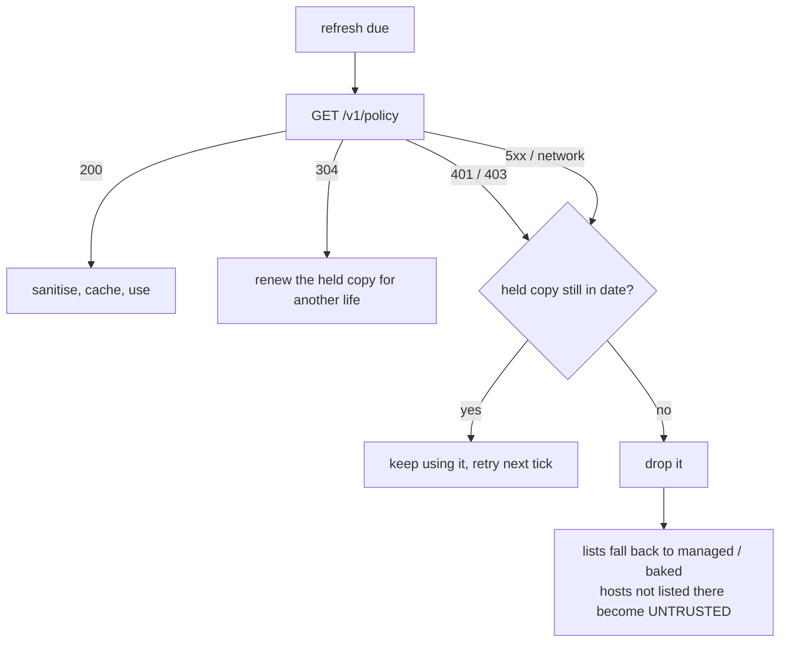

# Backend endpoints

What the browser extension needs from a server before it does anything at all.
Three endpoints, one credential, one origin.

Scope: the built path — classify a host, scan it, paint what is on it (SPEC
§1–§5). The token and vault endpoints of SPEC §6–§8 are not required yet and are
sketched in [§6](#6-not-required-yet) only so the shape is not designed into a
corner.

Tracked as [#10](https://github.com/ma-abdellaoui/anonymice/issues/10);
the service itself is [#8](https://github.com/ma-abdellaoui/anonymice/issues/8).

| Endpoint | Method | Auth | Called by | Called when |
|---|---|---|---|---|
| `/v1/health` | `GET` | none | operators, QA | on demand |
| `/v1/policy` | `GET` | bearer | service worker | boot, then every `policyRefreshMinutes` |
| `/v1/detect` | `POST` | bearer | service worker | per idle tick, per cache miss |

**All three live on one origin.** The extension is pinned to it by managed
policy and will not follow the backend anywhere else — see [§2.4](#24-authority-what-the-pull-may-and-may-not-decide).

## 0. The trust boundary is the deployment constraint

`/v1/detect` receives raw page text and `/v1/policy` decides which pages get
read at all. Both therefore sit **inside the same trust boundary as the vault**
(SPEC §3.1) — a detector outside it leaks exactly the data it exists to protect,
and a policy server outside it can point the detector at anything it likes.

This is not a deployment preference. It is why the client refuses to let a
response move the detect endpoint off its configured origin, and why the mock
backend binds to `localhost` and nowhere else.

## 1. `GET /v1/health`

Liveness only. Unauthenticated on purpose: it says nothing a caller does not
already know, and QA needs an answer before a token is configured.

```http
GET /v1/health
```
```json
{ "status": "ok", "modelVersion": "det-3.2" }
```

`200` means the process is up. It is **not** a readiness signal for detection —
the client's circuit breaker (SPEC §3.2) is driven by real `/v1/detect` results,
not by this. Nothing in the extension polls it.

## 2. `GET /v1/policy` — the trust lists

This is the endpoint that did not exist before, and the one worth reading
carefully. It answers: **how does the extension learn which hosts are `NATIVE`
and which are `TRUSTED`?**

### 2.1 Why there is a pull at all

SPEC §1 puts the trust list in `chrome.storage.managed`, distributed by an
administrator and not user-editable. That is still true and still the root of
trust — but a managed-policy push is a fleet-wide configuration change, and the
list moves faster than that. A new internal CRM host, a partner portal moving to
`TRUSTED`, a decommissioned subdomain: none of those should need a Group Policy
update on every machine.

So the managed policy becomes an **enrollment** rather than a full list:

```json
{
  "policyEndpoint": "https://anonymice.internal.example/v1/policy",
  "detectEndpoint": "https://anonymice.internal.example/v1/detect",
  "detectToken": "…",
  "policyRefreshMinutes": 60
}
```

and the lists come from the pull. An administrator who prefers the old model
just omits `policyEndpoint`: with no endpoint configured the extension **never
contacts a policy server at all**, and the managed lists are the whole story.
A shipped build with neither lists nor endpoint registers nothing, which is the
correct inert default.

### 2.2 Request and response

```http
GET /v1/policy
Authorization: Bearer <the enrollment credential>
If-None-Match: "b20b8787…"     ← when the client already holds a copy
```

```http
200 OK
ETag: "b20b8787…"
Cache-Control: max-age=300
```
```json
{
  "policyVersion": "2026-08-22",
  "locale": "de-CH",
  "native":  ["crm.internal.example", "*.clinic.internal.example"],
  "trusted": ["docs.partner.example"],
  "scanTrusted": "off",
  "maxAgeSeconds": 300
}
```

Every field is optional. An omitted field means "no opinion" and leaves whatever
the local configuration says; it does **not** mean "empty". To empty a list,
send `[]`.

| Field | Meaning |
|---|---|
| `native` | Hosts whose pages hold real values and get highlighted (SPEC §1) |
| `trusted` | Hosts the user may be shown real values on, via the clone path |
| `scanTrusted` | `off` \| `readonly` \| `full` — only `off` is implemented |
| `policyVersion` | Opaque; also a `/v1/detect` cache-key component (SPEC §3.2) |
| `locale` | Drives normalisation of national formats (SPEC §5.1) |
| `detectToken` | Lets the backend rotate the detect credential without a push |
| `detectEndpoint` | Path only — see [§2.4](#24-authority-what-the-pull-may-and-may-not-decide) |
| `maxAgeSeconds` | Life of this copy when no `Cache-Control` header states one |

**Host patterns** are hostnames and nothing else: `example.org` matches that
host exactly, `*.example.org` matches it and its subdomains. No scheme, no port,
no path, no bare `*`. Anything else is dropped and reported
([§2.5](#25-what-the-client-refuses)).

`304 Not Modified` is the expected steady-state response and the reason the
`ETag` matters: at a one-minute refresh a fleet re-reads this endpoint
constantly, and only the first read should transfer a body. The ETag must mean
byte equality — a weak one is wrong here, because the client uses it to decide
whether it may keep serving a copy it already holds.

### 2.3 Freshness, and what happens when the backend is down

Two separate clocks, deliberately:

- **Refresh interval** — `policyRefreshMinutes`, client-side. How often it asks.
- **Life of a copy** — `Cache-Control: max-age`, else `maxAgeSeconds`, else 24h,
  capped at 7 days. How long an answer stays usable *without* a successful ask.



The copy is cached in `chrome.storage.local` so it survives a service-worker
restart, and a woken worker reuses it rather than re-fetching — only a real
boot, an empty cache, or the refresh alarm goes to the network.

**Expiry is the point.** An outage must not un-protect a host that was listed
five minutes ago, so a held copy keeps working. But it must not keep a
decommissioned host in the `NATIVE` list forever either, so the copy dies on a
bounded clock and the lists fall back to whatever is configured locally. Both
directions of that failure are safe: fewer hosts scanned, and hosts dropping to
`UNTRUSTED`, which is the class that gets no extension code at all.

A `401`/`403` is not retried — a revoked enrollment will not un-revoke on the
second attempt — but it does not discard a copy that is still in date either.

### 2.4 Authority: what the pull may and may not decide

Precedence, lowest to highest:

```
defaults  <  baked QA policy  <  pulled policy  <  storage.local  <  managed policy
```

Managed still wins. The pull is a **delegation** of the administrator's list,
not a replacement for it: a key the administrator states in managed policy is
not overridable from the network, and a key they leave open is filled by the
pull. `storage.local` sits above the pull because it is reachable only from the
extension's own devtools and is the break-glass a developer needs to keep.

Three things a response may **not** do, enforced in the client rather than
documented and hoped for:

1. **It may not move the detector.** A `detectEndpoint` in the response may
   change the path but never the origin, which stays pinned to the managed one.
   The pull decides *where we scan*; it must not also decide *where the page
   text goes*. Relocating the detector is a managed-policy change, deliberately.
2. **It may not redirect the next pull.** `policyEndpoint` is ignored in a
   response body, so a single bad answer cannot hand the extension to another
   server permanently.
3. **It may not grant `UNTRUSTED` activation.** `activated` (SPEC §1) is the
   user's own per-host consent for the reveal path and is not the server's to
   give.

Unknown keys are dropped rather than merged, so a field added server-side cannot
start steering clients that predate it.

### 2.5 What the client refuses

Every value is sanitised before it can reach
`chrome.scripting.registerContentScripts`. The list patterns are interpolated
into `*://<pattern>/*`, so a stray `*` there is not cosmetic — it would register
the extension on every site there is.

| Rejected | Why |
|---|---|
| `*`, `*.`, `*.*.example`, `a b`, `-x.example` | Not a hostname |
| `http://example.org`, `example.org/x`, `example.org:8080` | Scheme, path or port |
| Lists over 512 entries | Bounds registration cost; the tail is dropped |
| `detectEndpoint` off the pinned origin | §2.4 |
| `policyEndpoint`, `activated`, `painter`, unknown keys | §2.4 |
| A body that is not a JSON object | Nothing to merge |

Rejections are **never silent**: they are logged by the service worker and
returned by the `anonymice:diagnostics` message
([§5](#5-checking-it-from-the-extension)). A shortened list that nobody notices
is a host that stops being protected quietly.

### 2.6 The permission wrinkle

Adding a host to `native` is necessary but not always sufficient. The shipped
manifest ships `"host_permissions": []` and asks for `*://*/*` only as an
*optional* permission, so registering a content script for a host the user has
not granted fails with *"cannot add script relating to a host it does not have
access to"*.

The extension handles that failure loudly — it registers nothing, logs the
error, and reports it in diagnostics — but the backend team should know that
**a host appearing in `/v1/policy` does not by itself make it scanned.** In a
managed deployment the grant comes from Chrome's `ExtensionSettings` policy
alongside the anonymice policy file; the QA build sidesteps it by pre-granting
`*://*/*` (see QA.md §1).

## 3. `POST /v1/detect`

Unchanged from SPEC §3.2, restated here as the contract the backend implements.

```http
POST /v1/detect
Authorization: Bearer <detectToken>
Content-Type: application/json
```
```json
{
  "policyVersion": "2026-08-01",
  "locale": "de-CH",
  "hostClass": "native",
  "chunks": [
    {
      "id": "c1",
      "hash": "sha256:9f2b…",
      "text": "Kunde Anna Meier, IBAN CH93 0076 2011 6238 5295 7",
      "hints": [{ "start": 6, "end": 16, "cls": "PERSON", "origin": "annotation" }]
    }
  ]
}
```
```json
{
  "modelVersion": "det-3.2",
  "policyVersion": "2026-08-01",
  "chunks": [
    {
      "id": "c1",
      "hash": "sha256:9f2b…",
      "spans": [
        { "start": 6,  "end": 16, "cls": "PERSON", "normalized": "Anna Meier",            "origin": "model" },
        { "start": 23, "end": 44, "cls": "IBAN",   "normalized": "CH9300762011623852957", "origin": "rule" }
      ]
    }
  ]
}
```

The parts a backend gets wrong most easily:

- **Offsets are UTF-16 code units** over NFC-normalised text — what
  `String.prototype.slice` uses. A backend counting codepoints desynchronises on
  the first emoji or astral character. The backend converts; the client does not.
- **Determinism is part of the contract.** Same text and same versions ⇒ same
  spans, byte for byte. `spanId` digests depend on it, and so does the cache.
- **`normalized` is the backend's job**, per the table in SPEC §5.1. It is what
  gets digested into a `spanId`, so two formattings of one IBAN must produce one
  string here or they will not collapse in the registry.
- **`hints` are advisory.** They carry annotation spans the markup already
  stated (SPEC §3.4) so the passes need not re-derive them. Overlapping or
  ignoring them is allowed; the client merges by precedence regardless.
- **`hostClass`** is `native` \| `trusted` \| `untrusted`. Reject anything else
  rather than guessing.
- **Caps**: 4 000 chars per chunk, 64 chunks, 64 000 chars per request. Over any
  of them, answer **`413`** — the client reads it as "re-split" and halves the
  batch, so it is a control signal, not an error.
- **Failure is loud, not silent.** Anything that is not a `200` or a `413`
  degrades the page to "not scanned", and the badge says so. Returning `200`
  with an empty span list to paper over an internal failure is the one lie the
  product cannot tell: it reads as "nothing sensitive here".
- Only text projections leave the browser — never page HTML, URLs or cookies.

## 4. Authentication

One bearer credential, `detectToken`, on both authenticated endpoints. It is
distributed by managed policy, held only by the service worker, and never
reaches a content script — a page must not be able to influence, observe or
replay it.

`/v1/policy` may rotate it: a response setting `detectToken` applies to
subsequent `/v1/detect` calls, which lets the backend roll a credential without
a fleet-wide push. The rotation cannot escape the pinned origin
([§2.4](#24-authority-what-the-pull-may-and-may-not-decide)), so the worst a bad
rotation does is break detection loudly.

## 5. Checking it from the extension

The service worker answers a diagnostics message, which is how QA and support
tell "the backend said so" from "the baked default said so":

```js
await chrome.runtime.sendMessage({ type: 'anonymice:diagnostics' });
```
```js
{
  policyStatus: 'fresh',        // fresh · not-modified · cached · expired · unauthorized · error · disabled
  policyVersion: '2026-08-22',
  expiresAt: 1787366958631,
  rejected: [],                 // anything the sanitiser refused, verbatim
  registered: ['*://native.anonymice.test/*'],
  registrationError: null,      // the §2.6 permission failure lands here
  policyEndpoint: 'http://localhost:8788/v1/policy',
  detectEndpoint: 'http://localhost:8788/v1/detect',
  native: ['native.anonymice.test'],
  trusted: ['trusted.anonymice.test'],
}
```

`policyStatus` distinguishes the two failures that look identical from outside:
`expired` means the pull has been failing long enough that its lists are gone,
`disabled` means no pull was ever configured.

## 6. Not required yet

Listed so the shape is known, not to be built now. All of these belong to the
same origin and the same trust boundary.

| Endpoint | For | Spec |
|---|---|---|
| `POST /v1/tokens` | Mint a token on copy; mint a child on partial copy or edit | §6.3, §7, §8.4 |
| `POST /v1/tokens/resolve` | Resolve a token to its value for the reveal clone, re-scoped to the destination | §6.3, §8 |
| `DELETE /v1/tokens/{id}` | Revocation, immediate and independent of the retention clock | §6.7 |

Two constraints from SPEC §6.7 that will shape them: a resolve failure must be
**legible** — class, age, origin, never a bare "unknown" — which means the
tombstone rows are part of the response schema, not an error string. And
retention rolls from the last successful resolve, so a resolve is a write.

## 7. The service

`code/extensions/backend/` implements all three endpoints — dependency-free
Node, one process, no build step. `npm run dev` there is a drop-in for the mock
on :8788; `DETECT_TOKEN=… npm start` is everything else.

What it adds over the mock is mostly the parts §0 and §2.5 say are not optional:

- **No default credential.** An unset `DETECT_TOKEN` refuses to start, and the
  bind address is loopback unless `HOST` says otherwise (with a warning that
  raw page text crosses that socket). `DETECT_TOKEN_PREVIOUS` keeps a rotation
  from having a closed window (§4).
- **The §2.5 refusals, applied at the source.** The same sanitiser the client
  runs, run over the policy file before it is served — a rejected host pattern
  is then an error next to the file that caused it, rather than a host that
  quietly stopped being protected on somebody's laptop. `isValidHostPattern`
  and `MAX_HOSTS` are the client's own code, vendored and diffed.
- **A last-good copy.** A policy file that breaks while the service is up keeps
  serving its previous copy and logs the failure. Un-listing a host silently is
  the outcome worth avoiding.
- **A shared detection cache**, keyed `hash|modelVersion|policyVersion|locale`.
  The client's hash is echoed back — it is the response-to-chunk binding — but
  never used as the server's cache key: a client that miscomputes its hash would
  otherwise write its spans where another client reads.
- **`502` on a failed pass**, never a `200` with the spans that happened to
  work. §3's "the one lie the product cannot tell", enforced in code.
- **Logs that cannot carry page text.** The logger throws on a field name that
  could (`text`, `spans`, `normalized`, …), so the rule holds by construction.

`GET /v1/metrics` exists there too — authenticated, counters only, and
explicitly **not** part of this contract: nothing in the extension calls it.

## 8. The mock backend

`code/extensions/browser/mock/` implements all three endpoints for local work
and QA. It is a stand-in, not a reference implementation — [§7](#7-the-service)
is the service: the rule pass is real
(regex plus the shared checksums), the "model" pass is a fixed gazetteer, and it
holds no vault.

```sh
npm run mock          # http://localhost:8788, bearer dev-token
```

| | |
|---|---|
| Lists served | `mock/policy.json`, re-read on **every** request |
| Change the lists | Edit that file — no restart; the extension picks it up on its next refresh |
| ETag | SHA-256 of the served body, so editing the file invalidates it and `304`s stop |
| Credential | `dev-token`, or `DETECT_TOKEN=…` |
| Port | `8788`, or `PORT=…` |
| Policy file | `POLICY_FILE=…` to serve a different one |

Exercising the whole path by hand:

```sh
curl -s localhost:8788/v1/health
curl -si -H 'authorization: Bearer dev-token' localhost:8788/v1/policy | head -6
curl -s -o /dev/null -w '%{http_code}\n' localhost:8788/v1/policy          # 401
```

QA.md §4 walks the same path through the extension.
