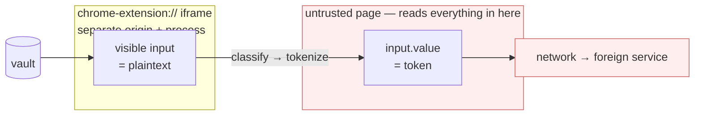
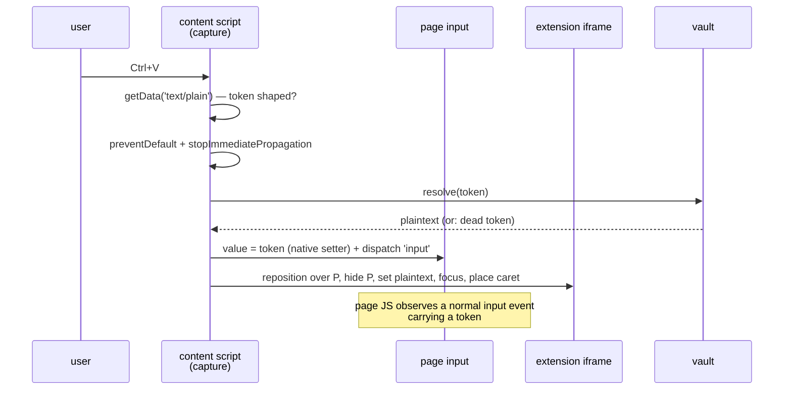

# Replacement

How the user sees a real value in a field whose value the untrusted client
reads as a token.

The claim in CONTROL_POINTS.md is that the untrusted client's own JavaScript
never sees the plaintext. That claim is cheap to keep if the user never needs
to see the plaintext either — tokens go in, tokens stay. This document covers
the case where they do: the user is looking at a form field and needs to read,
confirm, or correct the value that the field is standing in for.

The whole design follows from one property of the platform and one property of
the clipboard.

## 0. Two constraints that determine everything

**The clipboard has no reader identity.** One buffer, no caller attribution,
no per-destination views. Whatever we put on it is what *every* consumer gets
— the untrusted page, a native app, a clipboard manager syncing to a vendor
cloud. A copy-time decision is therefore a decision for all destinations at
once, made before any of them is known. This is why sanitisation happens at
copy: it is the only point where one decision covers every subsequent reader.
See USER_FLOWS.md §1.

**An isolated world is not an isolated DOM.** Content scripts get separate
globals and separate prototypes. They share the document tree. Anything we
render into the page is readable by the page:

| Surface | Page-readable? | Note |
|---|---|---|
| text node, `innerText`, `value` | yes | also via a `MutationObserver` installed at `document_start` |
| attribute, `data-*` | yes | |
| CSS `::before/::after { content }` | yes | `getComputedStyle(el, '::after').content` returns it |
| closed shadow root | mostly not | encapsulation, never designed as a confidentiality boundary; a page that patched `attachShadow` before us holds the root |
| `chrome-extension://` iframe | **no** | separate origin, same-origin policy, usually a separate process |

So the plaintext cannot be written into the page in any form. The only
rendering surface that holds is one the browser itself isolates.

**Invariant:** the page's input holds a token at every instant — before the
paste, during the edit, at submit. There is no window in which it holds
plaintext, a fragment of plaintext, or anything whose length or shape is
derived from the plaintext.

## 1. Why a clone and not an overlay

Two ways to show the user something other than what the field contains.

**Paint over it.** Position plaintext on top of the token and let the real
input keep focus. The caret, selection, arrow keys, wrapping and IME all
operate on the *token's* geometry while the user sees the *value's* — 13
characters against 21. Every text-editing affordance desyncs. This is a
permanent bug farm and we are not doing it.

**Clone into an iframe.** A genuine `<input>` in a `chrome-extension://`
document, holding the genuine value, positioned over the hidden real field.
Caret, selection, double-click-to-select-word, undo, RTL and IME are all
natively correct, because there is a real value for the browser to operate on.
The length mismatch stops being a caret problem and becomes a sync problem,
which we solve by re-tokenizing the whole value rather than mapping
characters.

This is the hosted-field pattern — Stripe Elements, Adyen, Braintree — run
with the trust direction reversed. It is proven, and it is expensive; §5 is
honest about how expensive.

## 2. Mount on paste, not on load

Cloning every input on every untrusted page is where this design dies. We
mount lazily, triggered by a paste that we can prove is one of ours.

This narrowing is not just economy — it removes two failure modes outright:

- **No typed-prefix leak.** Paste is atomic. We classify a complete value.
  Mirroring a value as it is *typed* would hand the page `C`, `CH`, `CH93`, …
  — none of which classify, all of which reassemble into the secret.
- **No autofill hazard.** Chrome's address and password autofill target the
  real input and would drop plaintext straight into the page tree. Autofill is
  not a paste, so it never reaches this path. Suppress it on fields we manage.

### Detection

`getData('text/plain')` is synchronous, so the decision is made before we
commit to `preventDefault()`. Detection strategy is coupled to token format:

- **Bracketed tokens** (`[[IBAN_a3f2]]`) — regex, trivial. These are also the
  ones a destination's `pattern` / `maxlength` / `type=email` validation will
  reject outright.
- **Format-preserving tokens** (a syntactically valid fake IBAN with a correct
  checksum) — unregexable by design. Detect via the custom clipboard flavour
  our own copy handler set (`clipboard.js`, `PROV`), falling back to a vault
  lookup keyed on a hash of the pasted string.

Confirm against the vault either way. It disambiguates the false positive
where someone pastes documentation that happens to contain a token-shaped
string; not in the vault, no clone.

### Sequence

Pre-warm one hidden iframe per page at load and reuse it. Mounting cold inside
a paste handler is where the visible glitch comes from; repositioning a warm
frame is one frame.

`stopImmediatePropagation()` is load-bearing and separate from
`preventDefault()`. The latter only suppresses the browser's default
insertion; without the former, a page handler still on the propagation path
receives a live `ClipboardEvent` and calls `getData()` itself.

### Rules that keep the scope honest

- **Empty-field or full-replace pastes only.** Pasting into the middle of
  existing content means reconciling mixed state — some typed plaintext, some
  previously tokenized. Fall back to a plain tokenized paste with no reveal.
- **Single-value inputs first.** A `<textarea>` receiving a paragraph with
  three tokens gives three spans to track through arbitrary edits, and there
  is no way to render an atomic chip inside a textarea to make them
  indivisible. Separate, harder problem — see CONTROL_POINTS.md §② for the
  rich-editor path, where chips *are* available.
- **Tear down on blur or on declassification.** The clone's lifetime is bounded
  to one active interaction.
- **Copy the computed accessible name** into the iframe input's `aria-label` at
  mount. `<label for>` cannot cross the boundary; the accessible name can.

## 3. Editing: child tokens

The naive rule — "re-tokenize whenever the value still classifies" — has a gap.
Delete the last four digits of an IBAN and it no longer classifies. Mid-edit
we would be choosing between stale page state and mirroring a fragment.

Instead: **the mirrored value is always a token, and an edit mints a child.**

- **One child per edit session, not per keystroke.** Mint at edit-start, mutate
  its value in the vault as the user types, commit on blur. The page sees one
  stable token throughout. Per-keystroke tokens would explode the vault and
  leak edit cadence through the churn.
- **Collapse to depth 1.** A child edited again reparents to the root. Chains
  make revocation a graph traversal and lineage unreadable.

"Child" bundles three properties; each is chosen separately:

| Property | Decision | Why |
|---|---|---|
| Derivation | always recorded | without it an edited value is an orphan and the chain back to "copied from the CRM at 14:32" is lost |
| Revocation | inherited | revoke the record, every derivative dies with it — this is the property that makes the scheme defensible |
| TTL | inherited | one clock, not many; the dead-token problem stays legible |

Mark children `user-modified` so a trusted destination resolving one knows it
is not the canonical record.

### Declassification is the exit

User pastes an IBAN, clears the field, types `invoice ref 12`. That is not
sensitive, and emitting a token for it puts a token where the destination
expects a plain string. On the value ceasing to classify: resolve to the
literal, write it through, sever the parent link, audit the transition.

Safe to expose, because page JS cannot reach into a cross-origin iframe. Only
the actual user can trigger declassification.

## 4. Failure direction

If the iframe fails to mount, fails to position, or is torn out of the DOM by
the page, the field contains the token — which is what the untrusted client is
supposed to receive. **Degraded UX, intact security.** The user sees a token
where they expected their value, which is visible, self-explaining and
recoverable.

This is the inverse of an eagerly-cloned design, where the real input is
hidden from page load and a mount failure makes the field appear to vanish.
The lazy mount is what buys the correct failure direction.

The page can also delete or z-index over the frame deliberately; same outcome.
What it **cannot** do is read the value inside it, and it cannot type into it.

The residual is spoofing in the other direction: the page draws its own fake
"🔒 protected" affordance so the user believes a field is tokenized when it is
not. Nothing rendered in page-space can defend against this. Any trustworthy
confirmation belongs in browser chrome — popup or side panel — not in an
overlay the page could imitate.

## 5. Known costs

Stated plainly, because each one is a reason this does not generalise to
arbitrary inputs on arbitrary sites.

- **The destination's live validation goes blind.** It validates the token on
  every `input` event, so it always passes or always fails regardless of what
  the user typed. "IBAN checksum invalid" from the app itself is gone; we
  reimplement those rules inside the clone or the user loses the feedback.
- **Token format vs. destination validation.** A field with `pattern`,
  `maxlength` or `type=email` rejects a bracketed token. Format-preserving
  tokens fix that and cost us regex detection and visual obviousness.
- **Format-preserving tokens fight the edit model.** A mid-edit value that has
  not settled into a class has no format to preserve; hold the last
  valid-shaped token until it resolves.
- **Web fonts do not cross the boundary.** The iframe is a separate document
  and does not inherit the page's `@font-face`. Re-declare them, and expect
  CORS or CSP to block some font files from our origin. Wrong font is
  instantly visible.
- **State styles must be enumerated.** `:focus`, `:hover`, `:invalid`,
  `:disabled`, `::placeholder`, and `:focus-within` on the page's wrapper —
  floating labels break here. Chrome's `:autofill` styling is UA-level and
  cannot be replicated.
- **Clipping.** Appended to `<body>` to escape z-index wars, the frame no
  longer clips inside the page's `overflow: hidden` ancestor and bleeds. Left
  in place, the page can stack over it.
- **Position tracking desyncs.** `ResizeObserver` + `IntersectionObserver` +
  `MutationObserver` + a rAF fallback, and still a frame of jitter on nested
  scroll containers, sticky ancestors and virtualised lists that recycle nodes.
- **SPA re-renders detach the anchor.** React reconciliation replaces the node
  and the measured clone points at a detached element. Needs re-attach logic,
  in practice per site.
- **Accessibility.** The accessible name can be copied across; `aria-describedby`
  pointing at page elements cannot. This is a real regression, not polish.
- **Synthesized events are `isTrusted: false`.** Anti-fraud and bot-detection
  scripts check this.
- **Password managers** inject their own overlays at the same coordinates and
  will fight ours.
- **Session replay** — FullStory, Hotjar, LogRocket, Datadog RUM serialise the
  DOM continuously and ship it to a third party. This is the concrete reason
  the iframe boundary is not paranoia: plaintext in the page tree is
  exfiltrated even by applications that never read the field themselves.
- **Selection does not cross the boundary**, so the user cannot select the
  revealed text to copy it. Provide an explicit "copy real value" action or
  they will work around us.
- **Screen sharing.** A permanently-revealed value defeats the point during a
  call — an argument for reveal-on-demand over a persistent clone.

## 6. Ship order

1. **Reveal-on-demand tooltip.** Field holds the token; hover or focus pops a
   read-only extension-iframe popover with the real value. No focus transfer,
   no caret placement, no accessibility regression, no style matching beyond a
   popover. Covers "paste it, glance to confirm it is the right customer, move
   on", which is most of the traffic.
2. **Paste-triggered clone** (§2–3), for the specific fields where users
   demonstrably need to correct a value in place.

The paste-triggered mount is the right mechanism for both; the question is
only what gets mounted.

## 7. Open

- Dead tokens. The clipboard outlives the vault: copied at 17:00, pasted into
  Word at 09:00 next morning against a cleared vault. A resolution failure must
  show class, timestamp and origin — never a bare failure. Token lifetime
  policy is not yet decided; see USER_FLOWS.md.
- Abandoned draft children need GC — minted at edit-start, never committed.
- Whether declassification requires an explicit user confirmation or is
  audit-only.
- Which validation rules we reimplement in the clone, and how they are
  maintained per destination.
